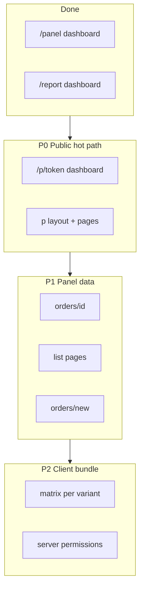

# Максимальная скорость panel + public

## Уже сделано (не трогаем повторно)

База из [dashboard_performance_analysis](.cursor/plans/dashboard_performance_analysis_5c6153ea.plan.md):

- Unified fetch: [`lib/dashboard/get-scoped-dashboard.ts`](lib/dashboard/get-scoped-dashboard.ts) + lean `select`
- Redis cache: [`lib/dashboard/cache.ts`](lib/dashboard/cache.ts), `docker-compose` redis, invalidation в API
- Panel/report dashboard: `getCachedScopedDashboard`, lazy recharts, `Suspense`, skeletons
- DB indexes: `order_items.subdivision_id`, `orders.organization_id`
- 33× `loading.tsx` на panel/public/report

**Главные оставшиеся проблемы:** public `p/[token]` делает 2–3 тяжёлых запроса на страницу; panel list/detail — over-fetch + `JSON.parse(JSON.stringify)`; client waterfalls на order-create; `AdminDashboardMatrix` в bundle public/report.



---

## Phase P0 — Public hot path (макс. impact)

### P0.1 — Request dedup (`React.cache`)

| Файлы | Diff |
|-------|------|
| [`lib/public/validate-token.ts`](lib/public/validate-token.ts) | `export const validateAccessToken = cache(async (token) => ...)` |
| [`lib/report-links/validate-token.ts`](lib/report-links/validate-token.ts) | То же для `validateReportToken` |
| [`lib/statuses/index.ts`](lib/statuses/index.ts) | `cache()` на `getWorkflowStatuses` / `listSelectableStatuses` |

**Win:** layout + page в одном request — 1× token query вместо 2×.

### P0.2 — Tiered public fetch (lean queries)

Разделить [`validateAccessToken`](lib/public/validate-token.ts) на уровни:

| Функция | Для | Include |
|---------|-----|---------|
| `validateAccessLink(token)` | layout, auth check | link + org + subdivision (без items) |
| `fetchPublicScopedItems(token)` | list/dashboard | lean select как `fetch-scoped-items` + measure code/desc + `order.issuedAt` |
| `getPublicOrderItem(token, id)` | item detail | `findUnique` + `responses: { take: 1 }` (как report) |

Обновить:
- [`app/(public)/p/[token]/layout.tsx`](app/(public)/p/[token]/layout.tsx) — `validateAccessLink` + лёгкий nav DTO (только `{ orderId, itemIds }` для sidebar)
- [`app/(public)/p/[token]/items/[id]/page.tsx`](app/(public)/p/[token]/items/[id]/page.tsx) — targeted query
- [`lib/public/build-public-nav-main.tsx`](lib/public/build-public-nav-main.tsx) — принимать slim nav props

**Win:** убрать `delayRequests`, full `responses[]`, `subdivisions` с каждого захода.

### P0.3 — Public dashboard = cached unified source

| Файлы | Diff |
|-------|------|
| [`app/(public)/p/[token]/page.tsx`](app/(public)/p/[token]/page.tsx) | `getCachedScopedDashboard(scope)` вместо `validateAccessToken` + `getScopedDashboardStats`; items из cache/matrix + `mapPublicMatrixItems()` adapter |
| [`lib/public/map-public-items.ts`](lib/public/map-public-items.ts) | Adapter: matrix DTO → `PublicItem[]` (или расширить `fetch-scoped-items` полями для public table) |
| [`app/(public)/p/[token]/loading.tsx`](app/(public)/p/[token]/loading.tsx) | `variant="dashboard"` (сейчас ошибочно `public-table`) |

**Win:** 1 Redis/DB fetch вместо 3; parity с `/report/[token]`.

### P0.4 — Public orders pages

| Файлы | Diff |
|-------|------|
| [`p/[token]/orders/page.tsx`](app/(public)/p/[token]/orders/page.tsx) | Не вызывать full `validateAccessToken`; reuse layout context или `fetchPublicOrderSummaries(token)` |
| [`p/[token]/orders/[orderId]/page.tsx`](app/(public)/p/[token]/orders/[orderId]/page.tsx) | Scoped fetch одного order + items (без всех orders) |
| Добавить `p/[token]/orders/loading.tsx` | `public-table` |

Убрать `JSON.parse(JSON.stringify)` — explicit DTO mappers в `lib/public/serialize-public.ts`.

---

## Phase P1 — Panel data layer

### P1.1 — DTO serializers (замена JSON hack)

Новый [`lib/serialize/`](lib/serialize/) с функциями по сущности:

| Mapper | Заменяет в |
|--------|-----------|
| `serializeOrders`, `serializeOrderDetail` | [`orders/page.tsx`](app/(platform)/panel/orders/page.tsx), [`orders/[id]/page.tsx`](app/(platform)/panel/orders/[id]/page.tsx) |
| `serializeMeasures` | measures list/edit |
| `serializeResponses`, `serializeDelays` | responses, delay-requests pages |
| `serializeUsers`, `serializeOrganizations` | settings/users, organizations |

По одной странице за подфазу (7 мелких PR).

### P1.2 — Slim `getOrder`

| Файлы | Diff |
|-------|------|
| [`lib/orders/index.ts`](lib/orders/index.ts) | `getOrderSummary(id)` — items без full `responses[]`/`delayRequests[]`; `responses: { take: 1 }`, `delayRequests: { take: 1, where: { status: PENDING } }` |
| [`order-detail-client.tsx`](components/platform/order-detail-client.tsx) | Lazy-expand history via dialog fetch (опционально Phase P1.2b) |

**Win:** самый тяжёлый panel route (`/panel/orders/[id]`).

### P1.3 — Parallel + lean list queries

| Route | Fix |
|-------|-----|
| [`organizations/[id]/page.tsx`](app/(platform)/panel/organizations/[id]/page.tsx) | `Promise.all([getOrganization, getOrganizationLinks])` |
| [`organizations/page.tsx`](app/(platform)/panel/organizations/page.tsx) | `getHeadOrganizationId` без full `getAppSettings` — отдельный `select headOrganizationId` |
| [`subdivisions/.../edit/page.tsx`](app/(platform)/panel/organizations/[id]/subdivisions/[subId]/edit/page.tsx) | `Promise.all` org + subdivision |
| [`settings/account/page.tsx`](app/(platform)/panel/settings/account/page.tsx) | session уже есть — parallel user fetch |

### P1.4 — Order create RSC prefetch

| Файлы | Diff |
|-------|------|
| [`orders/new/page.tsx`](app/(platform)/panel/orders/new/page.tsx) | Server: `listOrganizations()` + `getAppSettings()` → props в `OrderCreateForm` |
| [`order-create-form.tsx`](components/platform/order-create-form.tsx) | `initialOrganizations`, `initialSettings`; client fetch только fallback |
| [`orders/new/measures/page.tsx`](app/(platform)/panel/orders/new/measures/page.tsx) | Server prefetch `listMeasures()` если draft cache пуст |

**Win:** убрать client waterfall после hydration.

### P1.5 — Redis для sidebar counts (опционально, малый diff)

| Файлы | Diff |
|-------|------|
| [`lib/cache/sidebar-counts.ts`](lib/cache/sidebar-counts.ts) | `getPendingDelaysCount`, `getPendingResponsesCount` — Redis TTL 30s |
| [`app-sidebar.tsx`](components/app-sidebar.tsx) | Или server-pass counts через layout (лучше: hoist в panel layout RSC) |

Предпочтительно: **panel layout** async RSC fragment с counts → props в sidebar (0 client fetch для badge).

---

## Phase P2 — Client bundle & permissions

### P2.1 — Matrix code-split по variant

| Файлы | Diff |
|-------|------|
| [`scoped-dashboard-view.tsx`](components/dashboard/scoped-dashboard-view.tsx) | `dynamic()` для `AdminDashboardMatrix`, `ReportDashboardMatrix`, `PublicMeasuresTable` — каждый только при своём variant |

**Win:** public/report не тянут admin matrix JS.

### P2.2 — Dynamic heavy detail clients

| Component | dynamic import в page |
|-----------|----------------------|
| `order-detail-client` | `orders/[id]/page.tsx` |
| `response-detail-client` | `responses/[id]/page.tsx` |
| `organizations-manager` | `organizations/page.tsx` |

Skeleton = существующий route `loading.tsx` variant.

### P2.3 — Server permissions (убрать `usePlatformUser` waterfall)

| Файлы | Diff |
|-------|------|
| [`panel/layout.tsx`](app/(platform)/panel/layout.tsx) | `requirePageSession()` + `permissions` prop через context/provider |
| [`use-platform-user.ts`](components/platform/use-platform-user.ts) | Initial data from server context; fetch только refresh |
| Страницы с `*PageActions` | `canCreate` из server props |

Затронутые: orders, measures, responses detail, sidebar primary action.

### P2.4 — Change-password без full shell (опционально)

Отдельный minimal layout group или `PlatformShell` prop `bare` для `/panel/change-password` — меньше sidebar JS на forced redirect route.

---

## Phase P3 — Streaming & perceived speed

### P3.1 — Suspense на list pages

Паттерн для orders/measures/organizations/responses/delays:

```tsx
// page.tsx
<>
  <PageHeader ... />  {/* sync */}
  <Suspense fallback={<TablePageSkeleton />}>
    <OrdersTableSection />  {/* async RSC */}
  </Suspense>
</>
```

По одной list-странице за подфазу. Header появляется сразу.

### P3.2 — Order detail streaming

[`orders/[id]/page.tsx`](app/(platform)/panel/orders/[id]/page.tsx):

- Suspense block 1: order meta + stat strip
- Suspense block 2: items table (lean query)

### P3.3 — Public layout streaming

[`p/[token]/layout.tsx`](app/(public)/p/[token]/layout.tsx): shell/header sync, nav orders в `<Suspense fallback={<SidebarNavSkeleton />}>`.

---

## Phase P4 — Scale (когда данных станет много)

| Подфаза | Что |
|---------|-----|
| P4.1 | Server-side pagination + URL searchParams на orders/measures/responses tables |
| P4.2 | Prisma indexes: `order_items.order_id`, `order_items.status_id`, `responses.review_status` |
| P4.3 | Next.js Redis cache handler ([self-hosting](.agents/skills/next-best-practices/self-hosting.md)) для multi-instance ISR |
| P4.4 | `cacheComponents: true` + `'use cache'` на статичных справочниках (statuses, auth providers) |

Не блокирует P0–P3; включать по метрикам.

---

## Порядок выполнения

```
P0.1 → P0.2 → P0.3 → P0.4
  → P1.1 (по странице) → P1.2 → P1.3 → P1.4 → P1.5
  → P2.1 → P2.2 → P2.3 → (P2.4)
  → P3.1 (по list) → P3.2 → P3.3
  → P4.* по необходимости
```

**Принцип:** каждая подфаза = отдельный коммит, 1–3 файла, `npm run typecheck && npm run build` green.

---

## DoD

| Область | Метрика |
|---------|---------|
| `/p/{token}` dashboard | 1 cache/DB fetch (не 3); layout+page dedup |
| `/p/{token}/items/{id}` | `findUnique`, не full scope scan |
| `/panel/orders/{id}` | Query без full response/delay history arrays |
| `/panel/orders/new` | Нет client fetch orgs/settings при SSR prefetch |
| Public/report JS | `AdminDashboardMatrix` не в public bundle |
| Panel list pages | Нет `JSON.parse(JSON.stringify)` |
| Sidebar badges | 0 client fetch (server props) или Redis hit |
| Все маршруты | `typecheck + build` green; skeleton variant = page type |
