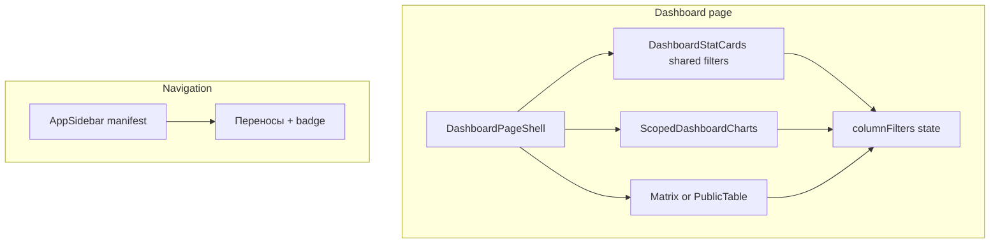
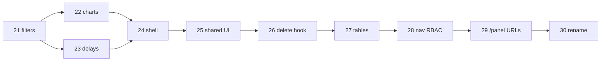

# Platform refactor — master plan

## Диагноз

### Регрессия сводки (admin)
На public фильтры подняты в [`PublicDashboardInteractive`](components/public/public-dashboard-interactive.tsx): KPI-карточки + чарты + таблица делят один `columnFilters`.

На admin [`page.tsx`](app/(admin)/admin/(panel)/page.tsx) KPI-карточки **вне** `ScopedDashboardView` и рендерятся **без** `onStatusClick`:

```45:65:app/(admin)/admin/(panel)/page.tsx
      <DashboardStatCards stats={stats} />
      <PendingDelaysCard count={pendingDelayCount} />
      ...
        <ScopedDashboardView variant="admin" ... />
```

Итог: клик по «В работе» / «К исполнению» на KPI не фильтрует таблицу. Чарты внутри `ScopedDashboardView` теоретически работают, но UX разорван — пользователь кликает KPI, а фокус таблицы не меняется.

### Смешение контекста
[`PendingDelaysCard`](components/dashboard/pending-delays-card.tsx) на сводке дублирует sidebar-пункт «Переносы» + badge ([`app-sidebar.tsx`](components/app-sidebar.tsx)). Сводка = статусы мер; заявки = отдельный workflow.

### Чарты
[`scoped-dashboard-charts.tsx`](components/dashboard/scoped-dashboard-charts.tsx):
- Pie legend: `ChartLegendContent` без `whitespace-nowrap` → длинные статусы ломаются по словам в узком `max-h-64` контейнере
- Pie center `<Label>`: SVG `tspan` с фиксированным `+18` — визуально смещён к кольцу
- Нет `LabelList` на секторах/столбцах (нет цифр 15, 20 на графике)
- Legend pie выглядит кликабельным (`cursor-pointer`), но **без** `onClick`

### Именование «admin»
Тройная вложенность `app/(admin)/admin/(panel)/`, компоненты в `components/admin/`, `useAdminMe`, `requireAdminSession` — при ролях OPERATOR/VIEWER это вводит в заблуждение. Sidebar уже говорит **«Платформа»**.

**Решение по URL (от пользователя):** сразу `/panel/*`, без редиректов.

---

## Целевая архитектура



---

## Фазы (малый diff, branch-per-phase)

### Phase 21 — Dashboard filter regression fix
**Branch:** `fstec/phase-21-dashboard-filters`  
**Diff:** ~3–5 файлов

1. Создать [`components/dashboard/dashboard-interactive.tsx`](components/dashboard/dashboard-interactive.tsx) — обобщить [`PublicDashboardInteractive`](components/public/public-dashboard-interactive.tsx):
   - props: `variant`, `scope`, `stats`, `items`, `overdueOnly`, admin/public extras
   - единый `columnFilters` + `DashboardStatCards` с `onStatusClick` + controlled `ScopedDashboardView`
2. Admin [`page.tsx`](app/(admin)/admin/(panel)/page.tsx): заменить разрозненные блоки на `DashboardInteractive`
3. Public: перевести на тот же компонент (удалить дубликат `PublicDashboardInteractive`)
4. **Убрать** `PendingDelaysCard` со сводки

**DoD:** клик KPI «В работе» на admin → таблица фильтруется; клик pie/bar → фильтр; повторный клик снимает; public не регресснул.

---

### Phase 22 — Chart UX polish
**Branch:** `fstec/phase-22-chart-polish`  
**Diff:** ~2–3 файла

1. [`scoped-dashboard-charts.tsx`](components/dashboard/scoped-dashboard-charts.tsx):
   - Pie: `LabelList` на секторах (count), overlay center label через flex (вместо SVG Label) или скорректировать `dy`
   - Bar overdue/completion: `LabelList` на столбцах
   - Pie legend: `whitespace-nowrap`, `flex-wrap` на контейнере, клик legend → `onStatusClick`
2. [`components/ui/chart.tsx`](components/ui/chart.tsx): опциональный prop `onLegendItemClick` в `ChartLegendContent` (переиспользуемо)
3. Исправить bug subdivision completion chart в [`lib/dashboard/stats.ts`](lib/dashboard/stats.ts): `completionBreakdown` для subdivision scope должен фильтровать по `orderTitle`, не по имени подразделения

**DoD:** на pie видны числа; legend «К исполнению» в одну строку; центр donut визуально по центру; legend кликабелен.

---

### Phase 23 — Delay requests placement
**Branch:** `fstec/phase-23-delays-context`  
**Diff:** ~2–3 файла

1. На [`delay-requests/page.tsx`](app/(admin)/admin/(panel)/delay-requests/page.tsx): alert/banner «N заявок ожидают решения» (если count > 0)
2. Sidebar badge оставить — это primary entry point
3. Удалить [`pending-delays-card.tsx`](components/dashboard/pending-delays-card.tsx) если больше не используется

**DoD:** сводка без заявок; заявки discoverable из nav + страницы переносов.

---

### Phase 24 — Dashboard shell DRY
**Branch:** `fstec/phase-24-dashboard-shell`  
**Diff:** ~3–4 файла

1. [`components/dashboard/dashboard-page-shell.tsx`](components/dashboard/dashboard-page-shell.tsx):
   - `PageHeader` + overdue toggle (Все / Просроченные)
   - slot для empty alert
   - `DashboardInteractive`
2. Admin + public dashboard pages → thin server wrappers
3. Удалить dead code:
   - [`components/admin/dashboard-charts.tsx`](components/admin/dashboard-charts.tsx)
   - [`app/api/dashboard/route.ts`](app/api/dashboard/route.ts) (нет consumers)

**DoD:** admin/public dashboard pages < 40 строк каждая; build green.

---

### Phase 25 — Shared UI extraction (DRY foundation)
**Branch:** `fstec/phase-25-shared-ui`  
**Diff:** move-only + import updates

Перенести **без логики** в [`components/shared/`](components/shared/):
- `page-header.tsx`, `form-actions-bar.tsx`, `form-skeleton.tsx`, `form-error-slot.tsx`
- Re-export из старых путей `@deprecated` на 1 phase (удалить в phase 26)

Public уже импортирует admin UI — это блокер для rename.

**DoD:** typecheck; public imports from `components/shared`.

---

### Phase 26 — CRUD delete hook + pilot table
**Branch:** `fstec/phase-26-crud-delete-hook`  
**Diff:** ~3–4 файла

1. [`hooks/use-resource-delete.ts`](hooks/use-resource-delete.ts): `{ deleteId, deleting, requestDelete, confirmDelete, cancelDelete }`
2. Применить к [`measures-table.tsx`](components/admin/measures-table.tsx) (pilot)
3. Удалить deprecated re-exports из `components/admin/`

**DoD:** measures delete через hook; остальные таблицы — в phase 27.

---

### Phase 27 — CRUD tables DRY rollout
**Branch:** `fstec/phase-27-crud-tables`  
**Diff:** ~6–8 файлов

Применить `useResourceDelete` + унифицировать delete handler в:
- [`orders-table.tsx`](components/admin/orders-table.tsx)
- [`organizations-manager.tsx`](components/admin/organizations-manager.tsx)
- [`users-list-client.tsx`](components/admin/users-list-client.tsx)
- [`org-links-panel.tsx`](components/admin/org-links-panel.tsx)

Вынести [`lib/ui/delay-status.ts`](lib/ui/delay-status.ts) — badge helper для delay table + detail.

**DoD:** нет copy-paste delete blocks; один STATUS_VARIANT для delays.

---

### Phase 28 — Nav manifest + RBAC UI gates
**Branch:** `fstec/phase-28-nav-rbac`  
**Diff:** ~4–6 файлов

1. [`lib/nav/platform-nav.ts`](lib/nav/platform-nav.ts): items `{ title, href, icon, permission?, badge? }`
2. [`AppSidebar`](components/app-sidebar.tsx): filter by `usePlatformUser().can()`
3. Скрыть «Создать поручение» / «Добавить меру» для VIEWER (sidebar + list page actions)
4. [`lib/auth/session.ts`](lib/auth/session.ts): `requireAdminSession` → `requireAuthenticatedSession` (alias deprecated)

**DoD:** VIEWER видит read-only nav; OPERATOR не видит settings/users.

---

### Phase 29 — URL rename `/admin` → `/panel`
**Branch:** `fstec/phase-29-panel-urls`  
**Diff:** mechanical, many files — **отдельная phase, без смешения с логикой**

1. Переместить routes: `app/(admin)/admin/(panel)/` → `app/(platform)/panel/`
2. Middleware matcher: `/panel/:path*`
3. Mass-update: sidebar, breadcrumbs, `revalidatePath`, links, `next` login redirect
4. Удалить `app/(admin)/admin/login/` (legacy redirect)
5. Login success → `/panel`

**DoD:** все routes `/panel/*`; grep `/admin` только в docs/changelog if any.

---

### Phase 30 — Code rename admin → platform
**Branch:** `fstec/phase-30-platform-rename`  
**Diff:** rename-only

| Было | Стало |
|------|-------|
| `components/admin/` | `components/platform/` |
| `AdminShell` | `PlatformShell` |
| `useAdminMe` | `usePlatformUser` |
| `admin-breadcrumb` | `platform-breadcrumb` |
| `lib/admin/` | `lib/nav/` (orders sidebar builder) |
| AGENTS.md context `admin` | `platform` |

Обновить [`docs/plans/fstec_master.plan.md`](docs/plans/fstec_master.plan.md) — phases 21–30, routes table, RBAC note.

**DoD:** нет `AdminShell`/`useAdminMe` в коде; AGENTS.md актуален.

---

## Порядок и зависимости



**Приоритет для пользователя:** Phase 21 → 22 → 23 (видимый UX), затем DRY и rename.

---

## Общий DoD (каждая phase)

```bash
npm run typecheck && npm run lint && npm run build
```

Smoke phase 21–23:
1. `/panel` (после phase 29) или `/admin` (до 29): KPI «В работе» → таблица отфильтрована
2. Pie «Просрочено» → filter + highlight segment
3. Completion bar «active» → status IN (К исполнению, В работе, Просрочено)
4. Сводка без карточки заявок; badge на «Переносы» работает

---

## Вне scope (отложено)

- Server-side pagination API
- Полный `CrudResourceTable` generic (только delete hook + постепенный rollout)
- Faceted filters на measure-select-table
- i18n UI strings
- Redirects `/admin` → `/panel` (не нужны по решению пользователя)
