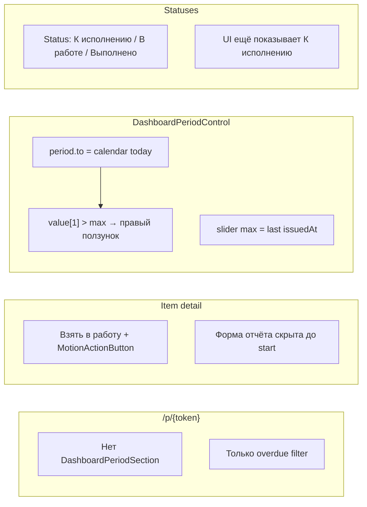
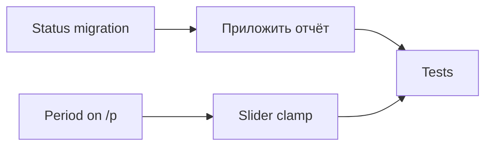

# Портал, отчёт, слайдер, статусы

## Диагноз



| Проблема | Причина | Файлы |
|---------|---------|-------|
| Нет фильтра на `/p/R1pf…` | Period подключён только на `/reports` и `/report/*`, не на public dashboard | [`app/(public)/p/[token]/page.tsx`](app/(public)/p/[token]/page.tsx), [`subdivisions/[subId]/page.tsx`](app/(public)/p/[token]/subdivisions/[subId]/page.tsx) |
| «Взять в работу» | Отдельный шаг `canStart` → PATCH `action: "start"` до формы | [`public-item-detail.tsx`](components/public/public-item-detail.tsx), [`item-detail-display.ts`](lib/ui/item-detail-display.ts) |
| Анимация кнопки | `MotionActionButton` на start/submit | [`public-item-detail.tsx`](components/public/public-item-detail.tsx), [`item-report-workflow-card.tsx`](components/shared/item-detail/item-report-workflow-card.tsx) |
| Сломан правый ползунок | `parsePeriodFromSearchParams({})` → `to=today`, а `totalDays` = до `max(issuedAt)` | [`period-range.ts`](lib/dashboard/period-range.ts), [`dashboard-period-control.tsx`](components/dashboard/dashboard-period-control.tsx) |
| «К исполнению» | Статус в seed + default для новых items + UI `getDisplayStatusName` | [`prisma/seed.ts`](prisma/seed.ts), [`workflow.ts`](lib/statuses/workflow.ts) |

---

## Фаза 1 — Период на публичной сводке

Подключить тот же паттерн, что на [`/report/[token]/page.tsx`](app/(public)/report/[token]/page.tsx):

1. Расширить `searchParams`: `from`, `to`, `period`, `overdue`.
2. [`resolveDashboardSearch`](lib/dashboard/resolve-dashboard-search.ts) + `getOrderIssuedAtBounds()`.
3. `beforeContent`: `DashboardPeriodSection` + (если есть) `PublicReportsRevisionBanner`.

Страницы:
- [`app/(public)/p/[token]/page.tsx`](app/(public)/p/[token]/page.tsx)
- [`app/(public)/p/[token]/subdivisions/[subId]/page.tsx`](app/(public)/p/[token]/subdivisions/[subId]/page.tsx)

`OverdueFilterActions` уже сохраняет period в query — доп. работы не нужны.

**DoD:** `/p/{token}?period=all` и пресеты/слайдер фильтруют сводку по `Order.issuedAt`.

---

## Фаза 2 — «Приложить отчёт» вместо «Взять в работу»

### UI (публичный item detail)

В [`public-item-detail.tsx`](components/public/public-item-detail.tsx):
- Удалить `startWork`, `starting`, `startSuccessPulseKey`, блок `dueStatusChildren` с «Взять в работу».
- Убрать `MotionActionButton` — обычный `Button`.

В [`item-detail-display.ts`](lib/ui/item-detail-display.ts):
- Удалить `canStart`.
- Расширить `canSubmitReport`: разрешить отправку для «не начато» (до миграции — legacy `NOT_STARTED`; после — всегда `В работе`).
- `getItemWorkflowPhase`: убрать фазу `not_started` как блокирующую форму — сразу `in_progress_form`.

В [`item-report-workflow-card.tsx`](components/shared/item-detail/item-report-workflow-card.tsx):
- Убрать copy «Сначала возьмите…» / «Нажмите Взять в работу».
- Показывать форму сразу, когда `canSubmitReport`.
- Кнопка submit: **«Приложить отчёт»** (повторная отправка — «Отправить повторно»).
- Убрать `MotionActionButton` с submit (prop `animateActions?: boolean`, default `false`).

### Backend

В [`submit-response.ts`](lib/responses/submit-response.ts):
- Принимать items в статусе «не начато» (legacy) **или** только «В работе» после миграции.
- В транзакции: если статус legacy `NOT_STARTED` / `Не начато` → перевести в `IN_PROGRESS` перед созданием `Response`.

Опционально deprecate [`PATCH .../status`](app/api/public/[token]/items/[id]/status/route.ts) `action: "start"` (оставить для обратной совместимости или удалить + тесты).

**DoD:** исполнитель открывает меру → сразу форма + «Приложить отчёт», без промежуточной кнопки.

---

## Фаза 3 — Починка слайдера

В [`dashboard-period-control.tsx`](components/dashboard/dashboard-period-control.tsx) добавить clamp:

```ts
function clampSliderRange(from: string, to: string, minDate: string, maxDate: string) {
  const total = Math.max(1, dayIndex(maxDate, minDate))
  return [
    Math.max(0, Math.min(dayIndex(from, minDate), total)),
    Math.max(0, Math.min(dayIndex(to, minDate), total)),
  ] as [number, number]
}
```

Использовать в `useState`, `useEffect`, `commitSlider`.

В [`period-range.ts`](lib/dashboard/period-range.ts): для default 90d — `to` = переданный `maxDate` (или today), не жёстко calendar today, чтобы URL и слайдер совпадали. Опционально: `presetToRange(preset, refDate, maxDate?)`.

Тест: `period-range.test.ts` + unit на clamp (правый thumb при `to > maxDate`).

**DoD:** первый заход на `/panel` — оба ползунка в допустимом диапазоне, даты под слайдером корректны.

---

## Фаза 4 — Удалить «К исполнению» из БД и логики

По выбору: **полное удаление строки статуса + миграция items**.

### Миграция Prisma

Новый migration SQL (пример):

```sql
-- 1. Перевести все order_items с «К исполнению» / «Не начато» → «В работе»
UPDATE "OrderItem" oi
SET "statusId" = (SELECT id FROM "Status" WHERE name = 'В работе' LIMIT 1)
WHERE "statusId" IN (
  SELECT id FROM "Status" WHERE name IN ('К исполнению', 'Не начато')
);

-- 2. Удалить строки статусов
DELETE FROM "Status" WHERE name IN ('К исполнению', 'Не начато');
```

### Seed

[`prisma/seed.ts`](prisma/seed.ts): только **2 workflow-статуса** в таблице:
- `В работе` (default, `sortOrder: 0`)
- `Выполнено` (terminal, `sortOrder: 1`)

Убрать upsert/migrate логику для «К исполнению».

### Код статусов

[`lib/statuses/workflow.ts`](lib/statuses/workflow.ts):
- Удалить `WORKFLOW_STATUS.NOT_STARTED`, `STATUS_DISPLAY_ORDER`, `isNotStarted`.
- `getDisplayStatusName`: только `В работе` / `Выполнено` / `Просрочено` (computed).
- `getDashboardDisplayStatusName` → можно свести к `getDisplayStatusName` (merge NOT_STARTED больше не нужен).
- `isInProgress`: только `В работе` (+ убрать ошибочную проверку `LEGACY_OVERDUE_STATUS`).

[`lib/statuses/index.ts`](lib/statuses/index.ts): `getDefaultStatusId()` → `В работе`.

Обновить все ссылки на `NOT_STARTED` / `isNotStarted` / `canStart` в:
- [`chart-filters.ts`](lib/dashboard/chart-filters.ts) — фильтр «В работе» только `[WORKFLOW_STATUS.IN_PROGRESS]`
- [`measures-data-table.tsx`](components/shared/measures-data-table.tsx), platform order views
- [`lib/cache/workflow-statuses.ts`](lib/cache/workflow-statuses.ts)
- mock/seed helpers, тесты

### Модель отображения (3 статуса)

| Bucket | Условие |
|--------|---------|
| **В работе** | не terminal, не overdue; включает PENDING review (`ResponseReviewStatus.PENDING`) |
| **Выполнено** | terminal / ACCEPTED |
| **Просрочено** | `dueAt < now` && !completed |

На item detail: badge «В работе» вместо «К исполнению»; «На проверке» / «Требует доработки» — через `reportStatusLabel` (без отдельного workflow-статуса в БД).

**DoD:** в UI и дашборде нигде не встречается «К исполнению»; новые order items создаются сразу в «В работе».

---

## Фаза 5 — Тесты

- [`item-detail-display.test.ts`](lib/ui/__tests__/item-detail-display.test.ts) — форма доступна без start, нет `canStart`.
- [`submit-response.test.ts`](lib/responses/__tests__/submit-response.test.ts) — submit из default status + auto in-progress.
- [`period-range.test.ts`](lib/dashboard/__tests__/period-range.test.ts) — clamp / default `to`.
- [`chart-filters.test.ts`](lib/dashboard/__tests__/chart-filters.test.ts) — убрать NOT_STARTED из ожиданий.
- Dashboard/stats/serialize tests — только 3 статуса.

---

## Порядок работ



Рекомендуется: **сначала миграция статусов (F4)**, затем UI отчёта (F2), параллельно period + slider (F1, F3).

## Проверка вручную

- `/p/R1pfGCiMZQ22vaRtscjd6XFuL2edA2hl` — пресеты + слайдер над сводкой
- Item detail — форма сразу, кнопка «Приложить отчёт», без анимации
- `/panel` — правый ползунок на месте при первом заходе
- Дашборд — 3 KPI: В работе / Выполнено / Просрочено, без «К исполнению»
