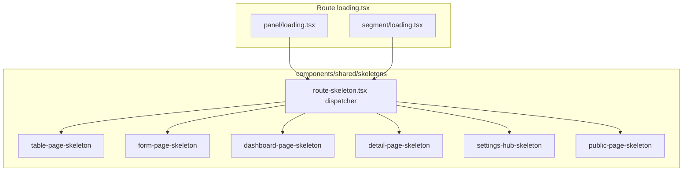

# Полное покрытие skeleton-загрузкой

## Текущее состояние

| Область | Сейчас | Проблема |
|---------|--------|----------|
| `/panel/*` | Один [`panel/loading.tsx`](app/(platform)/panel/loading.tsx) → [`PageSkeleton`](components/platform/page-skeleton.tsx) (таблица) | Формы, дашборд, детали показывают «табличный» скелетон |
| `/p/[token]/*` | Текст «Загрузка...» | [`PublicPageSkeleton`](components/public/public-page-skeleton.tsx) уже есть, но не подключён |
| `/report/[token]/*` | Нет `loading.tsx` | Пустая main-область при навигации |
| Client fetch | Только order-create / measure-select | Остальное — SSR, зависит от route loading |

Базовые примитивы уже есть: [`Skeleton`](components/ui/skeleton.tsx), [`TableSkeleton`](components/ui/table-skeleton.tsx), [`FormSkeleton`](components/shared/form-skeleton.tsx).

## Архитектура

**Принцип:** каждый `loading.tsx` — одна строка с `variant`. Скелетон повторяет реальный layout страницы (header + контент), а не generic spinner.

## 1. Библиотека skeleton-компонентов

Новая папка [`components/shared/skeletons/`](components/shared/skeletons/):

| Компонент | Повторяет layout | Ключевые блоки |
|-----------|------------------|----------------|
| `page-header-skeleton.tsx` | [`PageHeader`](components/shared/page-header.tsx) | title `h-8`, description `h-4`, optional back + actions |
| `table-page-skeleton.tsx` | list pages (orders, measures…) | header + toolbar + `TableSkeleton` (перенос из `PageSkeleton`) |
| `form-page-skeleton.tsx` | form pages | header + `FormSkeleton` + optional actions bar |
| `dashboard-page-skeleton.tsx` | [`/panel`](app/(platform)/panel/page.tsx), report dashboard | header + 4 stat cards + 3 chart cards (`h-48`) + table |
| `detail-cards-skeleton.tsx` | response/delay detail | header + 2-col cards grid + text block |
| `detail-table-skeleton.tsx` | order detail, org detail | header + actions + table (8 cols) |
| `settings-hub-skeleton.tsx` | [`settings-hub-client`](components/platform/settings-hub-client.tsx) | header + 4–5 nav card rows |
| `public-table-page-skeleton.tsx` | public lists | `max-w-5xl` wrapper + table (перенос `PublicPageSkeleton`) |
| `public-detail-skeleton.tsx` | public item detail | header + 2-col cards + form block |
| `route-skeleton.tsx` | dispatcher | `variant` prop, единая точка входа |

[`components/platform/page-skeleton.tsx`](components/platform/page-skeleton.tsx) — оставить как re-export `TablePageSkeleton` (обратная совместимость).

Расширить [`FormSkeleton`](components/shared/form-skeleton.tsx): props `fields`, `singleCard`, `showHeader`, `showActions`.

## 2. Platform `/panel` — nested `loading.tsx`

Заменить содержимое [`panel/loading.tsx`](app/(platform)/panel/loading.tsx) на **dashboard** variant (только для `/panel` и дочерних без своего loading).

Добавить segment-level `loading.tsx` (каждый импортирует `RouteSkeleton`):

| Маршрут | variant | Параметры |
|---------|---------|-----------|
| `orders/`, `measures/`, `organizations/`, `delay-requests/`, `responses/`, `settings/users/` | `table` | columns по странице |
| `orders/[id]/`, `organizations/[id]/` | `detail-table` | columns: 8 / 6 |
| `orders/new/`, `measures/new/`, `measures/[id]/edit`, `organizations/new/`, `organizations/[id]/edit`, subdivisions new/edit, `settings/account`, `settings/general`, `settings/auth`, `settings/users/new`, `settings/users/[id]/edit`, `change-password` | `form` | `singleCard` где одна карточка |
| `orders/new/measures/` | `table` | wide measure-select table |
| `delay-requests/[id]/`, `responses/[id]/` | `detail-cards` | — |
| `settings/` (hub) | `settings-hub` | — |
| `responses/` (list) | `table` | новая страница |

Итого ~20 файлов `loading.tsx`, каждый 3–5 строк.

## 3. Public `/p/[token]`

- Обновить [`p/[token]/loading.tsx`](app/(public)/p/[token]/loading.tsx): `PublicTablePageSkeleton` вместо текста.
- Добавить:
  - `p/[token]/items/[id]/loading.tsx` → `public-detail` (2 карточки + форма)
  - `p/[token]/orders/[orderId]/loading.tsx` → `public-table` (меры в поручении)

Дашборд `/p/[token]` наследует parent loading (таблица/matrix) — ок.

## 4. Report `/report/[token]`

Добавить [`report/[token]/loading.tsx`](app/(public)/report/[token]/loading.tsx) → `dashboard` variant (как panel dashboard).

Дочерние:
- `items/[id]/loading.tsx` → `detail-cards` + attachments block
- `orders/[orderId]/loading.tsx` → `table`
- `organizations/[id]/loading.tsx` → `table`

Layout [`report/[token]/layout.tsx`](app/(public)/report/[token]/layout.tsx) остаётся async; `loading.tsx` на том же уровне покрывает ожидание layout+page.

## 5. Client-side loading (точечно)

Уже покрыто: [`order-create-form`](components/platform/order-create-form.tsx), [`order-measure-select-client`](components/platform/order-measure-select-client.tsx).

Дополнительно:
- [`order-create-form`](components/platform/order-create-form.tsx): заменить inline `FormSkeleton` на `FormPageSkeleton` (с header) для一致ия с route loading.
- Upload spinner в [`commentary-attachments-field`](components/shared/commentary-attachments-field.tsx) — оставить (action-level, не page-level).

**Вне scope:** submit-кнопки со `Spinner`, sidebar badge fetch, dialog loading.

## 6. Документация и конвенция

Обновить [`AGENTS.md`](AGENTS.md):
- Новые страницы обязаны иметь `loading.tsx` с подходящим `RouteSkeleton variant`.
- Тип страницы → variant mapping.
- Client fetch >200ms → skeleton того же variant, не пустой div.

## 7. Проверка (DoD)

- Навигация по всем основным URL без «Загрузка...» и пустого main:
  - `/panel`, `/panel/orders`, `/panel/orders/1`, `/panel/orders/new`
  - `/panel/measures`, `/panel/settings`, `/panel/settings/general`
  - `/panel/responses`, `/panel/delay-requests/1`
  - `/p/{token}`, `/p/{token}/items/{id}`
  - `/report/{token}`, `/report/{token}/items/{id}`
- `npm run typecheck && npm run lint && npm run build`
- Скелетоны визуально соответствуют типу страницы (не таблица на форме)

## Порядок реализации

1. Shared skeleton library + `RouteSkeleton` dispatcher
2. Platform segment `loading.tsx` (batch по типам: table → form → detail → dashboard)
3. Public + Report `loading.tsx`
4. Client-side align (order-create)
5. AGENTS.md + verify build + smoke navigation
