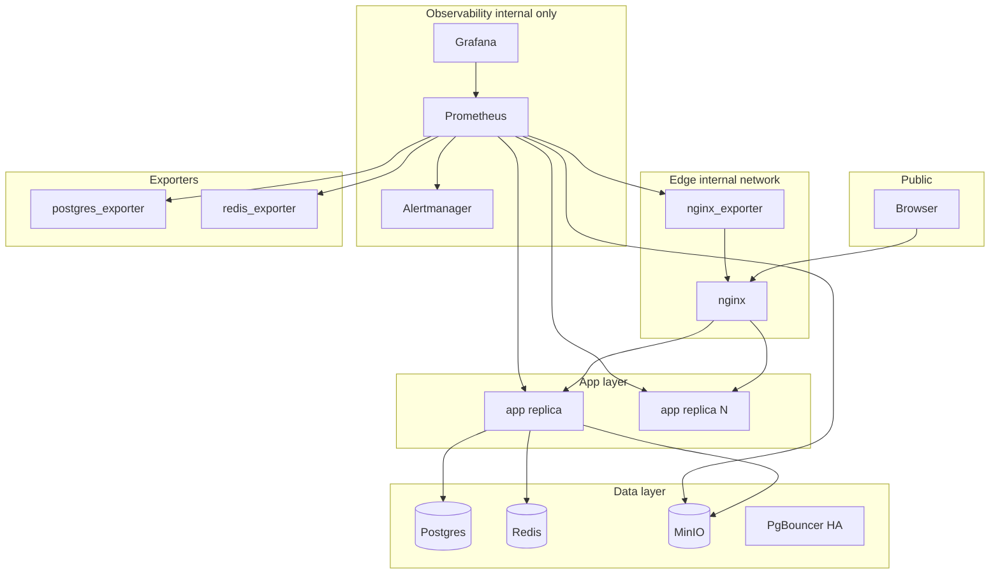

# Prometheus + Grafana для FSTEC

## Контекст

Prod-стек описан в [`docs/deployment.md`](docs/deployment.md):

- **app** — Next.js standalone ([`Dockerfile`](Dockerfile), healthcheck → `/login`)
- **nginx** — TLS, rate limits ([`docker/nginx/conf.d/fstec.conf`](docker/nginx/conf.d/fstec.conf), `/healthz` = статический `200 ok`)
- **Postgres 16**, **Redis 7**, **MinIO** — single ([`docker-compose.prod.yml`](docker-compose.prod.yml)) или HA ([`docker-compose.ha.yml`](docker-compose.ha.yml), до 8 app replicas)
- **Cron:** [`app/api/cron/due-reminders/route.ts`](app/api/cron/due-reminders/route.ts), [`app/api/cron/mail-inbox/route.ts`](app/api/cron/mail-inbox/route.ts) через [`cronRoute`](lib/api/route-handler.ts)

Сейчас **нет** `/api/metrics`, deep health, Prometheus, Grafana. [`middleware.ts`](middleware.ts) покрывает только `/panel/*` — HTTP-метрики нужны на уровне app + nginx, не только middleware.

## Целевая архитектура



**Принцип безопасности:** `/api/metrics`, Grafana (:3000), Prometheus (:9090) — только `internal` Docker network, **не** проксируются через публичный nginx.

---

## Фаза 1 — Health и метрики приложения

### 1.1 Deep health endpoint

Создать [`app/api/health/route.ts`](app/api/health/route.ts):

| Check | Реализация | Критичность |
|-------|------------|-------------|
| `db` | `prisma.$queryRaw\`SELECT 1\`` | required |
| `redis` | `getRedis()?.ping()` | optional (skip если нет `REDIS_URL`) |
| `s3` | `HeadBucketCommand` через [`lib/storage/s3.ts`](lib/storage/s3.ts) | required в prod |

Ответ: `200 { status, checks, uptime }` / `503` при падении required check.

Обновить:
- [`Dockerfile`](Dockerfile) `HEALTHCHECK` → `http://127.0.0.1:3000/api/health`
- Опционально: nginx `/healthz` проксирует на app (или оставить nginx liveness отдельно)

### 1.2 Prometheus metrics в app

Зависимость: `prom-client`.

Новый модуль [`lib/metrics/`](lib/metrics/):

| Файл | Содержимое |
|------|------------|
| `registry.ts` | Singleton `Registry`, default labels: `service=fstec`, `env=NODE_ENV` |
| `default.ts` | `collectDefaultMetrics()` — heap, event loop, GC |
| `http.ts` | `http_requests_total{method,route,status}`, `http_request_duration_seconds` histogram |
| `cron.ts` | `fstec_cron_runs_total{job,status}`, `fstec_cron_last_success_timestamp{job}` |
| `public.ts` | `fstec_rate_limit_rejected_total` (optional) |

Endpoint [`app/api/metrics/route.ts`](app/api/metrics/route.ts):
- `Content-Type: text/plain; version=0.0.4`
- Guard: `METRICS_ENABLED !== "false"` + optional `METRICS_TOKEN` (Bearer)
- Доступ только из internal network (compose network, не nginx)

### 1.3 HTTP instrumentation

**API routes (47 handlers):** обёртка `withMetrics(handler)` в [`lib/api/route-handler.ts`](lib/api/route-handler.ts) или отдельный `lib/metrics/with-http-metrics.ts`:
- Нормализация path: `/api/orders/123` → `/api/orders/:id` (ограничить cardinality)
- Интеграция в `cronRoute` для cron latency

**RSC/pages:** покрываются nginx-exporter (edge RPS/latency), не дублировать в app.

**Server bootstrap:** [`instrumentation.ts`](instrumentation.ts) (Next.js hook) — `collectDefaultMetrics()` при старте Node.

### 1.4 Cron metrics

В [`cronRoute`](lib/api/route-handler.ts) после успешного handler:
```ts
cronRunsTotal.inc({ job: jobName, status: "success" })
cronLastSuccess.set({ job: jobName }, Date.now() / 1000)
```
Job names: `due-reminders`, `mail-inbox`.

### 1.5 Тесты

- [`lib/metrics/__tests__/`](lib/metrics/__tests__/) — registry, path normalization, metrics endpoint auth
- Обновить [`lib/api/__tests__/route-handler.test.ts`](lib/api/__tests__/route-handler.test.ts) для cron metrics mock

---

## Фаза 2 — Docker overlay observability

Новый файл [`docker-compose.observability.yml`](docker-compose.observability.yml) (overlay к prod):

| Service | Image | Назначение |
|---------|-------|------------|
| `prometheus` | `prom/prometheus:v3.x` | Scrape + rules |
| `grafana` | `grafana/grafana:11.x` | Dashboards |
| `alertmanager` | `prom/alertmanager:v0.28.x` | Notifications |
| `nginx-exporter` | `nginx/nginx-prometheus-exporter:1.x` | nginx stub_status |
| `postgres-exporter` | `prometheuscommunity/postgres-exporter` | PG metrics |
| `redis-exporter` | `oliver006/redis_exporter` | Redis metrics |

Volumes/config:
```
docker/
  prometheus/
    prometheus.yml
    alerts/
      fstec.yml
  grafana/
    provisioning/
      datasources/prometheus.yml
      dashboards/
        fstec-overview.json
        fstec-app.json
        fstec-infra.json
  alertmanager/
    alertmanager.yml
```

Запуск:
```bash
docker compose \
  -f docker-compose.prod.yml \
  -f docker-compose.observability.yml \
  --profile single up -d
```

Порты (bind localhost only):
- Grafana: `${GRAFANA_PORT:-3001}:3000`
- Prometheus: `${PROMETHEUS_PORT:-9090}:9090` (dev/debug)

Env в [`.env.production.example`](.env.production.example):
```bash
METRICS_ENABLED=true
METRICS_TOKEN=          # optional Bearer for scrape
GRAFANA_ADMIN_PASSWORD=
GRAFANA_PORT=3001
PROMETHEUS_PORT=9090
```

---

## Фаза 3 — nginx и MinIO metrics

### nginx stub_status

В [`docker/nginx/conf.d/fstec.conf`](docker/nginx/conf.d/fstec.conf) добавить internal location:
```nginx
location /nginx_status {
  stub_status;
  allow 127.0.0.1;
  allow 172.16.0.0/12;
  deny all;
}
```

`nginx-exporter` scrape: `-nginx.scrape-uri=http://nginx:8080/nginx_status`

### MinIO

Встроенный endpoint: `GET /minio/v2/metrics/cluster` (port 9000, internal).
Prometheus job с bearer token (MinIO `mc admin prometheus generate`).

---

## Фаза 4 — Prometheus scrape config

[`docker/prometheus/prometheus.yml`](docker/prometheus/prometheus.yml):

| job_name | Target | Примечание |
|----------|--------|------------|
| `fstec-app` | `tasks.app:3000/api/metrics` | DNS SD для scaled replicas |
| `nginx` | `nginx-exporter:9113` | |
| `postgres` | `postgres-exporter:9187` | read-only DB user |
| `redis` | `redis-exporter:9121` | |
| `minio` | `minio:9000` | `/minio/v2/metrics/cluster` |

**Multi-replica (tier 2–3):** Docker Compose DNS `tasks.app` возвращает все IP app-контейнеров. Relabel: `instance`, `replica`.

**HA overlay** ([`docker-compose.ha.yml`](docker-compose.ha.yml)) — дополнительные jobs:

| job_name | Target |
|----------|--------|
| `postgres-primary` | postgres-exporter → PgBouncer write / primary |
| `postgres-replica` | отдельный exporter → read replica |
| `redis-sentinel` | redis_exporter с sentinel mode |
| `pgbouncer` | pgbouncer_exporter (если добавить сервис) |

postgres-exporter: создать read-only user `fstec_exporter` в migration/init script [`docker/postgres/`](docker/postgres/).

---

## Фаза 5 — Grafana dashboards

Provisioning через [`docker/grafana/provisioning/`](docker/grafana/provisioning/):

| Dashboard | Панели |
|-----------|--------|
| **FSTEC Overview** | UP targets, RPS (nginx + app), error rate 5xx, p95 latency, replica count |
| **FSTEC App** | Node.js heap, event loop lag, HTTP by route, cron last success |
| **FSTEC Infra** | Postgres connections/locks/replication lag, Redis memory/hit rate, MinIO disk/API |
| **FSTEC Cron** | `fstec_cron_last_success_timestamp`, run duration, failures |

Community dashboards как база (import + customize):
- PostgreSQL: Grafana ID 9628
- Redis: ID 11835
- nginx: ID 12708

---

## Фаза 6 — Alertmanager rules

[`docker/prometheus/alerts/fstec.yml`](docker/prometheus/alerts/fstec.yml):

| Alert | Expr | Severity | For |
|-------|------|----------|-----|
| `FstecAppDown` | `up{job="fstec-app"} == 0` | critical | 1m |
| `FstecHighErrorRate` | `rate(http_requests_total{status=~"5.."}[5m]) / rate(http_requests_total[5m]) > 0.05` | warning | 5m |
| `FstecHighLatency` | `histogram_quantile(0.95, rate(http_request_duration_seconds_bucket[5m])) > 2` | warning | 10m |
| `PostgresDown` | `pg_up == 0` | critical | 1m |
| `RedisDown` | `redis_up == 0` | critical | 1m |
| `RedisMemoryHigh` | `redis_memory_used_bytes / redis_memory_max_bytes > 0.85` | warning | 5m |
| `PostgresReplicationLag` | `pg_replication_lag > 30` | warning | 2m |
| `MinioDiskLow` | `minio_cluster_disk_free_bytes / minio_cluster_disk_total_bytes < 0.15` | warning | 5m |
| `CronDueRemindersStale` | `time() - fstec_cron_last_success_timestamp{job="due-reminders"} > 90000` | warning | 15m |
| `CronMailInboxFailed` | `increase(fstec_cron_runs_total{job="mail-inbox",status="error"}[1h]) > 0` | warning | 0m |

Alertmanager → email (`OPERATOR_NOTIFY_EMAIL`) или Telegram webhook ([`docker/alertmanager/alertmanager.yml`](docker/alertmanager/alertmanager.yml)).

---

## Фаза 7 — Документация и verify

Обновить [`docs/deployment.md`](docs/deployment.md):
- секция «Observability»
- команды запуска overlay
- env vars, порты, security notes
- promtool validate в CI (optional lint job)

Verify DoD:
```bash
# 1. Stack up
sh docker/scripts/prod-scale.sh --build -d
docker compose -f docker-compose.prod.yml -f docker-compose.observability.yml up -d

# 2. Targets UP
curl -s http://localhost:9090/api/v1/targets | jq '.data.activeTargets[].health'

# 3. Metrics from app
docker compose exec app wget -qO- http://127.0.0.1:3000/api/metrics | head

# 4. Health deep check
curl -s http://localhost:8080/api/health  # via nginx internal or direct

# 5. Alert smoke: docker stop app → FstecAppDown fires within 2m
```

---

## Структура новых файлов

```
app/api/health/route.ts
app/api/metrics/route.ts
instrumentation.ts
lib/metrics/
  registry.ts
  default.ts
  http.ts
  cron.ts
  with-http-metrics.ts
  normalize-route.ts
  __tests__/
docker-compose.observability.yml
docker/prometheus/prometheus.yml
docker/prometheus/alerts/fstec.yml
docker/grafana/provisioning/...
docker/alertmanager/alertmanager.yml
docker/postgres/exporter/init.sql   # read-only user
```

---

## Риски и ограничения

- **Cardinality:** нормализация route labels обязательна; не label'ить userId/token/orgId
- **Next.js standalone:** `instrumentation.ts` требует `experimental.instrumentationHook` (уже default в Next 15+)
- **Read-only app container:** metrics endpoint не пишет на disk — OK
- **HA complexity:** PgBouncer/Sentinel exporters — отдельные scrape jobs, тестировать на `SCALE_TIER=3`
- **MinIO metrics auth:** настроить bearer, не использовать root credentials в Prometheus

---

## Оценка

| Фаза | Effort |
|------|--------|
| 1 Health + app metrics | 1.5d |
| 2 Docker overlay | 0.5d |
| 3 nginx + MinIO | 0.5d |
| 4 Prometheus config + HA | 1d |
| 5 Grafana dashboards | 1d |
| 6 Alerts + Alertmanager | 0.5d |
| 7 Docs + verify | 0.5d |
| **Итого** | **~5.5d** |
