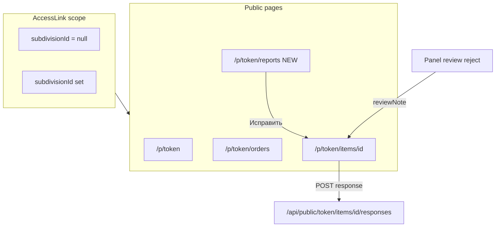

# Отчёты на публичной вкладке (org/subdivision scope)

## Контекст и границы

Сейчас публичный портал ([`app/(public)/p/[token]/`](app/(public)/p/[token]/)) — это **исполнительский** интерфейс: сводка + поручения + отправка отчётов на странице меры. Возврат с комментарием уже реализован на item detail ([`components/public/public-item-detail.tsx`](components/public/public-item-detail.tsx)) — `Alert variant="destructive"` + текст в [`ItemReportWorkflowCard`](components/shared/item-detail/item-report-workflow-card.tsx).

**Чего нет:**
- пункта «Отчёты» в сайдбаре ([`lib/public/build-public-nav-main.tsx`](lib/public/build-public-nav-main.tsx) — только «Сводка» и «Поручения»);
- централизованного списка отчётов в скоупе ссылки;
- заметной индикации «нужно переделать» до перехода на конкретную меру;
- колонки статуса отчёта в таблицах мер ([`MeasuresDataTable`](components/shared/measures-data-table.tsx) не знает про `reviewStatus`).

**Вне скоупа:** глобальная read-only отчётная ссылка [`/report/[token]`](app/(public)/report/[token]/page.tsx) (`ReportLink`) — другой продукт; не сливаем с `/p/`.



---

## Ключевое UX-решение: список по мерам, не по истории Response

Панель ([`/panel/responses`](app/(platform)/panel/responses/page.tsx)) показывает **все записи** `Response`. Для исполнителя это плохо: после повторной отправки старый `REJECTED` останется в истории и запутает.

**Публичный список — one row per order item**, только **последний** отчёт (`responses: { orderBy: submittedAt desc, take: 1 }`), отфильтрованный через существующий `itemScopeWhere` из [`lib/public/validate-token.ts`](lib/public/validate-token.ts):

```typescript
// org link: order.organizationId
// subdivision link: + subdivisionId
function itemScopeWhere(link) { ... }
```

Фильтры (исполнительская терминология, не копия панели):

| Фильтр | Условие (по latest response + статус меры) |
|--------|---------------------------------------------|
| Все | есть хотя бы один отчёт в скоупе |
| На проверке | `latest.reviewStatus === PENDING` |
| **Требуют доработки** | `latest.reviewStatus === REJECTED` и мера не завершена (`IN_PROGRESS`) |
| Приняты | `latest.reviewStatus === ACCEPTED` или мера `COMPLETED` |

CTA для rejected: кнопка/ссылка **«Исправить»** → `/p/{token}/items/{id}` (форма resubmit уже есть).

---

## Индикация «нужно переделать» — без ломания стиля

Переиспользовать существующие паттерны из review workflow ([`.cursor/plans/report_review_workflow_74a0732f.plan.md`](.cursor/plans/report_review_workflow_74a0732f.plan.md)):

| Место | Паттерн | Детали |
|-------|---------|--------|
| Shared alert | `Alert variant="destructive"` | Заголовок **«Требуется доработка»** (или сохранить «Отчёт не принят» для консистентности с item detail) |
| Badge статуса | [`RESPONSE_REVIEW_STATUS_*`](lib/ui/response-review-status.ts) | Для rejected — `outline` + label «Не принят» |
| Карточка workflow | `border-destructive/30 bg-destructive/5` | Уже есть для `isPendingReview`; добавить для `isRejected` |
| Таблица | `bg-destructive/5` на строке + колонка «Замечания» | `TruncatedCell` / `OverflowText`, `whitespace-pre-wrap` в tooltip |
| Nav badge | `Badge variant="destructive"` | Только count «требуют доработки», не pending |
| Dashboard banner | `Alert variant="destructive"` | «N отчётов возвращены на доработку» + Link на `?status=REJECTED` |

**Новый shared-компонент** (DRY, ~15 строк):

[`components/shared/response-revision-alert.tsx`](components/shared/response-revision-alert.tsx)

```tsx
// title: "Отчёт не принят" | optional action Link
// reviewNote с whitespace-pre-wrap
```

Заменить inline Alert в [`public-item-detail.tsx`](components/public/public-item-detail.tsx) на этот компонент.

**Дополнительно на item detail:** в [`ItemReportWorkflowCard`](components/shared/item-detail/item-report-workflow-card.tsx) при `isRejected` — `border-destructive/30 bg-destructive/5` (симметрия с pending) и вставить `ResponseRevisionAlert` **внутри** карточки над формой, чтобы замечание было видно рядом с CTA «Отправить отчёт».

---

## Слой данных

Новый модуль [`lib/public/reports.ts`](lib/public/reports.ts):

- `fetchPublicReportItems(token, statusFilter?)` — `validateAccessLink` + `prismaRead.orderItem.findMany` с `itemScopeWhere`, `responses take:1`, in-memory filter по latest status.
- `countPublicReportsNeedingRevision(token)` — items in scope где latest `REJECTED` и мера не terminal/completed.
- `countPublicReportItems(token, status?)` — для nav badge / banner.
- `serializePublicReportRows()` в [`lib/public/serialize-public.ts`](lib/public/serialize-public.ts).

Тип строки (пример):

```typescript
type PublicReportRow = {
  orderItemId: number
  measure: { id: number; name: string; code: string | null }
  order: { id: number; title: string }
  submittedAt: string | null
  reviewStatus: ResponseReviewStatus | null
  reviewNote: string | null
  needsRevision: boolean // REJECTED + in progress
}
```

Кэш: на первом этапе без отдельного Redis-ключа (запрос лёгкий, scope узкий); при необходимости — TTL 60–300s по аналогии с `access-link:{token}`.

**Revalidation:** при review в панели уже инвалидируется dashboard cache ([`lib/api/revalidate-panel.ts`](lib/api/revalidate-panel.ts)). Добавить `revalidatePath("/p/[token]/reports", "layout")` нельзя без знания token. Достаточно: пользователь видит актуальное состояние при навигации/refresh; item detail после reject обновится при следующем заходе.

---

## UI и маршруты

### 1. Страница отчётов

| Файл | Назначение |
|------|------------|
| [`app/(public)/p/[token]/reports/page.tsx`](app/(public)/p/[token]/reports/page.tsx) | Server page: `PageHeader`, фильтры, banner если `needsRevision > 0` |
| [`app/(public)/p/[token]/reports/loading.tsx`](app/(public)/p/[token]/reports/loading.tsx) | `RouteSkeleton variant="public-table"` |

Структура страницы (зеркало [`panel/responses/page.tsx`](app/(platform)/panel/responses/page.tsx), но исполнительские labels):

- `PageHeader` title **«Отчёты»**, description с org/subdivision из `validateAccessLink`.
- Filter buttons: Все / На проверке / **Требуют доработки** / Приняты (`?status=`).
- Если `needsRevisionCount > 0` и фильтр не REJECTED — destructive `Alert` сверху с CTA «Показать требующие доработки».
- [`components/public/public-reports-table.tsx`](components/public/public-reports-table.tsx) — client table на базе `DataTable`, колонки: поручение, мера, дата, статус (Badge), замечания (только для rejected), action «Исправить» / «Открыть».

### 2. Навигация

[`lib/public/build-public-nav-main.tsx`](lib/public/build-public-nav-main.tsx):
- пункт **«Отчёты»** (`FileTextIcon`), href `/p/{token}/reports`
- показывать если в скоупе есть хотя бы одна мера с отчётом **или** всегда при наличии поручений (пустой state «Отчётов пока нет»)
- `badge`: destructive count из `countPublicReportsNeedingRevision`

[`components/public/public-nav-sidebar-section.tsx`](components/public/public-nav-sidebar-section.tsx) — расширить fetch nav data (revision count в том же запросе или отдельный count).

### 3. Breadcrumbs

[`components/public/public-breadcrumb.tsx`](components/public/public-breadcrumb.tsx) — ветка `/reports` → Сводка → Отчёты.

### 4. Dashboard banner (рекомендуется)

[`app/(public)/p/[token]/page.tsx`](app/(public)/p/[token]/page.tsx) или thin wrapper в dashboard shell — если `needsRevisionCount > 0`, destructive Alert над таблицей мер с ссылкой на `/p/{token}/reports?status=REJECTED`.

Опционально (phase 2, если нужна видимость без перехода в «Отчёты»): расширить fetch scoped items + [`MeasuresTableItem`](lib/measures/table-types.ts) полем `latestReviewStatus` и optional column в `MeasuresDataTable` только для `variant="public"`.

---

## Архитектурные ограничения (AGENTS.md)

- Public pages → только `/api/public/[token]` для мутаций; новая страница **read-only**, данные через `lib/public/*` + `prismaRead`.
- Loading: `public-table` skeleton, layout в `PageContentShell`.
- shadcn: `Alert`, `Badge`, `Button`, `PageHeader`, `DataTable` — без новых кастомных компонентов кроме thin shared alert.
- Не трогать `ReportLink` / `/report/*`.

---

## Порядок реализации

1. **`lib/public/reports.ts`** + serializers + unit-friendly filter logic (latest response per item).
2. **Shared `ResponseRevisionAlert`** + рефактор `public-item-detail` + rejected styling в `ItemReportWorkflowCard`.
3. **`/p/[token]/reports`** page + table + loading skeleton.
4. **Nav + breadcrumb** + revision count badge.
5. **Dashboard banner** на сводке.
6. *(Optional)* колонка статуса отчёта в `MeasuresDataTable` для public variant.

---

## Definition of Done

- `/p/{token}/reports` показывает только меры в скоупе org/subdivision link.
- Фильтр «Требуют доработки» показывает только актуальные rejected (latest), без устаревших записей после resubmit.
- Комментарий ревьюера (`reviewNote`) виден: в списке (truncated), на banner, на item detail (shared alert), в workflow card.
- Nav badge = count мер, требующих доработки.
- Resubmit flow не меняется (`POST /api/public/.../responses`, `PENDING_EXISTS`, reject → `IN_PROGRESS`).
- `npm run typecheck && npm run lint && npm run build`.
- Smoke: reject отчёт в panel → открыть `/p/{token}/reports` → виден alert + строка «Требуют доработки» → «Исправить» → форма resubmit → accept → строка в «Приняты».
