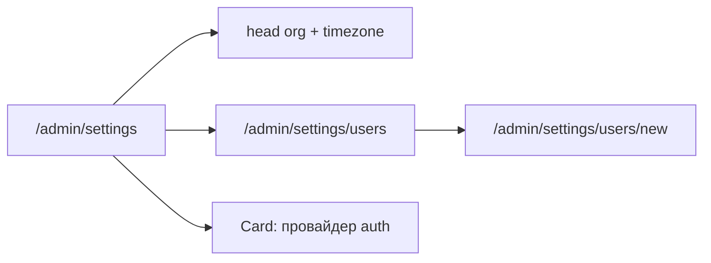

# RBAC, страница пользователей и stub AD/Keycloak

## Текущее состояние

- Все API защищены только `requireAdminSession()` — один уровень доступа
- [`UserRole`](prisma/schema.prisma): единственное значение `ADMIN`
- Создание админов встроено в [`settings-client.tsx`](components/admin/settings-client.tsx)
- Логин — локальный пароль в [`app/api/auth/login/route.ts`](app/api/auth/login/route.ts)

**Выбор пользователя:** granular permissions + роли как наборы permission; пользователи под `/admin/settings/users`.

---

## 1. Permission-based RBAC

**Файл** [`lib/auth/permissions.ts`](lib/auth/permissions.ts):

```ts
export const Permission = {
  settingsRead: "settings:read",
  settingsWrite: "settings:write",
  usersManage: "users:manage",
  measuresRead: "measures:read",
  measuresWrite: "measures:write",
  ordersRead: "orders:read",
  ordersWrite: "orders:write",
  orgsRead: "orgs:read",
  orgsWrite: "orgs:write",
  delaysRead: "delays:read",
  delaysWrite: "delays:write",
} as const

export type Permission = (typeof Permission)[keyof typeof Permission]

export const ROLE_LABELS: Record<UserRole, string> = { ... }

export const ROLE_PERMISSIONS: Record<UserRole, readonly Permission[]> = {
  SUPER_ADMIN: [/* all */],
  OPERATOR: [settingsRead, measures*, orders*, orgs*, delays*],
  VIEWER: [/* *:read only */],
}
```

**Prisma** — расширить enum `UserRole`:

| Роль | Назначение |
|------|------------|
| `SUPER_ADMIN` | все permissions (замена текущего `ADMIN`) |
| `OPERATOR` | операционная работа, без `users:manage` и `settings:write` |
| `VIEWER` | только `*:read` |

Миграция: `UPDATE users SET role = 'SUPER_ADMIN' WHERE role = 'ADMIN'` + удалить `ADMIN` из enum.

**Session** [`lib/auth/session-config.ts`](lib/auth/session-config.ts): добавить `role: UserRole`.

**Helpers** [`lib/auth/session.ts`](lib/auth/session.ts):

- `requirePermission(...permissions: Permission[])` — session + проверка `hasPermission(role, permission)` (OR по списку)
- `getUserPermissions(role)` — для UI

**Login** — записывать `session.role = user.role`.

**API mapping** (замена `requireAdminSession` на `requirePermission`):

| Область | GET | POST/PUT/DELETE |
|---------|-----|-----------------|
| settings | `settings:read` | `settings:write` |
| users | `users:manage` | `users:manage` |
| measures | `measures:read` | `measures:write` |
| orders | `orders:read` | `orders:write` |
| organizations, subdivisions, links | `orgs:read` | `orgs:write` |
| delay-requests | `delays:read` | `delays:write` |
| dashboard | `orders:read` | — |

`requireAdminSession` оставить как alias «любой залогиненный» только где нужен минимальный доступ; иначе — permission.

**UI gating:**
- `GET /api/auth/me` → `{ email, name, role, permissions[] }`
- [`app-sidebar.tsx`](components/app-sidebar.tsx): «Настройки» видны при `settings:read`; подсветка active для `/admin/settings/*`
- Страницы `/admin/settings/users*` — server check `users:manage`, иначе `notFound()` / redirect

---

## 2. Страницы пользователей (отдельно от общих настроек)



| Маршрут | Компонент | Доступ |
|---------|-----------|--------|
| [`/admin/settings`](app/(admin)/admin/(panel)/settings/page.tsx) | упрощённый `SettingsClient` — только общие + card auth | `settings:read` / write |
| [`/admin/settings/users`](app/(admin)/admin/(panel)/settings/users/page.tsx) | `UsersListClient` — DataTable (email, имя, роль, дата) | `users:manage` |
| [`/admin/settings/users/new`](app/(admin)/admin/(panel)/settings/users/new/page.tsx) | `UserForm` — email, имя, пароль, Select роли | `users:manage` |

**Рефакторинг:**
- Убрать блок «Администраторы» из [`settings-client.tsx`](components/admin/settings-client.tsx)
- Добавить ссылку «Пользователи» на settings page (видна при `users:manage`)
- Паттерн форм — как [`organization-form.tsx`](components/admin/organization-form.tsx) + [`measures/new`](app/(admin)/admin/(panel)/measures/new/page.tsx)

**Lib/users:** `listUsers()` возвращает `role`; `createUser()` принимает `role` из [`createUserSchema`](lib/validations/users.ts).

**Breadcrumbs** [`admin-breadcrumb.tsx`](components/admin/admin-breadcrumb.tsx):
- `/admin/settings` → «Настройки»
- `/admin/settings/users` → «Настройки» → «Пользователи»
- `/admin/settings/users/new` → «…» → «Новый пользователь»

---

## 3. Stub AD / Keycloak

**Env** (добавить в `.env.example`):

```env
AUTH_PROVIDER=local   # local | active_directory | keycloak
# AD stub
AD_LDAP_URL=
AD_BASE_DN=
# Keycloak stub
KEYCLOAK_ISSUER=
KEYCLOAK_CLIENT_ID=
KEYCLOAK_CLIENT_SECRET=
```

**Lib** `lib/auth/providers/`:

| Файл | Содержание |
|------|------------|
| `types.ts` | `AuthProvider`, `AuthCredentials`, `AuthResult` |
| `local.ts` | текущая логика email+password через Prisma |
| `active-directory.ts` | stub: `authenticate()` → throw `AUTH_PROVIDER_NOT_CONFIGURED` или return error; `getStatus()` → `{ configured: false, message }` |
| `keycloak.ts` | stub: OAuth redirect URL builder (не реализован), `getStatus()` |
| `index.ts` | `getAuthProvider()`, `getAuthProviderStatus()` по `AUTH_PROVIDER` |

**Login route** — делегировать `getAuthProvider().authenticate(credentials)` вместо inline Prisma.

**UI** — Card «Аутентификация» на `/admin/settings`:
- Текущий провайдер (Локальная / Active Directory / Keycloak)
- Статус stub («Интеграция не настроена» + какие env нужны)
- Кнопки AD/Keycloak disabled с tooltip «Будет доступно в следующей версии»

---

## 4. Проверка (DoD)

```bash
npx prisma migrate dev
npm run typecheck && npm run lint && npm run build
```

**Smoke:**
1. Seed admin → `SUPER_ADMIN`, login работает, `session.role` установлен
2. `/admin/settings` — без таблицы пользователей; ссылка «Пользователи»
3. `/admin/settings/users/new` — создать OPERATOR; login под ним — нет доступа к users API (403)
4. OPERATOR может CRUD поручения; VIEWER — только GET
5. Card auth показывает `local`; при `AUTH_PROVIDER=keycloak` — stub status

---

## Объём вне задачи

- Реальная LDAP/OIDC интеграция
- Редактирование/удаление пользователей
- Кастомные роли в БД (только built-in roles + permission map в коде)
