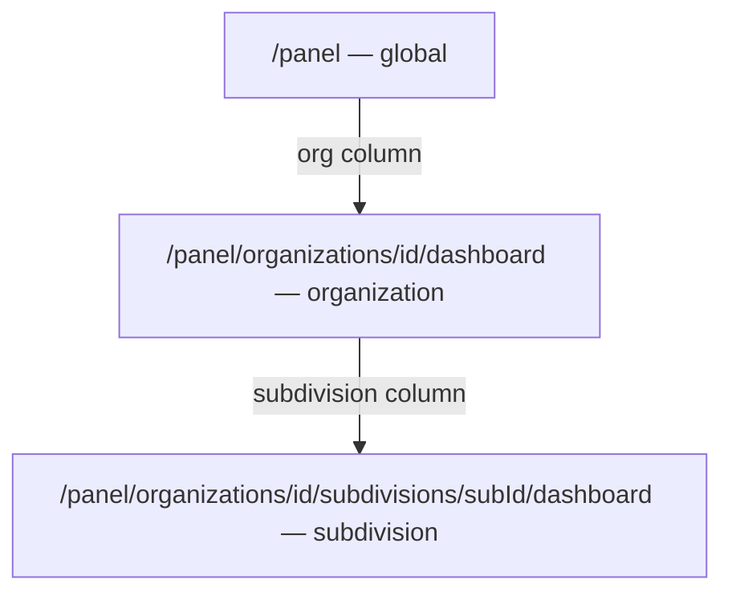

# Drill-down по подразделениям: Report + Public

## Контекст

Platform уже поддерживает трёхуровневую навигацию:



Report и Public **не имеют** scoped dashboard-маршрутов; ссылки в матрице ведут на orders list (report) или никуда (public measures table).

| Вариант | Global dashboard | Org drill-down | Subdivision drill-down |
|---------|------------------|----------------|------------------------|
| Platform | `/panel` | `/panel/organizations/{id}/dashboard` | `/panel/organizations/{id}/subdivisions/{subId}/dashboard` |
| Report | `/report/{token}` | **→ orders list** | **нет** |
| Public (org token) | `/p/{token}` | уже org scope | **нет in-app** (только отдельный token) |

---

## Часть 1: Report share

### 1a. Новые маршруты (копия platform-паттерна)

| Маршрут | Scope | Шаблон |
|---------|-------|--------|
| [`app/(public)/report/[token]/organizations/[id]/dashboard/page.tsx`](app/(public)/report/[token]/organizations/[id]/dashboard/page.tsx) | `{ type: "organization", organizationId }` | [`app/(platform)/panel/organizations/[id]/dashboard/page.tsx`](app/(platform)/panel/organizations/[id]/dashboard/page.tsx) |
| [`app/(public)/report/[token]/organizations/[id]/subdivisions/[subId]/dashboard/page.tsx`](app/(public)/report/[token]/organizations/[id]/subdivisions/[subId]/dashboard/page.tsx) | `{ type: "subdivision", organizationId, subdivisionId }` | platform subdivision dashboard |
| `loading.tsx` для обоих | `RouteSkeleton variant="dashboard"` | |

Страницы: `validateReportToken(token)` + проверка org/sub (`getOrganization`, `getSubdivision`, `subdivision.organizationId === orgId`).

`ScopedDashboardPageShell`:
- `variant="report"`
- `token={token}`
- `chartScope="organization"` / `"subdivision"`
- `baseHref` = текущий dashboard URL

### 1b. Wiring chartScope для report

Сейчас report **захардкожен** на `global`:

```80:88:lib/dashboard/interactive-props.ts
  if (props.variant === "report") {
    return {
      variant: "report",
      scope: "global",  // ← всегда global
```

**Изменения:**

| Файл | Изменение |
|------|-----------|
| [`components/dashboard/dashboard-page-shell.tsx`](components/dashboard/dashboard-page-shell.tsx) | `ReportShellProps`: добавить `chartScope?: ChartFilterScope` |
| [`lib/dashboard/interactive-props.ts`](lib/dashboard/interactive-props.ts) | `ReportInteractiveProps.scope`: `"global" \| "organization" \| "subdivision"`; передавать `props.chartScope` |
| [`components/dashboard/dashboard-matrix-section.tsx`](components/dashboard/dashboard-matrix-section.tsx) | report branch: передать `scope: shellProps.chartScope` |
| [`app/(public)/report/[token]/page.tsx`](app/(public)/report/[token]/page.tsx) | явно `chartScope="global"` |

### 1c. Link targets

[`lib/dashboard/link-targets.ts`](lib/dashboard/link-targets.ts) — report variant:

```ts
organization: (orgId) => `/report/${token}/organizations/${orgId}/dashboard`,
subdivision: (orgId, subId) =>
  `/report/${token}/organizations/${orgId}/subdivisions/${subId}/dashboard`,
```

`DashboardMatrixTable` уже рендерит subdivision links при наличии `linkTargets.subdivision`.

### 1d. Существующий orders list

[`app/(public)/report/[token]/organizations/[id]/page.tsx`](app/(public)/report/[token]/organizations/[id]/page.tsx) — **оставить** как список поручений org (не ломать прямые ссылки). Org column в global matrix переключится на dashboard; orders list доступен с org dashboard через существующие order links или отдельную навигацию при необходимости.

---

## Часть 2: Public portal (org token → subdivision)

### 2a. Новый маршрут subdivision drill-down

[`app/(public)/p/[token]/subdivisions/[subId]/page.tsx`](app/(public)/p/[token]/subdivisions/[subId]/page.tsx)

Условия доступа:
- `validateAccessLink(token)` — link активен
- `link.subdivisionId === null` (только org token; subdivision token уже scoped)
- `subId` принадлежит `link.organizationId`

Shell props (как при subdivision token, но тот же org token):

```tsx
<ScopedDashboardPageShell
  variant="public"
  scope={{ type: "subdivision", organizationId, subdivisionId }}
  publicScope="subdivision"
  showSubdivisionColumn={false}
  title={subdivision.name}
  description={`Подразделение · ${org.name}`}
  baseHref={`/p/${token}/subdivisions/${subId}`}
  ...
/>
```

+ `loading.tsx` (`RouteSkeleton variant="dashboard"`)

### 2b. Кликабельная колонка «Подразделение»

Сейчас [`MeasuresDataTable`](components/shared/measures-data-table.tsx) рендерит subdivision как plain text.

**Изменения:**

| Файл | Изменение |
|------|-----------|
| [`lib/measures/table-types.ts`](lib/measures/table-types.ts) | `subdivisionId?: number \| null` |
| [`lib/public/map-public-items.ts`](lib/public/map-public-items.ts) | маппить `subdivisionId: item.subdivision?.id ?? null` |
| [`lib/public/types.ts`](lib/public/types.ts) | PublicItem наследует subdivisionId |
| [`components/shared/measures-data-table.tsx`](components/shared/measures-data-table.tsx) | prop `subdivisionHref?: (subdivisionId: number) => string`; при наличии — `TextCell` с href |
| [`components/dashboard/scoped-dashboard-view.tsx`](components/dashboard/scoped-dashboard-view.tsx) | для public + `showSubdivisionColumn`: передать `subdivisionHref={(id) => \`/p/${token}/subdivisions/${id}\`}` только если org-scoped (не subdivision token) |

Альтернатива: использовать [`createSubdivisionColumn`](lib/data-table/columns/subdivision-column.tsx) внутри MeasuresDataTable — меньше дублирования.

### 2c. Breadcrumbs

На subdivision page — client helper [`PublicBreadcrumbMiddle`](components/public/public-breadcrumb-effect.tsx):

```
Сводка (/p/{token}) → {subdivision.name}
```

### 2d. Subdivision tokens без изменений

Per-subdivision access links из [`OrgLinksPanel`](components/platform/org-links-panel.tsx) (`/p/{otherToken}`) остаются для внешнего sharing. In-app drill-down — через org token + nested route.

---

## Часть 3: Тесты

| Файл | Что добавить/обновить |
|------|----------------------|
| [`lib/dashboard/__tests__/serialize-dashboard.test.ts`](lib/dashboard/__tests__/serialize-dashboard.test.ts) | report link targets → dashboard URLs + subdivision |
| [`lib/public/map-public-items` tests if exist] | `subdivisionId` mapping |
| Новый unit-тест helper | validate org token + subdivision belongs to org (optional, если вынесем в `lib/public/validate-token.ts`) |

---

## Verify

```bash
npm run typecheck
npm run lint
npm run test
```

Ручная проверка:
- `/report/{token}` → клик org → org dashboard с breakdown по подразделениям → клик subdivision → subdivision dashboard
- `/p/{orgToken}` → клик подразделение в таблице → `/p/{token}/subdivisions/{subId}` с charts по поручениям
- `/p/{subToken}` — без изменений (subdivision column скрыта)
- Chart filters ↔ matrix columns на report org/sub pages

---

## Затрагиваемые файлы

**Report (new):**
- `app/(public)/report/[token]/organizations/[id]/dashboard/page.tsx`
- `app/(public)/report/[token]/organizations/[id]/subdivisions/[subId]/dashboard/page.tsx`

**Public (new):**
- `app/(public)/p/[token]/subdivisions/[subId]/page.tsx`

**Shared wiring:**
- [`lib/dashboard/link-targets.ts`](lib/dashboard/link-targets.ts)
- [`lib/dashboard/interactive-props.ts`](lib/dashboard/interactive-props.ts)
- [`components/dashboard/dashboard-page-shell.tsx`](components/dashboard/dashboard-page-shell.tsx)
- [`components/dashboard/dashboard-matrix-section.tsx`](components/dashboard/dashboard-matrix-section.tsx)
- [`components/shared/measures-data-table.tsx`](components/shared/measures-data-table.tsx)
- [`components/dashboard/scoped-dashboard-view.tsx`](components/dashboard/scoped-dashboard-view.tsx)
- [`lib/public/map-public-items.ts`](lib/public/map-public-items.ts)
