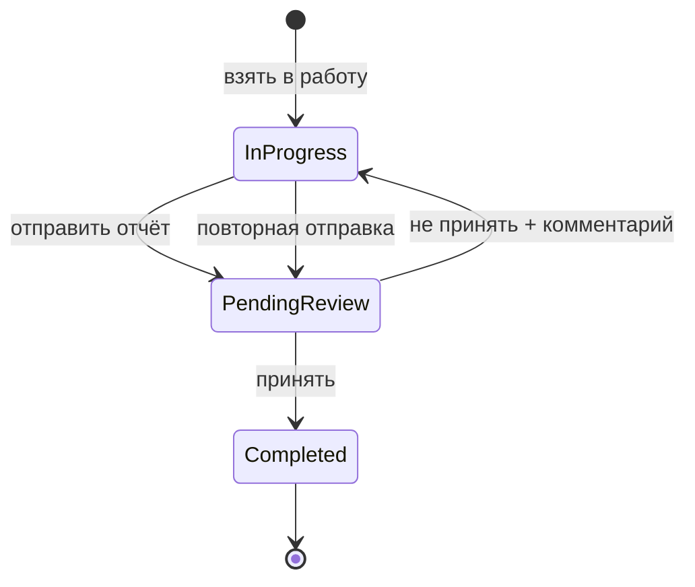

# Приёмка отчётов и скачивание вложений

## Текущее поведение

- [`lib/responses/submit-response.ts`](lib/responses/submit-response.ts) при отправке сразу ставит мере статус **COMPLETED** — отчёт считается принятым автоматически.
- [`ResponseDetailClient`](components/platform/response-detail-client.tsx) — только просмотр, без действий модератора.
- [`AttachmentGallery`](components/shared/attachment-gallery.tsx) — превью и lightbox, без скачивания; GET-роуты (`/api/attachments/{id}`, public/report) делают redirect на presigned URL без `Content-Disposition: attachment`.

## Целевой workflow



| Действие | Статус отчёта | Статус меры |
|----------|---------------|-------------|
| Отправка | `PENDING` | остаётся `IN_PROGRESS` |
| Принять | `ACCEPTED` | `COMPLETED` |
| Не принять | `REJECTED` + `reviewNote` | `IN_PROGRESS` (доработка) |

**Права:** модерация через `ordersWrite` (OPERATOR, SUPER_ADMIN) — тот же уровень, что и отправка отчёта из панели. Просмотр — `ordersRead`.

**Ограничения:**
- Нельзя отправить новый отчёт, пока есть `PENDING` отчёт по этой мере.
- После `REJECTED` исполнитель может отправить новый отчёт (новая запись `Response`, история сохраняется).
- Существующие отчёты в БД → backfill `ACCEPTED` (они были созданы до модерации и меры уже завершены).

## 1. Схема БД и миграция

В [`prisma/schema.prisma`](prisma/schema.prisma):

```prisma
enum ResponseReviewStatus {
  PENDING
  ACCEPTED
  REJECTED
}

model Response {
  ...
  reviewStatus   ResponseReviewStatus @default(PENDING) @map("review_status")
  reviewedById   Int?                 @map("reviewed_by_id")
  reviewedAt     DateTime?            @map("reviewed_at") @db.Timestamptz()
  reviewNote     String?              @map("review_note")
  reviewedBy     User?                @relation("ResponseReviewer", fields: [reviewedById], references: [id])
}
```

На `User` — `reviewedResponses Response[] @relation("ResponseReviewer")`.

Миграция `20260620190000_response_review`:
1. Добавить enum + поля.
2. `UPDATE responses SET review_status = 'ACCEPTED'` для всех существующих записей.

Обновить [`lib/db/client.ts`](lib/db/client.ts) stale-check при необходимости (если появится новая модель/поле).

## 2. Бизнес-логика

### Изменить submit — [`lib/responses/submit-response.ts`](lib/responses/submit-response.ts)

- Убрать `getCompletedStatusId()` и обновление `statusId` при создании.
- Перед созданием: `findFirst({ orderItemId, reviewStatus: PENDING })` → ошибка `PENDING_EXISTS`.
- Создавать `Response` с `reviewStatus: PENDING`.
- Возвращать `item` **без смены статуса** (остаётся `IN_PROGRESS`).

### Новый модуль — `lib/responses/review-response.ts`

```typescript
reviewResponse(responseId, action: "accept" | "reject", reviewerId, reviewNote?)
```

- `accept`: `reviewStatus = ACCEPTED`, `reviewedById/At`, `orderItem.statusId = COMPLETED`.
- `reject`: `reviewStatus = REJECTED`, `reviewNote`, `reviewedById/At`; мера остаётся/возвращается в `IN_PROGRESS` (явный `getInProgressStatusId()` если вдруг не IN_PROGRESS).
- Только если текущий `reviewStatus === PENDING`, иначе `INVALID_STATUS`.

### Расширить — [`lib/responses/index.ts`](lib/responses/index.ts)

- `getResponse` — включить `reviewedBy`, `reviewStatus`, `reviewNote`.
- `countPendingResponses()`, `listResponses(status?)` — по образцу [`lib/delays/index.ts`](lib/delays/index.ts).

### UI-лейблы — `lib/ui/response-review-status.ts`

Аналог [`lib/ui/delay-status.ts`](lib/ui/delay-status.ts): `RESPONSE_REVIEW_STATUS_LABELS`, варианты Badge.

## 3. API

### Новый роут — `app/api/responses/route.ts`

По образцу [`app/api/delay-requests/route.ts`](app/api/delay-requests/route.ts):

- `GET ?count=pending` → `{ count }` (`ordersRead`)
- `GET ?status=PENDING|ACCEPTED|REJECTED` → список (`ordersRead`)
- `POST { id, action: "accept" | "reject", reviewNote? }` → (`ordersWrite`)
  - `reviewNote` обязателен при `reject` (валидация zod)
  - `revalidatePath` для `/panel`, `/panel/responses`, `/panel/orders/{id}`

### Submit-роуты без изменений сигнатуры

- [`app/api/public/.../responses`](app/api/public/[token]/items/[id]/responses/route.ts)
- [`app/api/orders/.../responses`](app/api/orders/[id]/items/[itemId]/responses/route.ts)

Оба продолжают вызывать обновлённый `submitOrderItemResponse`; добавить маппинг ошибки `PENDING_EXISTS` в понятное сообщение.

## 4. Панель: модерация и очередь

### Страница очереди — `app/(platform)/panel/responses/page.tsx`

По образцу [`delay-requests/page.tsx`](app/(platform)/panel/delay-requests/page.tsx):
- Фильтры: Все / Ожидают / Приняты / Не приняты.
- Таблица `components/platform/responses-table.tsx` — мера, организация, поручение, дата, статус, ссылка на деталь.

### Навигация

- [`lib/nav/platform-nav.ts`](lib/nav/platform-nav.ts) — пункт «Отчёты» (`/panel/responses`, `ordersRead`).
- [`components/app-sidebar.tsx`](components/app-sidebar.tsx) — badge с `GET /api/responses?count=pending` (как для переносов).

### Деталь отчёта — [`components/platform/response-detail-client.tsx`](components/platform/response-detail-client.tsx)

Расширить тип `ResponseDetail` полями `reviewStatus`, `reviewNote`, `reviewedAt`, `reviewedBy`.

UI (по образцу [`delay-request-detail-client.tsx`](components/platform/delay-request-detail-client.tsx)):
- Badge статуса в заголовке.
- При `PENDING` + `ordersWrite`: кнопки **«Принять»** / **«Не принять»**.
- При reject — `Textarea` «Комментарий для исполнителя» (обязательное поле).
- Блок «Решение» при `ACCEPTED`/`REJECTED`: кто, когда, комментарий.

### Поручение — [`components/platform/order-detail-client.tsx`](components/platform/order-detail-client.tsx)

- В колонке отчётов — badge статуса (`На проверке` / `Принят` / `Не принят`) у ссылки.
- Скрыть «Отправить отчёт», если у позиции есть `PENDING` отчёт (даже при `IN_PROGRESS`).
- Обновить тип `Response` — добавить `reviewStatus`.

## 5. Публичный портал `/p/{token}`

### Сервер — [`app/(public)/p/[token]/items/[id]/page.tsx`](app/(public)/p/[token]/items/[id]/page.tsx)

Передать в `PublicItemDetail` `latestResponse` (последний по `submittedAt` из уже загружаемых `responses`):
- `reviewStatus`, `reviewNote`, `result`, `commentary`, `submittedAt`, `submittedByLabel`.

### Клиент — [`components/public/public-item-detail.tsx`](components/public/public-item-detail.tsx)

| Состояние | UI |
|-----------|-----|
| `IN_PROGRESS`, нет pending | форма отчёта (как сейчас) |
| `IN_PROGRESS`, latest `PENDING` | «Отчёт отправлен, ожидает проверки»; форма скрыта |
| `IN_PROGRESS`, latest `REJECTED` | показать `reviewNote`; форма доступна для повторной отправки |
| `COMPLETED` | «Мера завершена, отчёт принят» |

- Успех submit: «Отчёт отправлен, ожидает проверки» (не менять статус меры на completed в state).
- Badge «На проверке» в карточке срока, если latest `PENDING`.

## 6. Скачивание изображений

### Storage — [`lib/storage/s3.ts`](lib/storage/s3.ts)

Расширить `createGetPresignedUrl(storageKey, options?: { downloadFilename?: string })`:
```typescript
ResponseContentDisposition: `attachment; filename="${encodeURIComponent(filename)}"`
```

### Attachments lib — [`lib/attachments/index.ts`](lib/attachments/index.ts)

`getAttachmentDownloadUrl(attachmentId)` — presigned GET с `originalName`.

### API-роуты — query `?download=1`

Обновить все GET attachment routes:
- [`app/api/attachments/[id]/route.ts`](app/api/attachments/[id]/route.ts)
- [`app/api/public/[token]/attachments/[id]/route.ts`](app/api/public/[token]/attachments/[id]/route.ts)
- [`app/api/report/[token]/attachments/[id]/route.ts`](app/api/report/[token]/attachments/[id]/route.ts)

При `download=1` — redirect на presigned URL с `Content-Disposition`; иначе — inline (как сейчас).

### UI — [`components/shared/attachment-gallery.tsx`](components/shared/attachment-gallery.tsx)

- Расширить `AttachmentViewItem`: опциональный `downloadUrl` (или derive: `${viewUrl}?download=1`).
- На каждом thumbnail — иконка-кнопка «Скачать» (overlay, `stopPropagation` чтобы не открывать lightbox).
- В lightbox — кнопка «Скачать» под изображением.

Обновить все места передачи props:
- [`response-detail-client.tsx`](components/platform/response-detail-client.tsx)
- [`report-item-detail.tsx`](components/report/report-item-detail.tsx)

## 7. Read-only report view (без изменений логики)

[`components/report/report-item-detail.tsx`](components/report/report-item-detail.tsx) — показать `reviewStatus` latest отчёта (информативно) + download в галерее. Модерация только в панели.

## Порядок реализации

1. Prisma + миграция + backfill
2. `submit-response` + `review-response` + `lib/responses` helpers
3. `POST/GET /api/responses`
4. `ResponseDetailClient` (модерация) + очередь `/panel/responses` + sidebar badge
5. `PublicItemDetail` + public page props
6. Download: s3 → API → `AttachmentGallery`
7. `typecheck`, `lint`, `build`; smoke: submit → pending → reject → resubmit → accept → completed

## Definition of Done

- Отправка отчёта не завершает меру; мера завершается только после «Принять».
- «Не принять» с комментарием возвращает меру на доработку; исполнитель видит причину и может отправить снова.
- Оператор видит очередь ожидающих отчётов в `/panel/responses` с badge в сайдбаре.
- У каждого изображения в галерее есть кнопка скачивания с корректным именем файла.
- Существующие отчёты помечены `ACCEPTED`; сборка зелёная.
