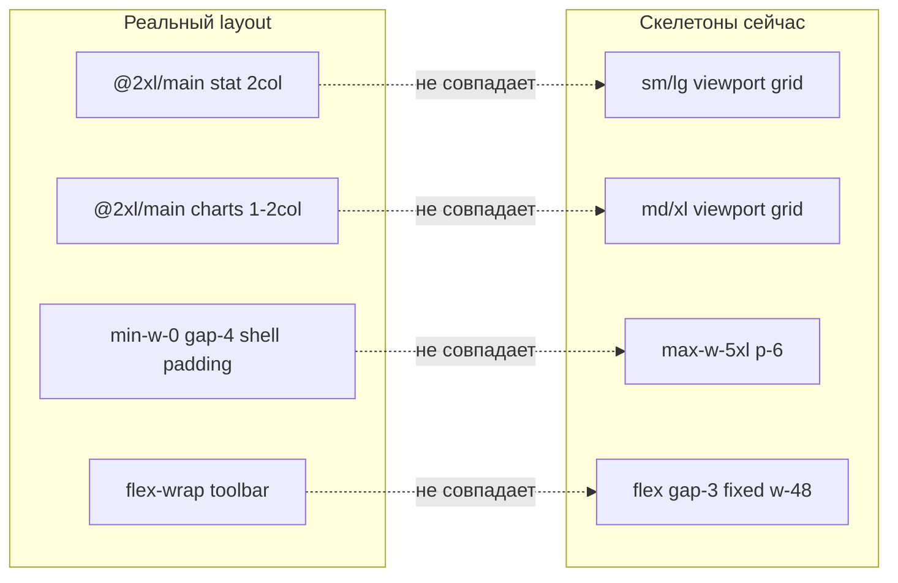

# Адаптивные скелетоны: аудит и исправление

## Диагноз

Скелетоны частично обновлялись (например [`page-header-skeleton.tsx`](components/shared/skeletons/page-header-skeleton.tsx) уже совпадает с responsive `PageHeader`), но **большинство layout-расхождений** остались после недавних изменений dashboard (`@container/main`) и public shell (`AppShell` без `max-w-5xl`).



| Файл | Проблема | Реальный эталон |
|------|----------|-----------------|
| [`dashboard-page-skeleton.tsx`](components/shared/skeletons/dashboard-page-skeleton.tsx) | stat `sm:2 lg:4`, charts `lg:3`, chart `h-48`, toolbar без wrap | [`dashboard-stat-cards.tsx`](components/dashboard/dashboard-stat-cards.tsx) `@2xl/@4xl`; [`scoped-dashboard-charts.tsx`](components/dashboard/scoped-dashboard-charts.tsx) `@2xl/@5xl`, `h-64` |
| [`dashboard-charts-skeleton.tsx`](components/dashboard/dashboard-charts-skeleton.tsx) | `md:2 xl:3`, `h-[220px]` | тот же charts grid + `h-64` |
| [`public-table-page-skeleton.tsx`](components/shared/skeletons/public-table-page-skeleton.tsx) | `mx-auto max-w-5xl p-6` | [`public-orders-list-page.tsx`](components/public/public-orders-list-page.tsx) `flex min-w-0 flex-col gap-4 md:gap-6` внутри shell |
| [`public-detail-skeleton.tsx`](components/shared/skeletons/public-detail-skeleton.tsx) | то же лишнее `max-w-5xl p-6` | public detail pages в shell |
| [`table-page-skeleton.tsx`](components/shared/skeletons/table-page-skeleton.tsx) + detail/dashboard variants | toolbar `flex gap-3` + фикс. `w-48/w-32` | [`data-table-toolbar.tsx`](components/data-table/data-table-toolbar.tsx) `flex-wrap`, search `max-w-sm` |
| [`table-skeleton.tsx`](components/ui/table-skeleton.tsx) | plain `<Table>` без `table-fixed`, `overflow-x-auto`, `min-w-0` | [`data-table.tsx`](components/data-table/data-table.tsx) + [`table.tsx`](components/ui/table.tsx) |
| [`form-skeleton.tsx`](components/shared/form-skeleton.tsx) | actions `flex gap-2` | [`form-actions-bar.tsx`](components/shared/form-actions-bar.tsx) `flex-col sm:flex-row` |
| [`settings-hub-skeleton.tsx`](components/shared/skeletons/settings-hub-skeleton.tsx) | row без `min-w-0`, description `w-64` | [`settings-nav.tsx`](components/platform/settings-nav.tsx) |
| [`data-table-shell.tsx`](components/platform/data-table-shell.tsx) | нет `min-w-0` на toolbar wrapper | влияет на все table skeletons |

**Уже OK:** `PageHeaderSkeleton`, `FormCardGrid`/`FormSkeleton` grid (`lg:grid-cols-2`), `DetailCardsSkeleton` (`md:grid-cols-2`), `PublicSidebarNavSkeleton`.

**Coverage (P2, вне чистой адаптивности):** нет `loading.tsx` для `/report/[token]/*`; большинство `/panel/*` сегментов падают на dashboard skeleton из [`panel/loading.tsx`](app/(platform)/panel/loading.tsx).

---

## Фаза 1 — Общие примитивы (DRY + единая адаптивность)

### 1.1 `components/shared/skeletons/primitives.tsx` (новый)

Вынести повторяющиеся блоки:

```tsx
// TableToolbarSkeleton — flex flex-wrap gap-3 min-w-0
//   - search: h-9 w-full max-w-sm
//   - filter btn: h-9 w-28 shrink-0
//   - columns btn: h-9 w-24 shrink-0

// StatCardsGridSkeleton — grid grid-cols-1 gap-4 @2xl/main:grid-cols-2 @4xl/main:grid-cols-4

// ChartsGridSkeleton — grid min-w-0 grid-cols-1 gap-4 @2xl/main:grid-cols-2 @5xl/main:grid-cols-3
//   - 3rd card: min-w-0 @2xl/main:col-span-2 @5xl/main:col-span-1
//   - chart area: h-64 w-full (не h-48/h-[220px])

// PageContentShell — flex min-w-0 flex-col gap-4 md:gap-6 (стандарт обёртки страницы)
```

### 1.2 Укрепить [`data-table-shell.tsx`](components/platform/data-table-shell.tsx)

```tsx
<div className="flex min-w-0 flex-col gap-3">
  {toolbar && <div className="min-h-10 min-w-0">{toolbar}</div>}
  <div className="min-w-0 overflow-x-auto rounded-md border">...</div>
</div>
```

### 1.3 Укрепить [`table-skeleton.tsx`](components/ui/table-skeleton.tsx)

- Обернуть в `overflow-x-auto` + `table-fixed w-full`
- Ячейки: `Skeleton className="h-3 w-full max-w-full"` (убрать жёсткий `max-w-[120px]`)
- Корневой wrapper: `min-w-0`

---

## Фаза 2 — Синхронизация вариантов RouteSkeleton

| Компонент | Изменения |
|-----------|-----------|
| [`dashboard-page-skeleton.tsx`](components/shared/skeletons/dashboard-page-skeleton.tsx) | `PageContentShell`; `StatCardsGridSkeleton`; `ChartsGridSkeleton`; `TableToolbarSkeleton`; `min-w-0` |
| [`dashboard-charts-skeleton.tsx`](components/dashboard/dashboard-charts-skeleton.tsx) | заменить grid на `ChartsGridSkeleton` (или inline те же классы) |
| [`table-page-skeleton.tsx`](components/shared/skeletons/table-page-skeleton.tsx) | `PageContentShell` + `TableToolbarSkeleton` |
| [`detail-table-skeleton.tsx`](components/shared/skeletons/detail-table-skeleton.tsx) | то же |
| [`public-table-page-skeleton.tsx`](components/shared/skeletons/public-table-page-skeleton.tsx) | убрать `max-w-5xl p-6`; `PageContentShell` + toolbar |
| [`public-detail-skeleton.tsx`](components/shared/skeletons/public-detail-skeleton.tsx) | убрать `max-w-5xl p-6`; `PageContentShell`; cards grid `lg:grid-cols-2` оставить |
| [`form-skeleton.tsx`](components/shared/form-skeleton.tsx) | actions через `FormActionsBar`-подобную обёртку: `flex-col sm:flex-row`, кнопки `flex-wrap` |
| [`settings-hub-skeleton.tsx`](components/shared/skeletons/settings-hub-skeleton.tsx) | rows: `min-w-0`; text block `min-w-0 flex-1`; description `w-full max-w-md` |
| [`detail-cards-skeleton.tsx`](components/shared/skeletons/detail-cards-skeleton.tsx) | добавить `min-w-0` на root; optional `lg:grid-cols-2` → оставить `md:grid-cols-2` (совпадает с detail pages) |

---

## Фаза 3 — Coverage loading.tsx (P2)

Добавить segment-level `loading.tsx` с правильным `variant` (не dashboard для таблиц):

| Маршрут | variant |
|---------|---------|
| `app/(platform)/panel/orders/loading.tsx` | `table` |
| `app/(platform)/panel/measures/loading.tsx` | `table` |
| `app/(platform)/panel/organizations/loading.tsx` | `table` |
| `app/(platform)/panel/settings/loading.tsx` | `settings-hub` |
| `app/(platform)/panel/delay-requests/loading.tsx` | `table` |
| `app/(platform)/panel/responses/loading.tsx` | `table` |
| `app/(public)/report/[token]/loading.tsx` | `dashboard` |
| `app/(public)/report/[token]/orders/loading.tsx` | `public-table` |

Оставить [`panel/loading.tsx`](app/(platform)/panel/loading.tsx) как `dashboard` — корректно для `/panel`.

---

## Фаза 4 — Документация

В [`AGENTS.md`](AGENTS.md) в секции Loading states добавить:

- Skeleton grids повторяют **container queries** (`@2xl/main`, `@4xl/main`), не viewport `md/lg`
- Public/report skeletons **без** собственного `max-w-*` / `p-6` — padding даёт `AppShell`
- Table toolbar skeleton: `flex-wrap` + `max-w-sm` search

---

## Верификация (DoD)

На **375px**, **858px**, **1024px**, **1280px**:

| Маршрут / состояние | Проверка |
|---------------------|----------|
| `/panel` loading | stat 1→2 col по ширине main; charts 1 col на узком; toolbar не вылезает |
| `/p/dev-sber` loading | нет двойного padding; dashboard skeleton на всю ширину content |
| Chart dynamic load | `DashboardChartsSkeleton` совпадает с финальным grid |
| `/panel/orders` (после P2) | table skeleton, не dashboard |
| Client Suspense (`responses-table-section`, `order-measure-select`) | toolbar wrap, horizontal scroll таблицы |
| `npm run typecheck` | green |

## Порядок работ

1. Primitives + `data-table-shell` + `table-skeleton` (фундамент)
2. Dashboard + public skeletons (самые заметные расхождения)
3. Form + settings + detail variants
4. loading.tsx coverage (P2)
5. AGENTS.md + typecheck

## Оценка объёма

- **~12–15 файлов** для P0–P1 (primitives + 8 skeleton variants + 2 UI shells)
- **~8 файлов** для P2 (loading.tsx)
- Без изменений plan-файла
