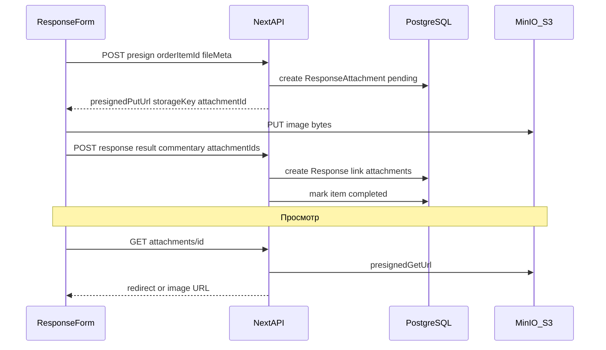

# S3/MinIO хранилище и вложения к отчёту

## Текущее состояние

- Модель [`Response`](prisma/schema.prisma): поля `result`, `commentary`, `submittedByLabel` — **вложений нет**
- Отправка отчёта: только [`POST /api/public/{token}/items/{id}/responses`](app/api/public/[token]/items/[id]/responses/route.ts)
- UI [`PublicItemDetail`](components/public/public-item-detail.tsx): есть `result`, но `commentary` всегда `null`, нет загрузки файлов
- Панель: только просмотр отчётов ([`ResponseDetailClient`](components/platform/response-detail-client.tsx)), **нет API/UI для отправки отчёта оператором**

## Архитектура



**Почему presigned URL, а не multipart через Next.js:** файлы не проходят через сервер приложения, меньше нагрузка, стандартный паттерн для S3/MinIO.

## 1. Инфраструктура MinIO + S3 client

**[`docker-compose.yml`](docker-compose.yml)** — сервис `minio`:
- API `:9000`, console `:9001`
- volume `minio_data`
- healthcheck

**[`.env.example`](.env.example)** — новые переменные:
```
S3_ENDPOINT=http://localhost:9000
S3_REGION=us-east-1
S3_ACCESS_KEY=minio
S3_SECRET_KEY=minioadmin
S3_BUCKET=fstec-attachments
S3_FORCE_PATH_STYLE=true
```

**Зависимости:** `@aws-sdk/client-s3`, `@aws-sdk/s3-request-presigner`

**[`lib/storage/s3.ts`](lib/storage/s3.ts)** — singleton S3 client (path-style для MinIO), `ensureBucket()`, `putPresignedUrl()`, `getPresignedUrl()`

**[`lib/storage/config.ts`](lib/storage/config.ts)** — чтение env, валидация при старте upload

## 2. Модель данных

**Prisma** — новая таблица `ResponseAttachment`:

```prisma
model ResponseAttachment {
  id           Int       @id @default(autoincrement())
  responseId   Int?      @map("response_id")
  orderItemId  Int       @map("order_item_id")
  storageKey   String    @unique @map("storage_key")
  originalName String    @map("original_name")
  mimeType     String    @map("mime_type")
  sizeBytes    Int       @map("size_bytes")
  createdAt    DateTime  @default(now()) @map("created_at")
  response     Response? @relation(fields: [responseId], references: [id], onDelete: Cascade)
  orderItem    OrderItem @relation(fields: [orderItemId], references: [id], onDelete: Cascade)

  @@index([orderItemId, responseId])
  @@map("response_attachments")
}
```

Связь `Response.attachments ResponseAttachment[]`.

Жизненный цикл:
1. **Presign** → запись с `responseId = null`, `orderItemId` зафиксирован
2. **Submit response** → привязка `attachmentIds` к созданному `Response`
3. Orphan cleanup (вне scope v1): записи без response старше 24ч

## 3. Доменная логика

**[`lib/attachments/index.ts`](lib/attachments/index.ts)**:
- `createPendingAttachment(orderItemId, meta)` → presigned PUT + DB row
- `linkAttachmentsToResponse(responseId, orderItemId, attachmentIds)`
- `getAttachmentForPublicToken(token, attachmentId)` / `ForPanel(user)` / `ForReportToken(token)`
- `listAttachmentsForResponse(responseId)`

**Валидация файлов** (server-side):
- MIME: `image/jpeg`, `image/png`, `image/webp`, `image/gif`
- Max size: **5 MB** на файл
- Max count: **10** на один отчёт
- Storage key: `attachments/{orderItemId}/{uuid}.{ext}`

## 4. API

| Метод | Путь | Auth | Назначение |
|-------|------|------|------------|
| POST | `/api/public/{token}/items/{id}/attachments/presign` | access token | presign для ДЗО |
| POST | `/api/orders/{id}/items/{itemId}/attachments/presign` | session + `ordersWrite` | presign для панели |
| POST | `/api/public/{token}/items/{id}/responses` | access token | **расширить**: `commentary`, `attachmentIds[]` |
| POST | `/api/orders/{id}/items/{itemId}/responses` | session + `ordersWrite` | **новый** — отправка отчёта из панели |
| GET | `/api/public/{token}/attachments/{id}` | access token | redirect на presigned GET |
| GET | `/api/attachments/{id}` | session + `ordersRead` | просмотр в панели |
| GET | `/api/report/{token}/attachments/{id}` | report token | read-only в отчёте |

Общая логика submit вынести в [`lib/responses/submit-response.ts`](lib/responses/submit-response.ts) — переиспользуется public и panel routes.

**[`lib/validations/public.ts`](lib/validations/public.ts)** — добавить `attachmentIds: z.array(z.number().int().positive()).max(10).optional()`

## 5. UI — общий компонент загрузки

**[`components/shared/commentary-attachments-field.tsx`](components/shared/commentary-attachments-field.tsx)**:
- `Textarea` для комментария
- Зона drag-and-drop + кнопка «Прикрепить»
- Paste из буфера (скриншоты) через `onPaste`
- Превью миниатюр с удалением до отправки
- Props: `presignUrl`, `disabled`, `onChange({ commentary, attachmentIds })`
- Состояния: uploading / error per file

**[`components/shared/attachment-gallery.tsx`](components/shared/attachment-gallery.tsx)**:
- Сетка изображений для просмотра (lightbox по клику — Dialog + `next/image` или `` с signed URL)

## 6. Интеграция в формы

### Публичный портал — [`components/public/public-item-detail.tsx`](components/public/public-item-detail.tsx)
- Разделить форму: `result` (обязательно) + блок **«Комментарий»** с `CommentaryAttachmentsField`
- `submitReport`: передать `commentary` и `attachmentIds`
- После отправки — очистить вложения

### Панель — новый [`components/platform/submit-response-dialog.tsx`](components/platform/submit-response-dialog.tsx)
- Dialog «Отправить отчёт» на странице поручения ([`order-detail-client.tsx`](components/platform/order-detail-client.tsx))
- Доступен для мер в статусе «В работе» (`ordersWrite`)
- Тот же `CommentaryAttachmentsField`, presign через panel API
- После успеха — `router.refresh()`

### Просмотр вложений
- [`components/platform/response-detail-client.tsx`](components/platform/response-detail-client.tsx) — галерея под комментарием
- [`components/report/report-item-detail.tsx`](components/report/report-item-detail.tsx) — комментарий + галерея (read-only)
- [`lib/responses/index.ts`](lib/responses/index.ts) — `include: { attachments: true }`

## 7. Quick start / dev

Обновить [`.env.example`](.env.example) и [`README.md`](README.md):
```bash
docker compose up -d db minio
```
Bucket создаётся автоматически при первом presign (`ensureBucket`).

## Definition of Done

1. MinIO поднимается через `docker compose`, приложение читает S3 env
2. Исполнитель на `/p/{token}` может добавить комментарий + до 10 изображений к отчёту
3. Оператор на `/panel/orders/{id}` может отправить отчёт с теми же вложениями
4. Вложения видны в `/panel/responses/{id}`, в report read-only, не доступны без scope
5. Невалидный MIME/размер отклоняется на presign
6. `typecheck`, `lint`, `build` проходят

## Вне scope (v1)

- Удаление вложений после отправки
- Cron очистки orphan uploads
- HEIC/TIFF, видео, PDF
- Платформенная страница отдельной меры (только dialog на поручении)
