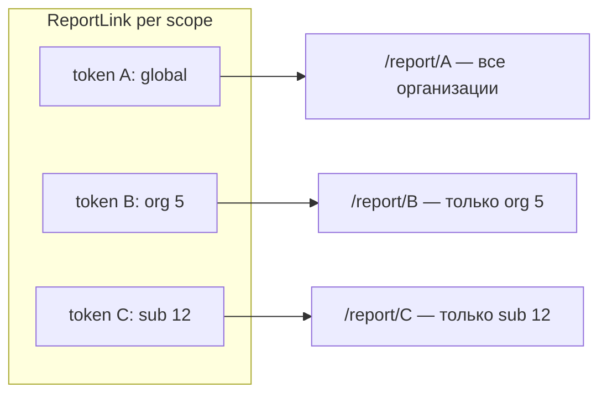

# Уникальные report-ссылки по срезам + Input в «Поделиться»

## Проблема сейчас

- Один активный [`ReportLink`](prisma/schema.prisma) на всё приложение ([`createReportLink()`](lib/report-links/index.ts) отзывает **все** ссылки).
- Срезы org/sub — это только разные URL поверх **одного** токена ([`reportScopedDashboardPath`](lib/report-links/scoped-path.ts)); любой, у кого есть токен, может открыть глобальную сводку.
- Кнопки «Поделиться» показывают усечённый `<code>` + иконки [`ShareLinkActions`](components/shared/share-link-actions.tsx), без поля ввода с полным URL.

## Целевая модель (как у portal `/p/`)



- Каждый срез имеет **свой** активный токен.
- URL для шаринга: **`/report/{token}`** — scope определяется полями ссылки, не «угадывается» из path.
- Drill-down внутри разрешённого scope (org-токен → подразделения этой org; global → всё) сохраняется через существующие nested-маршруты, но с **проверкой** scope.

---

## 1. Схема и миграция

Расширить `ReportLink` по аналогии с `AccessLink`:

```prisma
model ReportLink {
  id             Int       @id @default(autoincrement())
  token          String    @unique
  organizationId Int?      @map("organization_id")
  subdivisionId  Int?      @map("subdivision_id")
  revokedAt      DateTime? @map("revoked_at")
  expiresAt      DateTime? @map("expires_at")
  createdAt      DateTime  @default(now()) @map("created_at")
  organization   Organization? @relation(...)
  subdivision    Subdivision?  @relation(...)

  @@index([organizationId, subdivisionId])
}
```

- `organizationId = null, subdivisionId = null` → global
- `organizationId = N, subdivisionId = null` → org
- оба заданы → subdivision
- Миграция: существующие строки остаются global (null/null)

---

## 2. Домен `lib/report-links`

**Новый [`lib/report-links/scope.ts`](lib/report-links/scope.ts):**
- `scopeFromReportLink(link)` → `DashboardScope` (global если оба null)
- `reportLinkScopeWhere(scope)` → Prisma where для поиска активной ссылки среза
- `isReportScopeAllowed(linkScope, requestedScope)`:
  - global → любой requested scope
  - org → org + её subdivisions
  - sub → только этот subdivision

**Обновить [`lib/report-links/index.ts`](lib/report-links/index.ts):**
- `createReportLink(scope: DashboardScope)` — revoke **только** активную ссылку этого среза, создать новую с org/sub полями
- `getActiveReportLink(scope: DashboardScope)` — `findFirst` по scope where + `activeLinkWhere()`
- `getActiveReportLinks()` — batch для settings (все активные report-ссылки)

**Обновить [`lib/report-links/validate-token.ts`](lib/report-links/validate-token.ts):**
- `validateReportToken` возвращает `{ link, scope }`
- `getOrderItemForReportToken`, `getOrderForReportToken`, `getOrganizationOrdersForReportToken` — проверять, что сущность попадает в `linkScope` (item/order/org принадлежит разрешённому срезу)

**Обновить [`lib/report-links/scoped-path.ts`](lib/report-links/scoped-path.ts):**
- `reportSharePath(token)` → `/report/{token}` (entry URL для шаринга)
- `reportScopedDashboardPath(token, scope)` — оставить для in-app navigation / canonical paths

**Обновить [`lib/report-links/share-context.ts`](lib/report-links/share-context.ts):**
- `getReportShareContext(session, scope: DashboardScope)` → scoped token + `canManageReportLinks`

---

## 3. API

[`app/api/report-links/route.ts`](app/api/report-links/route.ts):
- `POST` принимает body `{ scope?: DashboardScope }` (default: global)
- `GET` может возвращать active links grouped by scope или query param `scope`

Regenerate в [`lib/public-links/regenerate-scopes.ts`](lib/public-links/regenerate-scopes.ts):
- `report` → `createReportLink({ type: "global" })`
- `org:N` → portal link **+** `createReportLink({ type: "organization", organizationId: N })`
- `sub:N` → portal link **+** `createReportLink({ type: "subdivision", ... })`

[`lib/public-links/list-scopes.ts`](lib/public-links/list-scopes.ts):
- Загружать все активные report-ссылки, мапить по scope key
- `reportPath` = `/report/{scopedToken}` из **своего** токена строки (убрать вычисление из global token)
- Для org/sub строк: report-колонка может быть `missing`, даже если portal active

---

## 4. Report-маршруты: enforcement

| Файл | Изменение |
|------|-----------|
| [`app/(public)/report/[token]/page.tsx`](app/(public)/report/[token]/page.tsx) | `scope` из `ctx.scope`, не hardcoded `global` |
| [`.../organizations/[id]/dashboard/page.tsx`](app/(public)/report/[token]/organizations/[id]/dashboard/page.tsx) | `notFound()` если URL scope не разрешён токеном |
| [`.../subdivisions/[subId]/dashboard/page.tsx`](app/(public)/report/[token]/organizations/[id]/subdivisions/[subId]/dashboard/page.tsx) | то же |
| [`app/(public)/report/[token]/items/[id]/page.tsx`](app/(public)/report/[token]/items/[id]/page.tsx) | scope check через validate |
| orders pages | scope check |

[`lib/dashboard/link-targets.ts`](lib/dashboard/link-targets.ts): для report variant передавать `linkScope` и не генерировать ссылки за пределы разрешённого scope (org-токен не даёт href на другие org).

---

## 5. UI: Input с полным URL

**Новый [`components/shared/share-link-field.tsx`](components/shared/share-link-field.tsx):**
- `InputGroup` + `InputGroupInput` (readOnly, полный URL через `window.location.origin + path`)
- Кнопки copy / open в `InputGroupAddon` (логика из `ShareLinkActions`)
- Опционально `className`, `copySuccessMessage`

**Заменить в:**
- [`components/report/report-share-button.tsx`](components/report/report-share-button.tsx) — убрать `<code>` truncate, вставить `ShareLinkField`, расширить dropdown (`w-80` → `w-[min(24rem,90vw)]`)
- [`components/report/report-scoped-share-button.tsx`](components/report/report-scoped-share-button.tsx):
  - POST с `{ scope }` в body
  - Создание/реген scoped link **без** зависимости от global
  - `ShareLinkField` с `reportSharePath(token)`
  - Тексты: «Новая ссылка» отзывает только этот срез
- [`components/platform/public-links-manager.tsx`](components/platform/public-links-manager.tsx) — portal и report колонки через `ShareLinkField`
- [`components/platform/org-links-panel.tsx`](components/platform/org-links-panel.tsx) — report-блоки и таблица; принимать per-scope report tokens (не один `reportToken`)

**Platform pages** — передавать scoped token:
- [`app/(platform)/panel/page.tsx`](app/(platform)/panel/page.tsx) — `getActiveReportLink({ type: "global" })`
- [`.../organizations/[id]/dashboard/page.tsx`](app/(platform)/panel/organizations/[id]/dashboard/page.tsx) — org-scoped token
- [`.../subdivisions/[subId]/dashboard/page.tsx`](app/(platform)/panel/organizations/[id]/subdivisions/[subId]/dashboard/page.tsx) — sub-scoped token
- [`app/(platform)/panel/organizations/[id]/page.tsx`](app/(platform)/panel/organizations/[id]/page.tsx) — загрузить org + per-sub report tokens для `OrgLinksPanel`

Обновить описание в PublicLinksManager: «отдельный токен на каждый срез отчёта».

---

## 6. Тесты

- [`lib/report-links/__tests__/index.test.ts`](lib/report-links/__tests__/index.test.ts) — scoped create/revoke/get
- Новый `lib/report-links/__tests__/scope.test.ts` — `scopeFromReportLink`, `isReportScopeAllowed`
- [`lib/report-links/__tests__/scoped-path.test.ts`](lib/report-links/__tests__/scoped-path.test.ts) — `reportSharePath`
- validate-token tests — scope enforcement на items/orders
- regenerate-scopes / list-scopes tests — independent report tokens per row

---

## Поведение после изменений

| Действие | Было | Станет |
|----------|------|--------|
| «Поделиться» на org dashboard | URL с global token + `/organizations/5/dashboard` | `/report/{orgToken}` — только org 5 |
| Org token → `/report/{token}` (global path) | Показывает всё | `notFound` или редирект только на свой scope |
| Регенерация org в settings | Только portal | Portal + org report token |
| Share dropdown | truncate path + icons | read-only Input с полным URL + copy/open |

## Риски / совместимость

- Старые bookmarked URL вида `/report/{globalToken}/organizations/5/dashboard` продолжат работать **только** для global-токена.
- После деплоя org/sub share-URL изменятся (новые токены) — ожидаемо при смене модели.
