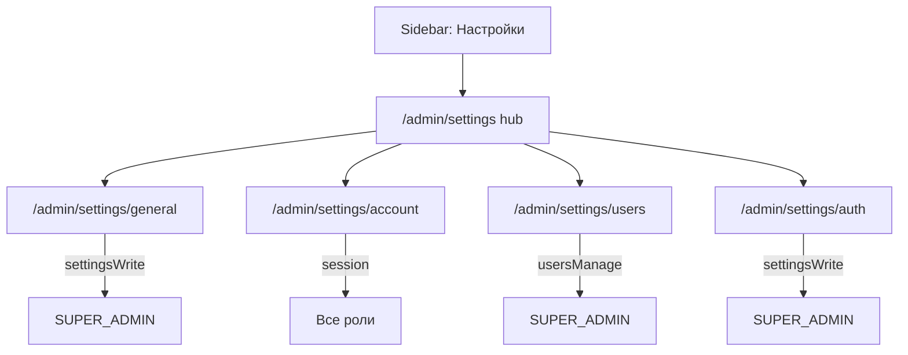

# Реструктуризация настроек и выбор языка

## Целевая навигация



| Пункт | Маршрут | Доступ | Содержание |
|-------|---------|--------|------------|
| Hub | `/admin/settings` | любой залогиненный | меню-карточки (только видимые пункты) |
| Общие | `/admin/settings/general` | `settings:write` | головная org, timezone, **глобальный язык** |
| Учётная запись | `/admin/settings/account` | session | имя, email, пароль, **личный язык** (override) |
| Пользователи | `/admin/settings/users` | `users:manage` | без изменений |
| Аутентификация | `/admin/settings/auth` | `settings:write` | [`AuthProviderCard`](components/admin/auth-provider-card.tsx) |

---

## 1. RBAC

**[`lib/auth/permissions.ts`](lib/auth/permissions.ts)** — убрать `settingsRead` у `OPERATOR` и `VIEWER` (остаётся только у `SUPER_ADMIN` для совместимости API `/api/settings/auth`).

**Sidebar [`components/app-sidebar.tsx`](components/app-sidebar.tsx)** — показывать «Настройки» всем залогиненным (`me != null`), не через `settingsRead`.

**Page guards [`lib/auth/page-guard.ts`](lib/auth/page-guard.ts)** — добавить `requirePageSession()`: redirect `/login` если нет сессии, без проверки permission.

| Страница | Guard |
|----------|-------|
| `/admin/settings` | `requirePageSession()` |
| `/admin/settings/general` | `requirePagePermission(settingsWrite)` |
| `/admin/settings/account` | `requirePageSession()` |
| `/admin/settings/auth` | `requirePagePermission(settingsWrite)` |
| users/* | без изменений (`usersManage`) |

---

## 2. Данные: язык

**Prisma** — миграция:

```prisma
// AppSettings
locale String @default("ru")

// User
locale String?  // null = наследовать глобальный
```

**[`lib/i18n/locales.ts`](lib/i18n/locales.ts)** (новый):

- `SUPPORTED_LOCALES`: `ru`, `en` с labels
- `DEFAULT_LOCALE = "ru"`
- `resolveLocale(userLocale, globalLocale)` → `userLocale ?? globalLocale ?? DEFAULT_LOCALE`

**[`lib/validations/settings.ts`](lib/validations/settings.ts)** — `locale` в `updateSettingsSchema`.

**[`lib/validations/account.ts`](lib/validations/account.ts)** (новый) — self-update: `name`, `email`, опциональные `password`/`passwordConfirm`, `locale: 'ru'|'en'|null` (null = «как в системе»).

**[`lib/users/index.ts`](lib/users/index.ts)** — `updateAccount(userId, data)` (без смены роли; email unique).

---

## 3. API

**[`app/api/account/route.ts`](app/api/account/route.ts)** (новый):

- `PUT` — `requireAdminSession()`, только `session.userId`, `updateAccount()`

**[`app/api/auth/me/route.ts`](app/api/auth/me/route.ts)** — добавить `locale`, `effectiveLocale` (resolved).

**[`app/api/settings/route.ts`](app/api/settings/route.ts)** — `GET` public: включить `locale`; `PUT`: сохранять `locale`.

**[`lib/settings/index.ts`](lib/settings/index.ts)** — чтение/запись `locale` в `getPublicSettings` / `updateAppSettings`.

---

## 4. UI: hub и страницы

**[`components/admin/settings-nav.tsx`](components/admin/settings-nav.tsx)** (новый) — карточки-ссылки (паттерн как блок «Пользователи» в текущем [`settings-client.tsx`](components/admin/settings-client.tsx)):

- Общие → `/admin/settings/general` — если `can(settingsWrite)`
- Учётная запись → `/admin/settings/account` — всегда
- Пользователи → `/admin/settings/users` — если `can(usersManage)`
- Аутентификация → `/admin/settings/auth` — если `can(settingsWrite)`

**Разделить [`settings-client.tsx`](components/admin/settings-client.tsx)**:

| Файл | Страница |
|------|----------|
| `general-settings-client.tsx` | head org + timezone + global locale Select |
| `account-settings-client.tsx` | name, email, `PasswordFieldsGroup`, locale Select («Системный по умолчанию» / ru / en) |
| hub использует `SettingsNav` + `PageHeader` | |

**Маршруты:**

- [`app/(admin)/admin/(panel)/settings/page.tsx`](app/(admin)/admin/(panel)/settings/page.tsx) — hub only
- `settings/general/page.tsx` — general client
- `settings/account/page.tsx` — account client
- `settings/auth/page.tsx` — `AuthProviderCard` + server data from `authProvidersPayload()`

Удалить auth/users links и общую форму из монолитного `SettingsClient`.

**Breadcrumbs [`admin-breadcrumb.tsx`](components/admin/admin-breadcrumb.tsx)** — ветки: Общие, Учётная запись, Аутентификация (+ существующие users).

**Back links** — users pages: `backHref="/admin/settings"` (hub).

---

## 5. Locale provider (pref only, UI на русском)

**[`components/locale-provider.tsx`](components/locale-provider.tsx)** (новый):

- Admin: `effectiveLocale` из `/api/auth/me`
- Public: `locale` из `/api/settings`
- `useEffect`: `document.documentElement.lang = effectiveLocale`
- Опционально: cookie `fstec_locale` для SSR-consistency позже

Подключить в admin layout / root layout рядом с [`timezone-provider.tsx`](components/timezone-provider.tsx).

Перевод строк UI **не входит** в scope — только хранение и `html lang`.

---

## 6. Sidebar и NavUser (мелочи)

- Sidebar: Settings виден всем (`me` loaded)
- [`components/nav-user.tsx`](components/nav-user.tsx): пункт «Учётная запись» → `/admin/settings/account` (удобный shortcut)

---

## 7. DoD

```bash
npx prisma migrate dev
npm run typecheck && npm run lint && npm run build
```

**Smoke:**

1. OPERATOR: sidebar «Настройки» → hub с одной карточкой «Учётная запись»; `/admin/settings/general` → 404
2. OPERATOR: account — смена имени/пароля/личного языка; `effectiveLocale` меняется
3. SUPER_ADMIN: все 4 пункта; global locale в General; User с `locale=null` наследует global
4. `/admin/settings/auth` — только AuthProviderCard, без общих полей
5. `document.documentElement.lang` = `en` при выборе English

---

## Вне scope

- Полный i18n / next-intl / перевод UI
- Keycloak/AD реальная интеграция
- Удаление пользователей
