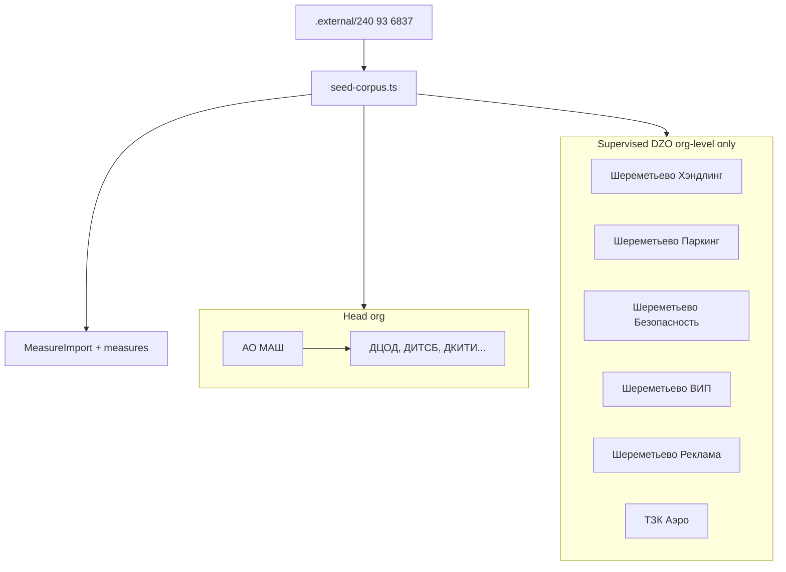

# Сид Шереметьево + отчёт потерь парсера

## Контекст

Базовый план [corpus_seed_no_mock](.cursor/plans/corpus_seed_no_mock_623253fd.plan.md) уже сделан частично: [`prisma/seed-corpus.ts`](prisma/seed-corpus.ts), gitignore, `corpus:prepare-slice`. Но в БД/сиде остаётся **«Тестовое ДЗО»** и при `db:seed:mock` — **Сбер/Ростех/Аэрофлот** ([`prisma/mock-data.ts`](prisma/mock-data.ts) `MOCK_ORGS`). Мок отключён по умолчанию, но **не удаляется** из существующей dev-БД автоматически.

Выбранная модель: **головная** — АО «Международный аэропорт Шереметьево»; **6 ДЗО** — подведомственные, **без подразделений** (пакетная рассылка на всю организацию).



---

## 1. Gitignored артефакты сида

Добавить в [`.gitignore`](.gitignore):

```
.external/seed/
corpus-gap-report.json
prisma/seed-manifest.generated.json
```

Новые файлы (всё локально, не в GitHub):

| Файл | Назначение |
|------|------------|
| [`.external/seed/orgs.json`](.external/seed/orgs.json) | Статическая структура org (можно править руками) |
| `prisma/seed-manifest.generated.json` | Список писем для импорта + результаты scan |
| `corpus-gap-report.json` | Потери парсера по 221 письму |

Коммитим только шаблон: [`.external/seed/orgs.example.json`](.external/seed/orgs.example.json) (без чувствительных данных).

---

## 2. Очистка старых организаций

В начале [`prisma/seed-corpus.ts`](prisma/seed-corpus.ts) — `purgeSeedOrgs()`:

**Удалить из БД** (cascade orders/accessLinks):
- `shortCode` starts with `DEV-` (Ростех, Сбер, Аэрофлот, Роскосмос)
- явный список: `Тестовое ДЗО`, `ФСТЭК` (если осталась от прошлого сида)
- опционально: любая org не из allowlist нового манифеста (флаг `SEED_PURGE_UNKNOWN_ORGS=true`)

**Не трогать:** admin user, statuses, app_settings shell.

После purge — только org из манифеста.

---

## 3. Структура организаций (Шереметьево)

Источник: [`.external/seed/orgs.json`](.external/seed/orgs.json) (копируется из example при первом `db:seed:corpus`).

```json
{
  "headOrganization": {
    "name": "АО \"Международный аэропорт Шереметьево\"",
    "shortCode": "SVO",
    "subdivisions": ["ДЦОД", "ДИТСБ", "ДКИТИ", "ДИТСС", "СЭПС", "ДИТСУП"]
  },
  "supervisedOrganizations": [
    { "name": "ООО \"Шереметьево Хэндлинг\"", "shortCode": "SVO-HDL" },
    { "name": "ООО \"Шереметьево Паркинг\"", "shortCode": "SVO-PRK" },
    { "name": "АО \"Шереметьево Безопасность\"", "shortCode": "SVO-SEC" },
    { "name": "ООО \"Шереметьево ВИП\"", "shortCode": "SVO-VIP" },
    { "name": "ООО \"Шереметьево Реклама\"", "shortCode": "SVO-ADV" },
    { "name": "ООО \"ТЗК Аэро\"", "shortCode": "SVO-TZK" }
  ]
}
```

Примечания:
- Подразделения **только у head** (из отчётов `Отчет*.xlsx` колонка «Подразделение» — ДЦОД/ДИТСБ; это внутренняя структура аэропорта для routing).
- У **6 ДЗО** — `subdivisions: []`, один `accessLink` на org (без subdivisionId).
- `app_settings.head_organization_id` → head org.
- Имена ДЗО — как вы указали (опечатку «Шереметьво ВИП» нормализуем к «Шереметьево ВИП» в example).

---

## 4. Импорт DOCX из корпуса

Расширить [`prisma/seed-corpus.ts`](prisma/seed-corpus.ts) + новый [`scripts/build-seed-manifest.mjs`](scripts/build-seed-manifest.mjs):

**`npm run corpus:build-seed-manifest`** сканирует [`.external/240 93 6837`](.external/240%2093%206837) и пишет `prisma/seed-manifest.generated.json`:
- все письма с `measureCount > 0` (из audit)
- пары letter+appendix для `pattern=routing`
- флаги: `parsed`, `committed`, `itemCount`, `needsAppendix`

**Сид по умолчанию** (быстрый dev):
- Must-have: `6837`, `4164`, `1409`+appendix
- + все `routing` (9) с приложениями где есть
- Опция `SEED_IMPORT_ALL=1` — импортировать все 209 писем с мерами (долго, ~MinIO)

Пайплайн без изменений: upload → parse → commit ([`seed-corpus.ts`](prisma/seed-corpus.ts) уже инлайнит логику).

---

## 5. Batch на все ДЗО

Продукт уже поддерживает org-level targets (`subdivisionId: null`) в [`lib/orders/batch-targets.ts`](lib/orders/batch-targets.ts).

После сида в консоли:
```
/panel/orders/new?importId={6837}
→ «Выбрать все» на 6 ДЗО (без подразделений)
```

Routing-матрица для ДЗО: при отсутствии subdivisions — все меры на org целиком (текущее поведение `buildSelectionFromSuggestions`). Routing по ДЦОД/ДИТСБ остаётся релевантен **только для head org** (внутренняя маршрутизация).

---

## 6. Отчёт: что теряем из корпуса (важно)

Новый скрипт [`scripts/corpus-gap-report.mjs`](scripts/corpus-gap-report.mjs) → `corpus-gap-report.json` (+ краткий markdown в консоль при `db:seed:corpus`).

### 6.1 Уже известно по [`audit-report.json`](audit-report.json) (221 письмо)

| Категория | Кол-во | Документы | Что теряется |
|-----------|--------|-----------|--------------|
| **routing** | 9 | 1409, 1555, 1762, 2019, 3111, 3229, 4539, 7784, 909 | **0 мер в письме** — меры только в приложении; без загрузки appendix теряются все рекомендации |
| **zero** | 3 | 1569, 2026, 2387 | **0 мер** — парсер не находит нумерацию; нужен разбор (таблица? нестандартный текст?) |
| **С мерами в письме** | 209 | остальные | ~2587 parsed items суммарно |

**Особые случаи:**
- `2019` — routing, но **нет файла приложения** в папке → полная потеря без ручного DOCX
- `1409` — письмо routing, appendix RECOMMENDATIONS (уже частично в сиде; letter commit skip)

### 6.2 Риски недосчёта при парсинге (не ноль, но меньше ground truth)

| Паттерн | Письма | Риск |
|---------|--------|------|
| **composite** (`6837`) | ~12 nested+bdu | Без `shouldExpandComposites` (7× `1.x`) секции 2+ могут сливаться в одну меру |
| **unnumbered** | 2386 BDU-inline, 1423 imperative | Fallback [`parse-unnumbered.ts`](lib/measure-imports/parse-unnumbered.ts) — не все варианты покрыты |
| **mis-kind APPENDIX** | ~108 в audit | `detectImportKind`→APPENDIX при хешах в тексте, но `parseMeasureItemsFromParagraphs` всё равно даёт N мер; в **import pipeline** может уйти в ветку IOC (1 мера) — **потеря при commit** |
| **table-only** | conditional | [`parse-docx-tables.ts`](lib/measure-imports/parse-docx-tables.ts) только если нет нумерации |

### 6.3 Сверка с Excel (ground truth)

Расширить gap-report: для каждой папки с `Отчет*.xlsx` сравнить **число строк мер** (колонка A) vs **parser measureCount**. Расхождения >2 → `undercount` / `overcount` в отчёте.

### 6.4 Вывод после сида

`db:seed:corpus` печатает summary:
```
Corpus coverage: 209/221 letters with measures
Lost: 9 routing (need appendix), 3 zero
Mis-kind risk: N letters (APPENDIX kind but N numbered items)
Full report: corpus-gap-report.json
```

---

## 7. npm / Makefile

```json
"corpus:build-seed-manifest": "tsx scripts/build-seed-manifest.mjs",
"corpus:gap-report": "tsx scripts/corpus-gap-report.mjs",
"db:seed:corpus": "... && npm run corpus:gap-report"
```

[`Makefile`](Makefile): обновить `dev-corpus` — перед seed вызывать `corpus:build-seed-manifest` если есть корпус.

---

## 8. README

Короткий блок в [README.md](README.md):
- структура Шереметьево + 6 ДЗО
- `cp .external/seed/orgs.example.json .external/seed/orgs.json`
- как читать `corpus-gap-report.json`
- что моки (`db:seed:mock`) — отдельно, не для прод/demo стенда

---

## Файлы в diff (~10)

| Файл | Изменение |
|------|-----------|
| [`.gitignore`](.gitignore) | `.external/seed/`, gap-report, manifest |
| `.external/seed/orgs.example.json` | шаблон org |
| [`prisma/seed-corpus.ts`](prisma/seed-corpus.ts) | purge + orgs.json + manifest-driven imports |
| `scripts/build-seed-manifest.mjs` | scan corpus → manifest |
| `scripts/corpus-gap-report.mjs` | потери парсера + xlsx diff |
| [`package.json`](package.json) | новые scripts |
| [`README.md`](README.md) | Шереметьево + gap report |
| [`prisma/mock-data.ts`](prisma/mock-data.ts) | комментарий deprecated / не для corpus seed |

---

## DoD

1. `db:boot:corpus` → в БД только Шереметьево + 6 ДЗО, **нет** Сбера/Ростеха/Тестового ДЗО
2. Head с подразделениями ДЦОД…; DZO без subdivisions
3. Импорт 6837 committed, routing check ДЦОД для network
4. `corpus-gap-report.json` с 9 routing + 3 zero + mis-kind списком
5. Все seed-артефакты в gitignore, `git status` чистый от docx/seed json
