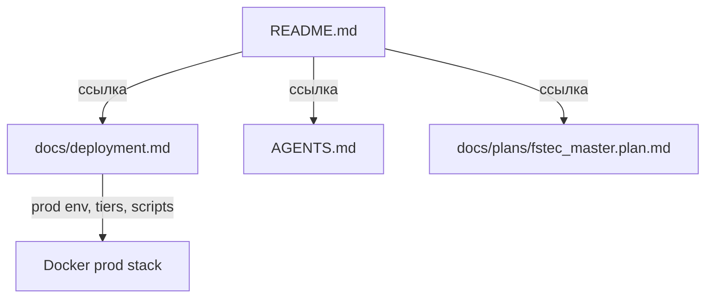
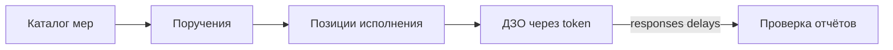
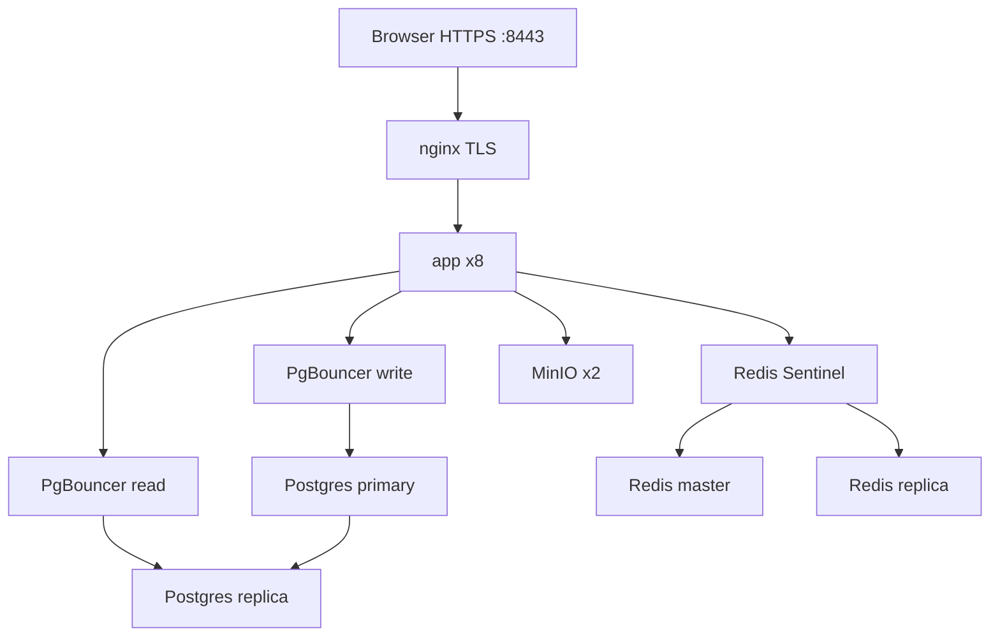

# План документации FSTEC

## Текущее состояние

Сейчас описание системы минимальное:
- [README.md](README.md) — 52 строки: stack, quick start, таблица контекстов, scripts
- [AGENTS.md](AGENTS.md) — правила для агентов/разработчиков, не для операторов
- [docs/plans/fstec_master.plan.md](docs/plans/fstec_master.plan.md) — master plan с фазами и маршрутами (технический артефакт)
- GitHub repo [butbeautifulv/fstec](https://github.com/butbeautifulv/fstec) — **description пустой**

Пользователь выбрал: **RU + краткий EN summary**, структура **README + docs/deployment.md**.

---

## Целевая структура



| Файл | Аудитория | Содержание |
|------|-----------|------------|
| README.md | Разработчики, заказчик, новые участники | Полное описание системы |
| docs/deployment.md | DevOps / деплой | Prod, tiers, HA, VM, env, TLS |
| AGENTS.md | Без изменений по сути | Только добавить ссылку на docs/deployment.md если нужно |

---

## README.md — структура и содержание

Переписать README как **входную точку**: читаемый, с чёткими секциями, без дублирования AGENTS.md (UI-конвенции и agent workflow остаются там).

### 1. Шапка (hero)

- Название: **Сервис контроля мер ФСТЭК**
- Tagline из [lib/ui/branding.ts](lib/ui/branding.ts): «Учёт мер информационной безопасности»
- **English summary** (3–4 предложения): purpose, stack, three access modes
- Кратко: для кого (операторы ФСТЭК / ДЗО / наблюдатели)

### 2. Назначение и предметная область

Описать бизнес-логику по [prisma/schema.prisma](prisma/schema.prisma) и [docs/plans/fstec_master.plan.md](docs/plans/fstec_master.plan.md):



- **Меры** — справочник мер ИБ (без статуса/срока)
- **Поручения** — назначение мер организациям/подразделениям
- **Позиции** — статус workflow + срок `dueAt`
- **Отчёты** — ответы ДЗО с вложениями (S3), проверка оператором
- **Переносы** — заявки на продление срока
- **Просрочено** — вычисляемый статус ([lib/statuses/workflow.ts](lib/statuses/workflow.ts))

Workflow статусов: «К исполнению» → «В работе» → «Выполнено»

### 3. Роли и доступ

Таблица из [lib/auth/permissions.ts](lib/auth/permissions.ts):

| Роль | Возможности |
|------|-------------|
| SUPER_ADMIN | Всё + настройки, пользователи, report links |
| OPERATOR | Меры, поручения, орг., переносы, отчёты |
| VIEWER | Только чтение |

Три режима доступа (не путать с ролями):

| Режим | URL | Описание |
|-------|-----|----------|
| Platform | `/panel/*` | Авторизация (iron-session) |
| Public assignment | `/p/{token}` | ДЗО: исполнение, отчёты, переносы |
| Report share | `/report/{token}` | Read-only сводка для руководства |

### 4. Архитектура приложения

Таблица контекстов (расширить текущую из README):

| Контекст | Путь | API | Назначение |
|----------|------|-----|------------|
| platform | `app/(platform)/panel/` | `/api/*` + session | Рабочее место |
| public | `app/(public)/p/` | `/api/public/[token]` | ДЗО |
| report | `app/(public)/report/` | token-scoped read | Глобальная сводка |
| lib | `lib/` | — | Доменная логика |

Ключевые модули `lib/`: `auth`, `measures`, `orders`, `organizations`, `responses`, `delays`, `dashboard`, `public`, `report-links`, `cache`, `storage`.

Стек (актуализировать — сейчас в README не хватает Redis, S3, motion):

- Next.js 16 (App Router), React 19, TypeScript
- PostgreSQL 16 + Prisma 6
- Redis 7 (кеш дашборда, panel counts)
- S3 / MinIO (вложения отчётов)
- shadcn/ui + Tailwind CSS 4 + motion
- iron-session, bcryptjs, Zod

### 5. Основные разделы UI (platform)

Краткая карта по [lib/nav/platform-nav.ts](lib/nav/platform-nav.ts):

- Сводка (`/panel`) — KPI, графики, матрица организаций
- Каталог мер, Поручения, Организации (+ подразделения, access links)
- Заявки на перенос, Отчёты (review workflow)
- Настройки: общие, аккаунт, пользователи, аутентификация

Public `/p/{token}`: сводка, поручения, карточка позиции, отчёты на доработку.

### 6. API (обзор, без полного OpenAPI)

Группы route handlers из `app/api/` (~33 endpoint):

- Auth: login, logout, me, change-password
- CRUD: measures, orders, organizations, subdivisions, users
- Workflow: responses (review), delay-requests, attachments (presign)
- Public: token-scoped status/responses/delays/attachments
- Settings, report-links, account

Принцип: platform API — session + `requirePermission`; public API — token + rate limit ([lib/public/rate-limit.ts](lib/public/rate-limit.ts)).

### 7. Локальная разработка

Актуализировать quick start (добавить redis, generate:favicons если уместно):

```bash
cp .env.example .env.local
docker compose up -d db redis minio
npm install && npm run db:migrate && npm run db:seed
npm run dev
```

- Login: `admin@fstec.local` / `admin123`
- Public links: после `db:seed:mock` — токены в консоли
- Проверка: `npm run typecheck && npm run lint && npm run build`

Таблица npm scripts (расширить текущую: `generate:favicons`, `db:studio`, prod scripts → ссылка на deployment.md).

### 8. Переменные окружения (dev)

Краткая таблица из [.env.example](.env.example): DATABASE_URL, REDIS_URL, SESSION_SECRET, S3_*, AUTH_PROVIDER, ADMIN_*.

### 9. Ссылки

- [docs/deployment.md](docs/deployment.md) — production
- [AGENTS.md](AGENTS.md) — правила разработки
- [docs/plans/fstec_master.plan.md](docs/plans/fstec_master.plan.md) — история фаз

---

## docs/deployment.md — содержание

Отдельный runbook по prod-инфраструктуре (источники: [docker-compose.prod.yml](docker-compose.prod.yml), [docker-compose.ha.yml](docker-compose.ha.yml), [docker-compose.vm.yml](docker-compose.vm.yml), [docker/scripts/](docker/scripts/), [.env.production.example](.env.production.example)).

### Секции

1. **Обзор prod-стека** — app (Next standalone) + nginx TLS + Postgres + Redis + MinIO
2. **Быстрый старт prod (local preview)**
   ```bash
   cp .env.production.example .env.production
   sh docker/scripts/generate-dev-certs.sh
   sh docker/scripts/prod-scale.sh --build -d
   # https://localhost:8443
   ```
3. **Scale tiers (SCALE_TIER 0–3)**

   | Tier | App replicas | Data layer |
   |------|-------------|------------|
   | 0 | 1 | single-node |
   | 3 | 8 | HA Postgres + PgBouncer, Redis Sentinel, MinIO x2 |

   Скрипт: [docker/scripts/prod-scale.sh](docker/scripts/prod-scale.sh)

4. **HA overlay** — когда подключать `docker-compose.ha.yml`, migrate-ha, seed-ha
5. **VM / Podman deploy** — [docker/scripts/vm-deploy.sh](docker/scripts/vm-deploy.sh), baked images ([docker/scripts/build-prod-images.sh](docker/scripts/build-prod-images.sh))
6. **Env vars (production)** — полная таблица из `.env.production.example` с пояснениями
7. **Операции** — seed первого запуска, остановка стека (`docker compose ... down`), бенчмарк (`benchmark-scale.sh`)
8. **Безопасность** — secrets не в git, SESSION_SECRET ≥32 chars, смена паролей по умолчанию

Диаграмма prod (tier 3):



---

## GitHub metadata

После merge документации обновить описание репозитория:

```bash
gh repo edit butbeautifulv/fstec \
  --description "Сервис контроля мер ФСТЭК — учёт мер информационной безопасности и отслеживание исполнения среди ДЗО. Next.js · PostgreSQL · Redis · MinIO"
```

Опционально topics (если поддерживается): `nextjs`, `postgresql`, `fstec`, `security-compliance`, `typescript`.

---

## Git: commit и push

**Branch:** `main` (или отдельная `docs/system-description` — по желанию; для doc-only изменений можно сразу в main).

**Файлы в коммите:**
- `README.md` (rewrite)
- `docs/deployment.md` (new)
- Минимальная правка `AGENTS.md`: ссылка на `docs/deployment.md` в секции verify/docs (1 строка)

**Commit message** (стиль репозитория — краткий why):

```
Document system architecture and deployment runbook.

Add comprehensive README with domain model, RBAC, and API overview;
extract production deployment guide to docs/deployment.md.
```

**Push:**

```bash
git add README.md docs/deployment.md AGENTS.md
git commit -m "$(cat <<'EOF'
Document system architecture and deployment runbook.

Add comprehensive README with domain model, RBAC, and API overview;
extract production deployment guide to docs/deployment.md.
EOF
)"
git push origin HEAD
gh repo edit butbeautifulv/fstec --description "..."
```

---

## Что сознательно не включаем

- User manual / скриншоты UI — вне scope (техническая документация)
- OpenAPI/Swagger — API описан обзорно в README
- Дублирование agent rules из AGENTS.md и `.agents/rules/`
- Изменение `docs/plans/fstec_master.plan.md` — это dev artifact, не user docs

---

## Критерии готовности (DoD)

- README читается как самодостаточное описание системы на русском + EN summary
- docs/deployment.md покрывает dev compose, prod tiers 0–3, env, scripts
- Quick start в README проверен на соответствие [.env.example](.env.example) и [docker-compose.yml](docker-compose.yml)
- GitHub description заполнен
- Commit pushed to origin
