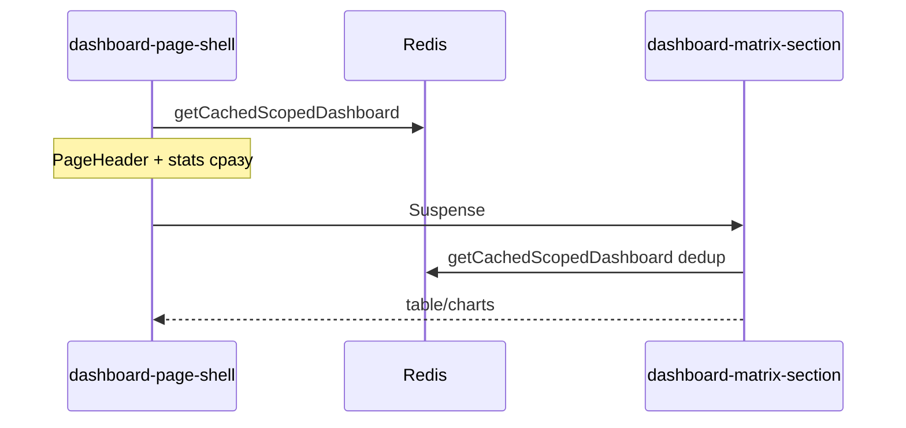

# UI Performance: Redis cache, streaming, nginx, Next cacheHandler

Принцип: **одна подфаза = один логический diff (обычно 1–3 файла), `typecheck` + `build` green после каждой.**

## Текущее состояние

Уже есть:
- Redis dashboard cache ([`lib/dashboard/cache.ts`](lib/dashboard/cache.ts), TTL **60s**)
- `getCachedScopedDashboard` на `/panel`, `/p/[token]`, `/report/[token]`
- `dynamic()` charts/matrix, Suspense на platform/report
- `React.cache` на `validateAccessLink`, `getWorkflowStatuses` — **только внутри одного RSC-запроса**
- tier 3: 8 app + read replica + PgBouncer

---

## Phase 1 — Общий Redis cache helper

### P1.1 — `getCachedJson` (lib only)

| Файл | Diff |
|------|------|
| [`lib/cache/json-cache.ts`](lib/cache/json-cache.ts) (new) | `getCachedJson<T>(key, ttlSec, fetcher)`, `invalidateKeys(...keys)` |

**DoD:** модуль импортируется, без callers — build green.

### P1.2 — TTL из env

| Файл | Diff |
|------|------|
| [`lib/cache/redis.ts`](lib/cache/redis.ts) | `getDashboardCacheTtl()`, `getReferenceCacheTtl()` из env, fallback 300/900 |
| [`.env.production.example`](.env.production.example) | `DASHBOARD_CACHE_TTL_SECONDS=300`, `REFERENCE_CACHE_TTL_SECONDS=900` |

**DoD:** константы читаются, dashboard cache ещё не трогаем.

### P1.3 — Dashboard cache refactor

| Файл | Diff |
|------|------|
| [`lib/dashboard/cache.ts`](lib/dashboard/cache.ts) | заменить inline Redis на `getCachedJson`; TTL из `getDashboardCacheTtl()` |

**DoD:** поведение идентично, TTL 300s default.

---

## Phase 2 — Redis на горячих read-path

### P2a — Workflow statuses

| Подфаза | Файлы | Diff |
|---------|-------|------|
| **P2a.1** | [`lib/statuses/index.ts`](lib/statuses/index.ts) | `getCachedWorkflowStatuses()` key `ref:workflow-statuses`; `getWorkflowStatuses` делегирует |
| **P2a.2** | [`app/(public)/p/[token]/page.tsx`](app/(public)/p/[token]/page.tsx), [`orders/[orderId]/page.tsx`](app/(public)/p/[token]/orders/[orderId]/page.tsx), [`items/[id]/page.tsx`](app/(public)/p/[token]/items/[id]/page.tsx), [`report/.../items/[id]/page.tsx`](app/(public)/report/[token]/items/[id]/page.tsx), [`app/api/public/[token]/route.ts`](app/api/public/[token]/route.ts) | заменить import/call (по 1 файлу за коммит или батч ≤3 public pages) |

Инвалидация статусов — только при появлении mutation (сейчас не нужна).

### P2b — Access link validation

| Подфаза | Файлы | Diff |
|---------|-------|------|
| **P2b.1** | [`lib/public/validate-token.ts`](lib/public/validate-token.ts) | Redis cache `access-link:{token}`, slim serialized DTO, TTL 5 min |
| **P2b.2** | [`lib/access-links/revoke-from-request.ts`](lib/access-links/revoke-from-request.ts) + [`app/api/organizations/[id]/links/route.ts`](app/api/organizations/[id]/links/route.ts), [`app/api/subdivisions/[id]/links/route.ts`](app/api/subdivisions/[id]/links/route.ts) | `invalidateKeys` при revoke (1 route за подфазу если нужно) |

### P2c — Panel layout pending counts

| Подфаза | Файлы | Diff |
|---------|-------|------|
| **P2c.1** | [`lib/delays/index.ts`](lib/delays/index.ts), [`lib/responses/index.ts`](lib/responses/index.ts) | `getCachedPendingDelayCount()`, `getCachedPendingResponseCount()` |
| **P2c.2** | [`app/(platform)/panel/layout.tsx`](app/(platform)/panel/layout.tsx) | swap на cached helpers |
| **P2c.3** | [`app/api/delay-requests/route.ts`](app/api/delay-requests/route.ts) | +1 вызов `invalidateKeys('panel:pending:delays')` |
| **P2c.4** | [`app/api/responses/route.ts`](app/api/responses/route.ts), [`app/api/orders/[id]/items/[itemId]/responses/route.ts`](app/api/orders/[id]/items/[itemId]/responses/route.ts) | invalidate `panel:pending:responses` (можно 2 файла одним diff) |

### P2d — List pages cache

| Подфаза | Файлы | Diff |
|---------|-------|------|
| **P2d.1** | [`lib/orders/index.ts`](lib/orders/index.ts), [`lib/api/revalidate-panel.ts`](lib/api/revalidate-panel.ts) | `getCachedListOrders()` + invalidate в `revalidatePanelOrder*` |
| **P2d.2** | [`lib/measures/index.ts`](lib/measures/index.ts), [`lib/api/revalidate-panel.ts`](lib/api/revalidate-panel.ts) | `getCachedListMeasures()` + invalidate в `revalidatePanelMeasures` |
| **P2d.3** | [`app/(platform)/panel/orders/page.tsx`](app/(platform)/panel/orders/page.tsx) | `getCachedListOrders()` |
| **P2d.4** | [`app/(platform)/panel/measures/page.tsx`](app/(platform)/panel/measures/page.tsx) | `getCachedListMeasures()` |

---

## Phase 3 — Public UX: streaming charts

| Подфаза | Файлы | Diff |
|---------|-------|------|
| **P3.1** | [`lib/dashboard/variant-config.ts`](lib/dashboard/variant-config.ts) | `public.suspenseChartsDefault: true` |
| **P3.2** | [`app/(public)/p/[token]/page.tsx`](app/(public)/p/[token]/page.tsx) | удалить `suspenseCharts={false}` |

**DoD:** public дашборд показывает skeleton charts до hydrate (как panel).

---

## Phase 4 — RSC streaming: stats first, matrix later



| Подфаза | Файлы | Diff |
|---------|-------|------|
| **P4.1** | [`lib/dashboard/cache.ts`](lib/dashboard/cache.ts) | `export const getCachedScopedDashboard = cache(async ...)` |
| **P4.2** | [`components/dashboard/dashboard-matrix-section.tsx`](components/dashboard/dashboard-matrix-section.tsx) (new) | async RSC: fetch cache → render `DashboardInteractive` props |
| **P4.3** | [`components/dashboard/dashboard-page-shell.tsx`](components/dashboard/dashboard-page-shell.tsx) | split: header/stats sync, matrix в `<Suspense>` |
| **P4.4** | [`app/(platform)/panel/page.tsx`](app/(platform)/panel/page.tsx) | адаптировать props под новый shell API |
| **P4.5a** | [`app/(public)/p/[token]/page.tsx`](app/(public)/p/[token]/page.tsx) | wire split shell |
| **P4.5b** | [`app/(public)/report/[token]/page.tsx`](app/(public)/report/[token]/page.tsx) | wire split shell |

**DoD P4:** cold path — stat cards видны до таблицы.

---

## Phase 5 — Matrix pagination

| Подфаза | Файлы | Diff |
|---------|-------|------|
| **P5.1** | [`lib/dashboard/serialize-dashboard.ts`](lib/dashboard/serialize-dashboard.ts) | `limit?: number` на items slice |
| **P5.2** | [`components/dashboard/scoped-dashboard-view.tsx`](components/dashboard/scoped-dashboard-view.tsx) | `initialPageSize = 50` в DataTable |
| **P5.3** | [`lib/dashboard/cache.ts`](lib/dashboard/cache.ts) или pages | передавать `limit: 50` кроме `overdueOnly` |

Fallback (отдельная подфаза только если P5.3 ломает chart filters): API route `GET /api/dashboard/matrix` — **не делать заранее**.

---

## Phase 6 — nginx: static cache + brotli

| Подфаза | Файлы | Diff |
|---------|-------|------|
| **P6.1** | [`docker/nginx/conf.d/fstec.conf`](docker/nginx/conf.d/fstec.conf) | `location /_next/static/` + `Cache-Control: immutable` |
| **P6.2** | [`docker/nginx/nginx.conf`](docker/nginx/nginx.conf) | `brotli on`, `brotli_types` |
| **P6.3** | [`docker/nginx/Dockerfile`](docker/nginx/Dockerfile) | apk brotli module; rebuild nginx image |

**DoD P6:** repeat visit — `/_next/static/*` с long cache; `Content-Encoding: br` на HTML.

---

## Phase 7 — Next.js shared cacheHandler

| Подфаза | Файлы | Diff |
|---------|-------|------|
| **P7.1** | [`cache-handler.mjs`](cache-handler.mjs) (new) | `get`/`set` через Redis, prefix `nextjs:`; shared connection helper |
| **P7.2** | [`next.config.ts`](next.config.ts), [`Dockerfile`](Dockerfile) | `cacheHandler`, `cacheMaxMemorySize: 0`, `COPY cache-handler.mjs` |
| **P7.3** | [`cache-handler.mjs`](cache-handler.mjs) | `revalidateTag` no-op/stub + комментарий; smoke `npm run build` в Docker |

Не трогать страницы на `'use cache'` в v1 — только foundation.

---

## Phase 8 — Верификация

| Подфаза | Действие |
|---------|----------|
| **P8.1** | `npm run typecheck && npm run build` |
| **P8.2** | `SCALE_TIER=3 sh docker/scripts/prod-scale.sh --build -d` |
| **P8.3** | `sh docker/scripts/benchmark-scale.sh` → [`docker/benchmark-results/latest.txt`](docker/benchmark-results/latest.txt) |
| **P8.4** | DevTools: TTFB repeat, `/_next/static` cache, stat cards before matrix |

Целевые ориентиры (tier 3, repeat):
- `/login` TTFB < 100ms
- `/p/dev-rost` TTFB < 300ms (Redis hit)
- Stat cards first paint < 500ms cold

---

## Рекомендуемый порядок (ветки / PR)

```
P1.1 → P1.2 → P1.3
  → P2a.1 → P2a.2
  → P2b.1 → P2b.2
  → P2c.1 → P2c.2 → P2c.3 → P2c.4
  → P2d.1 → P2d.2 → P2d.3 → P2d.4
P3.1 → P3.2          (можно параллельно с P2)
P4.1 → P4.2 → P4.3 → P4.4 → P4.5a → P4.5b
P6.1 → P6.2 → P6.3   (независимо, параллельно с P2–P4)
P5.1 → P5.2 → P5.3   (после P4)
P7.1 → P7.2 → P7.3   (после P1)
P8.*
```

## Риски

- **Stale data:** каждый cache key → invalidation в mutation route (отдельная подфаза на каждый)
- **Matrix limit (P5):** проверить chart filters на mock seed до merge P5.3
- **cacheHandler + Sentinel:** smoke на tier 3 после P7.2
