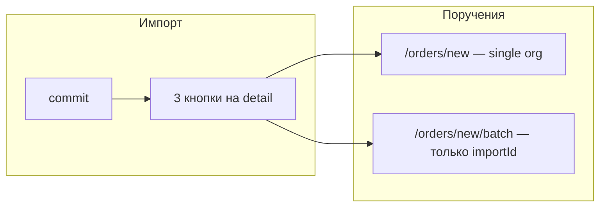
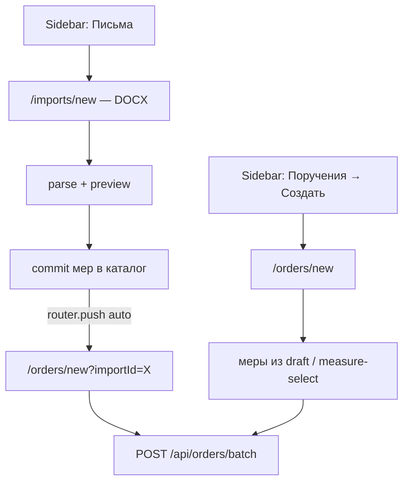

# Единый batch-флоу: Письма → импорт → поручения

## Проблема сейчас



- Пакетное назначение **привязано к importId** ([`batch/page.tsx`](app/(platform)/panel/orders/new/batch/page.tsx) — `notFound()` без импорта).
- На detail импорта **3 дублирующих CTA**, включая «Назначить всем подведомственным» — это просто preset, не отдельный шаг.
- Batch UI — **flat checkbox list** без DataTable ([`order-batch-create-client.tsx`](components/platform/order-batch-create-client.tsx)).
- **Конфликт org/subdivision**: `buildAllTargets()` показывает и «вся организация», и подразделения; «Выбрать всех» всегда ломается.
- Дублирование bootstrap: [`orders/new/page.tsx`](app/(platform)/panel/orders/new/page.tsx) vs [`orders/new/batch/page.tsx`](app/(platform)/panel/orders/new/batch/page.tsx).

## Целевой флоу



**Один экран** `/panel/orders/new` — единый batch UI, но **два независимых пути**:

| | Из документа (предпочтительно) | Полностью вручную |
|---|---|---|
| **Вход** | Sidebar «Импорт DOCX» → commit → автопереход | Поручения → «Создать поручение» → `/orders/new` |
| **Меры** | Prefill из импорта, **редактируемо** (убрать/добавить через «Выбрать меры», правки на preview импорта до commit) | Draft + «Выбрать меры» из каталога ([`/orders/new/measures`](app/(platform)/panel/orders/new/measures/page.tsx)) |
| **Название / срок** | Prefill из письма, **редактируемо** | Пустые / из draft, **редактируемо** |
| **Получатели** | Default = `expandBatchTargets` (подведомственные), **редактируемо** | Пустой выбор, пользователь сам отмечает org/sub в DataTable |
| **Каталог мер** | Без изменений: «Добавить меру» на `/panel/measures/new` | то же |

**Не вырезается:**
- ручное добавление мер в каталог;
- ручной выбор мер и организаций на `/orders/new` без `importId`;
- **редактирование мер на всех этапах импорта** (preview-таблица: правка текста, добавление строк, снятие галочек) — на случай ошибок парсера;
- **корректировка набора мер на `/orders/new` даже с `importId`** (prefill, но можно убрать/добавить из каталога);
- API `POST /api/orders` (legacy), UI переводится на batch API.

**Убирается только:** отдельная single-org форма (Select одной организации) и отдельный маршрут `/orders/new/batch` — их заменяет тот же `/orders/new` с batch targets (1 org = 1 target).

Single-order **UI** и маршрут `/orders/new/batch` **удаляются**; single-order **сценарий** (одна org) = batch с одной выбранной строкой.

---

## 1. Навигация: «Письма» + primary CTA

**Файлы:** [`lib/nav/platform-nav.ts`](lib/nav/platform-nav.ts), [`components/app-sidebar.tsx`](components/app-sidebar.tsx), [`app/(platform)/panel/measures/imports/page.tsx`](app/(platform)/panel/measures/imports/page.tsx)

- Добавить пункт **«Письма»** → `/panel/measures/imports` (`MailIcon`, `Permission.measuresRead`).
- Сузить `match` у **«Меры»**: каталог, но не `/panel/measures/imports*`.
- Заменить `PLATFORM_PRIMARY_ACTION` (предпочтительный путь, **не единственный**):
  - href: `/panel/measures/imports/new`
  - label: **«Импортировать меры из DOCX»**
  - permission: `measuresWrite`
- Ручное создание поручений остаётся через **Поручения → «Создать поручение»** ([`OrdersPageActions`](components/platform/resource-page-actions.tsx)).
- Заголовок страницы imports: **«Письма»** (description — про DOCX).
- Убрать дубль «Импорт DOCX» из [`resource-page-actions.tsx`](components/platform/resource-page-actions.tsx) (`MeasuresPageActions`) — вход через сайдбар.
- «Создать поручение» остаётся на странице [`OrdersPageActions`](components/platform/resource-page-actions.tsx) → `/panel/orders/new`.

---

## 2. DRY: общий server context для создания поручений

**Новый файл:** `lib/orders/order-create-context.ts`

```typescript
loadOrderCreateContext({ importId?: number })
// → { import?, measureIds, measures[], defaultTitle, defaultDue, organizations }
```

- Единая логика из двух page.tsx: проверка `IMPORTED`, `getCommittedMeasureIds`, `defaultOrderTitle`, due (+30d fallback).
- Организации: `listSupervisedOrganizations()` для batch (как сейчас в batch).
- Используется только в [`orders/new/page.tsx`](app/(platform)/panel/orders/new/page.tsx).

---

## 3. Исправить модель targets (без конфликта org/sub)

**Файл:** [`lib/orders/batch-targets.ts`](lib/orders/batch-targets.ts)

- Добавить `listSelectableBatchTargets(orgs)` — **только** строки по правилу `expandBatchTargets`:
  - есть подразделения → по строке на subdivision
  - нет → одна строка «вся организация»
- Удалить `buildAllTargets()` из client (дублирует и создаёт конфликт).
- `hasOrgSubdivisionConflict` — оставить как guard, но UI больше не генерирует конфликтные комбинации.
- **Server:** в [`lib/orders/batch-create.ts`](lib/orders/batch-create.ts) добавить проверку conflict + reject (сейчас только client).
- Тесты в `lib/orders/__tests__/batch-targets.test.ts`: `listSelectableBatchTargets`, conflict cases.

**UX toggles:**
- Default selection **только при `importId`**: `expandBatchTargets(orgs)` (бывший `preset=supervised`).
- Без `importId`: **пустой** выбор получателей — пользователь выбирает сам (ручной флоу).
- «Подведомственные + подразделения» — кнопка на обоих путях, не автоприменяется вручную.
- «Выбрать всех» = все строки таблицы (теперь безопасно).
- Убрать preset query param — логика через наличие `importId`.

---

## 4. DataTable для выбора получателей

**Новый компонент:** `components/platform/batch-target-select-table.tsx`

По образцу [`measure-select-table.tsx`](components/platform/measure-select-table.tsx):
- `DataTable` + checkbox column + `DataTableColumnHeader`
- Колонки: checkbox | Организация | Подразделение (или «—» для org-level)
- `searchPlaceholder`, «Выбрать все по фильтру» / «Снять все», счётчик выбранных
- `colMeta` / fixed widths как в остальных таблицах

**Рефактор:** [`order-batch-create-client.tsx`](components/platform/order-batch-create-client.tsx) + [`order-create-form.tsx`](components/platform/order-create-form.tsx) → **`order-create-client.tsx`** (единый client для `/orders/new`):
- Card «Параметры» (title, due) — всегда редактируемо
- Card «Меры» — **одинаковый UX на обоих путях**: [`SelectedMeasuresTable`](components/platform/selected-measures-table.tsx) с remove + link «Выбрать меры»; при `importId` только **prefill** выбранных id (не блокировка). Ссылка «Вернуться к письму» → import detail для правки preview до/после commit
- Card «Кому назначить» — `BatchTargetSelectTable`; initial selection зависит от `importId` (см. выше)
- Submit → всегда `POST /api/orders/batch` (в т.ч. 1 org = 1 target)

---

## 5. Единая страница `/panel/orders/new`

**Изменения:**
- [`app/(platform)/panel/orders/new/page.tsx`](app/(platform)/panel/orders/new/page.tsx) — `loadOrderCreateContext`, рендер нового client.
- **Удалить:** [`app/(platform)/panel/orders/new/batch/`](app/(platform)/panel/orders/new/batch/) (page + loading).
- **Redirect:** `/panel/orders/new/batch?importId=X` → `/panel/orders/new?importId=X` (middleware или page redirect — один файл-redirect достаточно).
- **Удалить/заменить:** [`order-create-form.tsx`](components/platform/order-create-form.tsx) — single-org Select и `POST /api/orders` из UI убрать (API endpoint можно оставить для совместимости, но UI не использует).

**Back navigation:**
- с `importId` → `/panel/measures/imports/{id}`
- без → `/panel/orders`

---

## 6. Упростить import detail (убрать лишние CTA)

**Файл:** [`measure-import-detail-client.tsx`](components/platform/measure-import-detail-client.tsx)

Убрать блок из 3 кнопок (supervised / batch / single).

После успешного **commit**:
```typescript
router.push(`/panel/orders/new?importId=${record.id}`)
router.refresh()
```

На detail при `status === "IMPORTED"` — одна вторичная ссылка «Создать поручения» (если пользователь вернулся), ведущая на тот же URL. Без preset-кнопок.

Кнопки формы остаются: «Сохранить preview», «Добавить строку», «Импортировать N мер» (после commit — redirect). Preview-таблица **полностью редактируема** — основное место правки после плохого парсинга.

---

## 7. Чистка и согласованность

| Что | Действие |
|-----|----------|
| `preset=supervised` в URL/docs | удалить |
| README / AGENTS упоминания batch-only-from-import | обновить |
| [`platform-breadcrumb.tsx`](components/platform/platform-breadcrumb.tsx) | убрать batch route |
| Due input | единый `datetime-local` на order create |
| `getImportMeasureIds` vs `getCommittedMeasureIds` | оставить один helper или thin wrapper |

---

## Definition of Done

- Sidebar: **Письма** + primary **Импортировать меры из DOCX** (предпочтительный путь)
- `/panel/orders/new` работает **с и без** `importId`; ручной флоу (меры + org из каталога) полностью сохранён
- **С `importId`**: prefill мер/title/due + default supervised targets; набор мер **можно менять**; **без `importId`**: пустой выбор, draft мер
- После commit импорта — **автопереход** на `/orders/new?importId=` (не блокирует ручной путь через Поручения)
- Single-org UI заменён batch (1 target), не удалён как сценарий
- Выбор получателей — **DataTable** с поиском; нет конфликта org+subdivision
- «Выбрать всех» работает корректно
- `/orders/new/batch` редиректит на `/orders/new`
- Ручное «Добавить меру» в каталоге без изменений
- Тесты `batch-targets`; `typecheck` + `build` проходят
