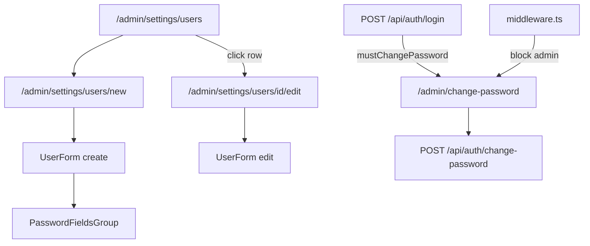

# Редактирование пользователей и улучшение паролей

## Текущее состояние

- Создание: [`components/admin/user-form.tsx`](components/admin/user-form.tsx) — одно поле `type="password"`, min 8 символов, без подтверждения
- API: только `GET/POST` в [`app/api/users/route.ts`](app/api/users/route.ts)
- Модель [`User`](prisma/schema.prisma): нет флага временного пароля
- Login: [`lib/auth/providers/local.ts`](lib/auth/providers/local.ts) не проверяет `mustChangePassword`
- Список [`users-list-client.tsx`](components/admin/users-list-client.tsx) — строки не кликабельны, нет edit-маршрута

## Архитектура



---

## 1. Данные и валидация

**Prisma** — миграция, поле в `User`:

```prisma
mustChangePassword Boolean @default(false) @map("must_change_password")
```

**[`lib/auth/password-policy.ts`](lib/auth/password-policy.ts)** (новый):

| Правило | Описание в UI |
|---------|---------------|
| ≥ 8 символов | Минимум 8 символов |
| `[A-Z]` | Заглавная буква |
| `[a-z]` | Строчная буква |
| `[0-9]` | Цифра |

- `validatePassword(password)` → `{ valid, unmet: string[] }`
- `generateSecurePassword()` → 16 символов, гарантированно проходит политику (crypto)

**[`lib/validations/users.ts`](lib/validations/users.ts)**:

- `createUserSchema`: `password` через политику + `passwordConfirm` + `.refine` на совпадение + `mustChangePassword: boolean` (default false)
- `updateUserSchema`: `id`, `email`, `name`, `role`, опциональные `password`/`passwordConfirm`/`mustChangePassword` (флаг только если пароль задан)

**[`lib/users/index.ts`](lib/users/index.ts)**:

- `updateUser(id, data)` — unique email, hash при новом пароле, `mustChangePassword`
- Защита: нельзя понизить роль **последнего** `SUPER_ADMIN`; при редактировании **себя** — поле `role` игнорируется (выбор пользователя: себя и других, роль себе менять нельзя)

---

## 2. API

**[`app/api/users/[id]/route.ts`](app/api/users/[id]/route.ts)** (новый):

- `GET` — `users:manage`, вернуть `{ id, email, name, role, createdAt }`
- `PUT` — `users:manage`, `updateUserSchema`, revalidate `/admin/settings/users`

**[`app/api/users/route.ts`](app/api/users/route.ts)** — расширить `POST` полями `passwordConfirm`, `mustChangePassword`

**Auth — принудительная смена пароля:**

- [`lib/auth/session-config.ts`](lib/auth/session-config.ts): `mustChangePassword: boolean` в `SessionData`
- [`lib/auth/providers/types.ts`](lib/auth/providers/types.ts): `mustChangePassword` в `AuthUser`
- [`lib/auth/providers/local.ts`](lib/auth/providers/local.ts): читать флаг из БД
- [`app/api/auth/login/route.ts`](app/api/auth/login/route.ts): писать в сессию; в JSON `{ ..., mustChangePassword }`
- [`app/api/auth/change-password/route.ts`](app/api/auth/change-password/route.ts) (новый): `currentPassword`, `newPassword`, `passwordConfirm` → смена hash, `mustChangePassword = false`, обновление сессии
- [`lib/auth/session.ts`](lib/auth/session.ts): `hydrateSessionRole` также синхронизирует `mustChangePassword` из БД

**[`middleware.ts`](middleware.ts)**:

- Если `session.isLoggedIn && session.mustChangePassword` и путь не `/admin/change-password` и не `/api/auth/*` → redirect на `/admin/change-password`

---

## 3. UI компоненты

**[`components/admin/password-fields-group.tsx`](components/admin/password-fields-group.tsx)** (новый, переиспользуемый):

- Поля «Пароль» + «Подтверждение пароля»
- Кнопка-иконка Eye/EyeOff на каждом поле
- Живой чеклист требований (`FieldDescription` + галочки met/unmet)
- Кнопка «Сгенерировать» → заполняет оба поля валидным паролем
- Checkbox «Временный пароль (требует смены при входе)» — `mustChangePassword`
- Prop `required: boolean` — на create обязательно; на edit секция «Новый пароль» опциональна (пусто = не менять)

**Рефакторинг [`components/admin/user-form.tsx`](components/admin/user-form.tsx)**:

- Props: `user?: { id, email, name, role }` — режим create/edit (паттерн [`organization-form.tsx`](components/admin/organization-form.tsx))
- Create: `POST /api/users`; Edit: `PUT /api/users/[id]`
- Edit: заголовок «Сохранить»; пароль — опциональный блок с `PasswordFieldsGroup`
- Edit self (сравнение `user.id` с `/api/auth/me`): Select роли disabled + подсказка

**Список [`components/admin/users-list-client.tsx`](components/admin/users-list-client.tsx)**:

- Email — ссылка на `/admin/settings/users/[id]/edit` (как org links)

**Страница edit** — [`app/(admin)/admin/(panel)/settings/users/[id]/edit/page.tsx`](app/(admin)/admin/(panel)/settings/users/[id]/edit/page.tsx):

- `requirePagePermission(users:manage)`, `getUserById`, `notFound()` если нет

**Принудительная смена пароля:**

- [`app/(admin)/admin/change-password/page.tsx`](app/(admin)/admin/change-password/page.tsx) — вне `(panel)`, без sidebar (карточка как login)
- [`components/admin/change-password-form.tsx`](components/admin/change-password-form.tsx) — текущий пароль + `PasswordFieldsGroup` (без checkbox temporary)

**Login [`components/login-form.tsx`](components/login-form.tsx)**:

- При `mustChangePassword: true` в ответе → `router.push("/admin/change-password")`

**Breadcrumbs** [`admin-breadcrumb.tsx`](components/admin/admin-breadcrumb.tsx):

- `/admin/settings/users/[id]/edit` → Настройки → Пользователи → «Редактирование»

---

## 4. Проверка (DoD)

```bash
npx prisma migrate dev
npm run typecheck && npm run lint && npm run build
```

**Smoke:**

1. Create user: show/hide пароля, confirm mismatch → ошибка, чеклист требований, генерация пароля
2. Create с «временный пароль» → login → redirect на change-password → после смены доступ в админку
3. Edit user: смена имени/роли; пароль пустой — не меняется
4. Edit self: роль disabled
5. Edit другого SUPER_ADMIN → нельзя оставить систему без SUPER_ADMIN
6. Users list: клик по email → edit

---

## Вне scope

- Удаление пользователей
- Сброс пароля по email / forgot password
- Политика пароля для seed admin (только для форм управления)
