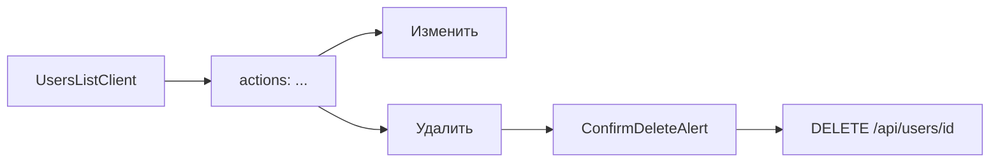

# Удаление пользователей и улучшения пароля

## Выбор UI для таблицы

Использовать **`...` (`TableRowActions` + `MoreHorizontal`)** — уже принятый паттерн в [`organizations-manager.tsx`](components/admin/organizations-manager.tsx), [`measures-table.tsx`](components/admin/measures-table.tsx), [`orders-table.tsx`](components/admin/orders-table.tsx).

`ChevronRight` в проекте — для hub-навигации ([`settings-nav.tsx`](components/admin/settings-nav.tsx)), не для row actions.



---

## 1. Удаление пользователей

**[`lib/users/index.ts`](lib/users/index.ts)** — `deleteUser(id, actorId)`:

| Проверка | Ошибка |
|----------|--------|
| Пользователь не найден | `NOT_FOUND` |
| `actorId === id` (удалить себя) | `CANNOT_DELETE_SELF` |
| Последний `SUPER_ADMIN` | `LAST_SUPER_ADMIN` |
| Есть меры или поручения (`measures` / `orders` где `createdById`) | `USER_HAS_DATA` |

**[`app/api/users/[id]/route.ts`](app/api/users/[id]/route.ts)** — `DELETE`:

- `requirePermission(usersManage)`
- `deleteUser(id, session.userId)`
- revalidate `/admin/settings/users`
- маппинг ошибок → 404 / 409 с понятными сообщениями

**UI [`components/admin/users-list-client.tsx`](components/admin/users-list-client.tsx)**:

- Колонка `actions` с [`TableRowActions`](components/admin/crud/table-row-actions.tsx):
  - **Изменить** → `/admin/settings/users/[id]/edit`
  - **Удалить** (destructive) → [`ConfirmDeleteAlert`](components/admin/crud/confirm-delete-alert.tsx)
- `DELETE /api/users/${id}` + `router.refresh()` + toast
- Скрыть «Удалить» для текущего пользователя (`useAdminMe().me.id`)
- Email-ссылку на edit оставить (как у org)

Опционально на edit-странице — не добавляем (scope: таблица).

---

## 2. Копирование пароля

**[`components/admin/password-fields-group.tsx`](components/admin/password-fields-group.tsx)**:

- Кнопка **«Копировать»** рядом с «Сгенерировать» (иконка `Copy`)
- `navigator.clipboard.writeText(password)` + `notify.success("Пароль скопирован")`
- Disabled если пароль пустой
- После «Сгенерировать» — auto-copy опционально **не** делать (явная кнопка достаточно)

---

## 3. Скрытие подтверждения при видимости

Поднять состояние `visible` на уровень группы:

**[`components/admin/password-input-field.tsx`](components/admin/password-input-field.tsx)** — опциональные props:

```ts
visible?: boolean
onVisibleChange?: (v: boolean) => void
```

Если переданы — controlled; иначе local state (для change-password form без группы).

**[`components/admin/password-fields-group.tsx`](components/admin/password-fields-group.tsx)**:

- `const [passwordVisible, setPasswordVisible] = useState(false)` — одно состояние для поля пароля
- Первое поле: controlled `visible` / `onVisibleChange`
- **Если `passwordVisible`**: скрыть поле «Подтверждение»; в `useEffect` синхронизировать `passwordConfirm = password`
- Валидация mismatch — только когда confirm виден
- [`user-form.tsx`](components/admin/user-form.tsx) / [`account-settings-client.tsx`](components/admin/account-settings-client.tsx): `passwordValid` учитывает режим без confirm

Server-side validation в [`lib/validations/users.ts`](lib/validations/users.ts) и [`account.ts`](lib/validations/account.ts) **не менять** — клиент всегда шлёт `passwordConfirm === password`.

---

## 4. DoD

```bash
npm run typecheck && npm run lint && npm run build
```

**Smoke:**

1. Таблица users: колонка `...` → Изменить / Удалить
2. Удалить тестового OPERATOR без данных — OK; себя — пункт скрыт; последний SUPER_ADMIN — ошибка
3. USER с поручениями/мерами — ошибка «Нельзя удалить…»
4. Сгенерировать пароль → Копировать → вставка в буфер
5. Показать пароль (eye) → поле подтверждения исчезает; submit проходит

---

## Вне scope

- Каскадное удаление / переназначение `createdBy`
- Удаление с edit-страницы
