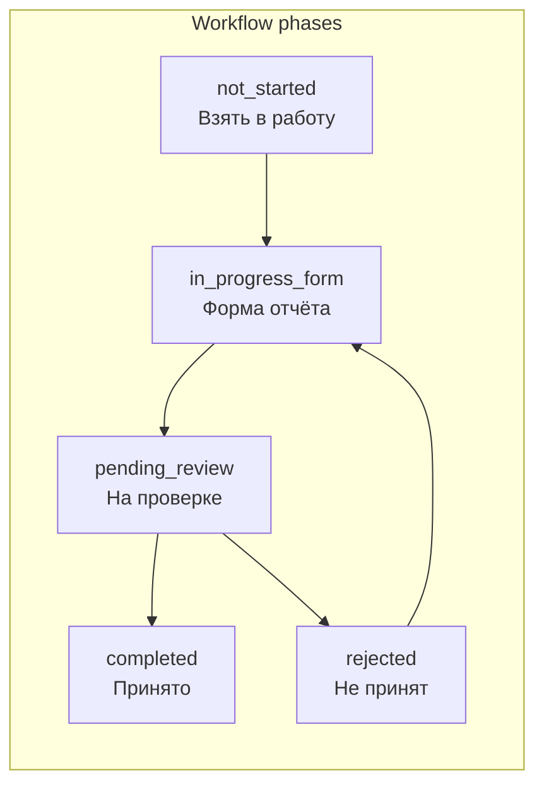

# Workflow motion — «пожирнее» на простых страницах

## Контекст

Сейчас motion-kit ([`components/motion/`](components/motion/)) покрывает только лёгкий fade/stagger/pressable (0.2s). **AnimatePresence / spring / orchestrated sequences ещё нигде не используются** — идеальное место для «тяжелее» без удара по dashboard/table.

Workflow UI сосредоточен в shared item-detail:



| Компонент | Роль | Client? |
|-----------|------|---------|
| [`item-report-workflow-card.tsx`](components/shared/item-detail/item-report-workflow-card.tsx) | 5 состояний карточки отчёта | да |
| [`item-due-status-card.tsx`](components/shared/item-detail/item-due-status-card.tsx) | Badge + кнопка «Взять в работу» | нет → client |
| [`public-item-detail.tsx`](components/public/public-item-detail.tsx) | `startWork()` / `submitReport()` | да |
| [`response-detail-client.tsx`](components/platform/response-detail-client.tsx) | Принять / Отклонить | да |
| [`delay-request-detail-client.tsx`](components/platform/delay-request-detail-client.tsx) | Одобрить / Отклонить | да |
| [`item-detail-overview.tsx`](components/shared/item-detail/item-detail-overview.tsx) | 2-card grid + children | нет → client |

**Покрываются автоматически:** public `/p/[token]/items/[id]`, report `/report/[token]/items/[id]`, panel submit form.

## Guardrails (как в motion polish + ваш чеклист)

- Только **GPU props:** `opacity`, `x`/`y`, `scale`, `rotate` — без `width`/`height`/`layout`
- **`useReducedMotion`** — instant render, без shake/pulse
- **Не трогать:** [`data-table.tsx`](components/data-table/data-table.tsx), [`measures-data-table.tsx`](components/shared/measures-data-table.tsx), dashboard matrix, sidebar Link prefetch
- Библиотека: **`motion/react`** (уже в проекте), не добавлять `framer-motion`
- `AnimatePresence` — только на **1–3 блока** на странице, не на списках

---

## Phase 1 — Motion kit: workflow orchestration

Новые файлы в [`components/motion/`](components/motion/):

| Файл | Назначение |
|------|------------|
| `motion-workflow-presets.ts` | Variants по фазам: `slideUp`, `scaleIn`, `shake`, `pulse`, spring transitions (0.35–0.5s) |
| `motion-workflow-panel.tsx` | `MotionWorkflowPanel` — `AnimatePresence mode="wait"` + `key={phase}` |
| `motion-status-badge.tsx` | `MotionStatusBadge` — pop spring при смене `displayStatus` |
| `motion-action-button.tsx` | `MotionActionButton` — pressable + optional `successPulse` после async action |

Пример preset (reject — лёгкий shake через `rotate`, не layout):

```tsx
export const shake = {
  animate: { rotate: [0, -4, 4, -3, 3, 0] },
  transition: { duration: 0.45, ease: "easeOut" },
} as const
```

Обновить [`components/motion/index.ts`](components/motion/index.ts) re-exports.

---

## Phase 2 — Pure helper: workflow phase

Добавить в [`lib/ui/item-detail-display.ts`](lib/ui/item-detail-display.ts):

```tsx
export type ItemWorkflowPhase =
  | "not_started" | "in_progress_form" | "pending_review" | "rejected" | "completed"

export function getItemWorkflowPhase(state: ReturnType<typeof getItemDetailDisplayState>): ItemWorkflowPhase
```

Единый ключ для AnimatePresence во всех item-detail экранах.

---

## Phase 3 — Hero: ItemReportWorkflowCard (главный эффект)

Refactor [`item-report-workflow-card.tsx`](components/shared/item-detail/item-report-workflow-card.tsx):

- Вычислить `phase = getItemWorkflowPhase(...)`
- Обернуть Card content в **`MotionWorkflowPanel`**
- Per-phase entrance (GPU-only):

| Phase | Анимация |
|-------|----------|
| `not_started` | fade + y:12, muted copy |
| `in_progress_form` | **MotionStagger** на поля формы + `MotionActionButton` на «Отправить отчёт» |
| `pending_review` | scale 0.96→1 + gentle opacity pulse на текст «ожидает проверки» |
| `rejected` | **shake** на card + `MotionFadeIn` для [`ResponseRevisionAlert`](components/shared/response-revision-alert.tsx) |
| `completed` | scaleIn spring → [`ItemResponseCard`](components/shared/item-detail/item-response-card.tsx) |

[`ResponseRevisionAlert`](components/shared/response-revision-alert.tsx) — обернуть в `MotionFadeIn variant="up"` + optional shake wrapper (client).

---

## Phase 4 — «Взять в работу» + status badge

[`item-due-status-card.tsx`](components/shared/item-detail/item-due-status-card.tsx) → `"use client"`:

- `MotionStatusBadge` вместо статичного `Badge` (pop при смене `displayStatus`)
- Card border tint через **opacity overlay** (`absolute inset-0 bg-destructive/5 pointer-events-none`) — не анимировать border-width

[`public-item-detail.tsx`](components/public/public-item-detail.tsx):

- Кнопка «Взять в работу» → `MotionActionButton` с `successPulse` после успешного `startWork()`
- При смене state — workflow card и due card синхронно меняют phase (уже через props)

---

## Phase 5 — Operator review pages (простые, 1 card)

[`response-detail-client.tsx`](components/platform/response-detail-client.tsx):

- `AnimatePresence` на блок reject textarea (`rejectMode` toggle): slideUp + fade
- После accept/reject — краткий **scale pulse** на status badge (spring, 0.3s)
- Кнопки «Принять» / «Отклонить» → `MotionActionButton`

[`delay-request-detail-client.tsx`](components/platform/delay-request-detail-client.tsx) — тот же паттерн approve/reject.

---

## Phase 6 — Detail page entrance (лёгкий бонус)

[`item-detail-overview.tsx`](components/shared/item-detail/item-detail-overview.tsx) → `"use client"`:

- `MotionStagger` на grid из 2 cards (measure + due status)
- `MotionFadeIn` на `{children}` (workflow card ниже)

[`submit-order-item-response-form.tsx`](components/platform/submit-order-item-response-form.tsx):

- `MotionStagger` на поля + `MotionActionButton` submit

**Не делать:** page-level fade поверх [`AppShell`](components/shell/app-shell.tsx) MotionPageEnter — достаточно local orchestration.

---

## Verify

- `npm run typecheck` + `npm run build`
- Public item detail: Not started → «Взять в работу» → form stagger → submit → pending
- Simulate reject (showcase seed / panel responses) → shake + revision alert
- `prefers-reduced-motion: reduce` → мгновенные переходы, без shake
- Dashboard / orders table — без новых motion на rows
- Tier 3 smoke: нет 503 (prefetch лимиты уже пофикшены)

## Rollback gate

Если shake на reject раздражает — убрать `shake` preset, оставить fade + stagger form.

## Порядок

1. Motion workflow kit + `getItemWorkflowPhase`
2. ItemReportWorkflowCard + ResponseRevisionAlert
3. ItemDueStatusCard + public startWork
4. Response/Delay review clients
5. ItemDetailOverview entrance + submit form
6. Verify
