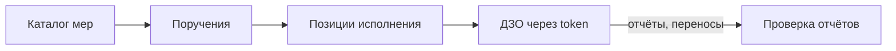

# Сервис контроля мер ФСТЭК

**Учёт мер информационной безопасности** — веб-платформа для ведения каталога мер ФСТЭК, назначения поручений дочерним обществам (ДЗО) и контроля исполнения: статусы, сроки, отчёты с вложениями, заявки на перенос.

> **English.** FSTEC is a full-stack compliance tracking app for information-security measures assigned to subsidiary organizations. Operators manage a measure catalog and orders via an authenticated panel; subsidiaries execute work through token-based public links; leadership can view read-only dashboards via report share links. Built with Next.js 16, PostgreSQL, Redis, and S3-compatible storage.

**Для кого:** операторы и администраторы ФСТЭК · исполнители в ДЗО (без логина, по ссылке) · наблюдатели (read-only в платформе)

---

## Предметная область



| Сущность | Описание |
|----------|----------|
| **Меры** | Справочник мер ИБ — без статуса и срока |
| **Поручения** | Назначение набора мер организации или подразделению |
| **Позиции** | Конкретная мера в рамках поручения: workflow-статус + срок `dueAt` |
| **Отчёты** | Ответы ДЗО с текстом и вложениями (S3); проверка оператором |
| **Переносы** | Заявки на продление срока исполнения |
| **Просрочено** | Вычисляемый статус — не хранится в БД, определяется по `dueAt` |

**Workflow статусов:** «К исполнению» → «В работе» → «Выполнено»

**Review отчётов:** PENDING → ACCEPTED / REJECTED (при отклонении ДЗО дорабатывает и отправляет повторно)

---

## Роли и режимы доступа

### Роли платформы

| Роль | Возможности |
|------|-------------|
| **Суперадминистратор** | Полный доступ: настройки, пользователи, report links, все CRUD |
| **Оператор** | Меры, поручения, организации, переносы, отчёты — без настроек и пользователей |
| **Наблюдатель** | Только чтение: меры, поручения, организации, переносы |

Матрица прав: [`lib/auth/permissions.ts`](lib/auth/permissions.ts)

### Три режима доступа

| Режим | URL | Аутентификация | Назначение |
|-------|-----|----------------|------------|
| **Platform** | `/panel/*` | Логин + iron-session | Рабочее место операторов |
| **Public assignment** | `/p/{token}` | Токен access link | Исполнение в ДЗО |
| **Report share** | `/report/{token}` | Токен report link | Read-only сводка для руководства |

---

## Архитектура

| Контекст | Путь | API | Назначение |
|----------|------|-----|------------|
| `platform` | `app/(platform)/panel/` | `/api/*` + session cookie | Авторизованное рабочее место |
| `public` | `app/(public)/p/` | `/api/public/[token]` | Страницы ДЗО |
| `report` | `app/(public)/report/` | token-scoped read | Глобальная сводка |
| `lib` | `lib/` | — | Доменная логика |

**Ключевые модули `lib/`:** `auth`, `measures`, `orders`, `organizations`, `responses`, `delays`, `dashboard`, `public`, `report-links`, `cache`, `storage`

**Компоненты:** `components/platform/` · `components/public/` · `components/report/` · `components/shared/` · `components/dashboard/` · `components/ui/` (shadcn)

### Стек

| Слой | Технология |
|------|------------|
| Frontend | Next.js 16 (App Router), React 19, TypeScript |
| UI | shadcn/ui, Tailwind CSS 4, motion |
| БД | PostgreSQL 16, Prisma 6 |
| Кеш | Redis 7 (дашборд, счётчики panel) |
| Файлы | S3-compatible (MinIO локально, AWS SDK v3) |
| Auth | iron-session, bcryptjs; провайдеры: local (готов), AD/Keycloak (заглушки) |
| Валидация | Zod 4 · таблицы: TanStack Table · графики: Recharts |

---

## Разделы интерфейса

### Platform (`/panel`)

| Раздел | Путь | Описание |
|--------|------|----------|
| Сводка | `/panel` | KPI, графики, матрица организаций; report share для админов |
| Меры | `/panel/measures` | Каталог мер ФСТЭК |
| Поручения | `/panel/orders` | Создание поручений, позиции, назначение мер |
| Организации | `/panel/organizations` | Организации, подразделения, access links |
| Переносы | `/panel/delay-requests` | Рассмотрение заявок на продление срока |
| Отчёты | `/panel/responses` | Проверка ответов ДЗО |
| Настройки | `/panel/settings/*` | Общие, аккаунт, пользователи, аутентификация |

### Public (`/p/{token}`)

Сводка по организации/подразделению · список поручений · карточка позиции (статус, отчёт, вложения, перенос) · раздел «Отчёты на доработку».

### Report share (`/report/{token}`)

Read-only дашборд и детализация по организациям, поручениям и позициям.

---

## API (обзор)

~33 route handler в `app/api/`:

| Группа | Endpoints | Защита |
|--------|-----------|--------|
| **Auth** | login, logout, me, change-password | session |
| **Measures** | CRUD `/api/measures` | `requirePermission` |
| **Orders** | CRUD + items, sidebar | `requirePermission` |
| **Organizations** | CRUD + subdivisions + links | `requirePermission` |
| **Responses** | list, review accept/reject | `requirePermission` |
| **Delays** | list, approve/reject | `requirePermission` |
| **Users / Settings** | CRUD users, app settings, auth config | SUPER_ADMIN |
| **Report links** | create, list, revoke | SUPER_ADMIN |
| **Attachments** | presign upload, download | session / token |
| **Public** | status, responses, delays, attachments | token + rate limit |

Platform API: session cookie + RBAC. Public API: только данные, доступные по токену; rate limiting — [`lib/public/rate-limit.ts`](lib/public/rate-limit.ts).

---

## Локальная разработка

### Требования

Node.js 20+, Docker (для Postgres, Redis, MinIO)

### Быстрый старт

```bash
cp .env.example .env.local
docker compose up -d db redis minio
npm install
npm run db:migrate
npm run db:seed
npm run dev
```

| URL | Назначение |
|-----|------------|
| http://localhost:3000/login | Вход в платформу |
| http://localhost:9001 | MinIO Console |

**Seed-учётка:** `admin@fstec.local` / `admin123`

**Public links:** после `npm run db:seed:mock` токены `/p/{token}` выводятся в консоль.

### Проверка перед коммитом

```bash
npm run typecheck
npm run lint
npm run build
```

### npm scripts

| Команда | Описание |
|---------|----------|
| `npm run dev` | Dev-сервер |
| `npm run build` | Production build |
| `npm run typecheck` | TypeScript |
| `npm run lint` | ESLint |
| `npm run db:migrate` | Prisma migrate |
| `npm run db:seed` | Seed: admin + статусы + dev mock (120 мер, 120 поручений) |
| `npm run db:seed:mock` | Сброс mock-данных и повторный seed |
| `npm run db:studio` | Prisma Studio |
| `npm run generate:favicons` | Пересборка favicon из `app/icon.svg` |

Production-деплой: см. [docs/deployment.md](docs/deployment.md)

### Переменные окружения (dev)

| Переменная | Назначение |
|------------|------------|
| `DATABASE_URL` | PostgreSQL (порт 5433 в docker-compose) |
| `REDIS_URL` | Redis — кеш дашборда (опционально в dev) |
| `SESSION_SECRET` | Секрет iron-session (≥ 32 символов) |
| `S3_*` | MinIO: endpoint, ключи, bucket |
| `AUTH_PROVIDER` | `local` \| `active_directory` \| `keycloak` |
| `ADMIN_EMAIL` / `ADMIN_PASSWORD` | Seed admin-пользователя |

Полный список: [`.env.example`](.env.example)

---

## Документация

| Документ | Содержание |
|----------|------------|
| [docs/deployment.md](docs/deployment.md) | Production: Docker, tiers, HA, VM |
| [AGENTS.md](AGENTS.md) | Правила разработки, UI-конвенции, verify |
| [docs/plans/fstec_master.plan.md](docs/plans/fstec_master.plan.md) | Master plan, история фаз |

---

## Лицензия

[MIT](LICENSE)
