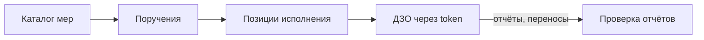

# Сервис контроля мер ФСТЭК

**Учёт мер информационной безопасности** — веб-платформа для ведения каталога мер ФСТЭК, назначения поручений дочерним обществам (ДЗО) и контроля исполнения: статусы, сроки, отчёты с вложениями, заявки на перенос.

> **English.** FSTEC is a full-stack compliance tracking app for information-security measures assigned to subsidiary organizations. Operators manage a measure catalog and orders via an authenticated panel; subsidiaries execute work through token-based public links; leadership can view read-only dashboards via report share links. Built with Next.js 16, PostgreSQL, Redis, and S3-compatible storage.

**Для кого:** операторы и администраторы ФСТЭК · исполнители в ДЗО (без логина, по ссылке) · наблюдатели (read-only в платформе)

---

## Предметная область



| Сущность | Описание |
|----------|----------|
| **Меры** | Справочник мер ИБ — без статуса и срока |
| **Поручения** | Назначение набора мер организации или подразделению |
| **Позиции** | Конкретная мера в рамках поручения: workflow-статус + срок `dueAt` |
| **Отчёты** | Ответы ДЗО с текстом и вложениями (S3); проверка оператором |
| **Переносы** | Заявки на продление срока исполнения |
| **Просрочено** | Вычисляемый статус — не хранится в БД, определяется по `dueAt` |

**Workflow статусов:** «К исполнению» → «В работе» → «Выполнено»

**Review отчётов:** PENDING → ACCEPTED / REJECTED (при отклонении ДЗО дорабатывает и отправляет повторно)

---

## Роли и режимы доступа

### Роли платформы

| Роль | Возможности |
|------|-------------|
| **Суперадминистратор** | Полный доступ: настройки, пользователи, report links, все CRUD |
| **Оператор** | Меры, поручения, организации, переносы, отчёты — без настроек и пользователей |
| **Наблюдатель** | Только чтение: меры, поручения, организации, переносы |

Матрица прав: [`lib/auth/permissions.ts`](lib/auth/permissions.ts)

### Три режима доступа

| Режим | URL | Аутентификация | Назначение |
|-------|-----|----------------|------------|
| **Platform** | `/panel/*` | Логин + iron-session | Рабочее место операторов |
| **Public assignment** | `/p/{token}` | Токен access link | Исполнение в ДЗО |
| **Report share** | `/report/{token}` | Токен report link | Read-only сводка для руководства |

---

## Архитектура

| Контекст | Путь | API | Назначение |
|----------|------|-----|------------|
| `platform` | `app/(platform)/panel/` | `/api/*` + session cookie | Авторизованное рабочее место |
| `public` | `app/(public)/p/` | `/api/public/[token]` | Страницы ДЗО |
| `report` | `app/(public)/report/` | token-scoped read | Глобальная сводка |
| `lib` | `lib/` | — | Доменная логика |

**Ключевые модули `lib/`:** `auth`, `measures`, `measure-imports`, `orders`, `organizations`, `contacts`, `responses`, `delays`, `dashboard`, `public`, `report-links`, `email`, `notifications`, `mail-inbox`, `cron`, `cache`, `storage`

**Компоненты:** `components/platform/` · `components/public/` · `components/report/` · `components/shared/` · `components/dashboard/` · `components/ui/` (shadcn)

### Стек

| Слой | Технология |
|------|------------|
| Frontend | Next.js 16 (App Router), React 19, TypeScript |
| UI | shadcn/ui, Tailwind CSS 4, motion |
| БД | PostgreSQL 16, Prisma 6 |
| Кеш | Redis 7 (дашборд, счётчики panel) |
| Файлы | S3-compatible (MinIO локально, AWS SDK v3) |
| Auth | iron-session, bcryptjs; провайдеры: local (готов), AD/Keycloak (заглушки) |
| Валидация | Zod 4 · таблицы: TanStack Table · графики: Recharts |

---

## Разделы интерфейса

### Platform (`/panel`)

| Раздел | Путь | Описание |
|--------|------|----------|
| Сводка | `/panel` | KPI, графики, матрица организаций; report share для админов |
| Письма | `/panel/measures/imports` | Импорт мер из DOCX |
| Меры | `/panel/measures` | Каталог мер ФСТЭК |
| Поручения | `/panel/orders` | Создание поручений, позиции, назначение мер |
| Отчёты | `/panel/responses` | Проверка ответов ДЗО |
| Переносы | `/panel/delay-requests` | Рассмотрение заявок на продление срока |
| Организации | `/panel/organizations` | Организации, подразделения, access links |
| Настройки | `/panel/settings/*` | Общие, аккаунт, пользователи, аутентификация |

### Public (`/p/{token}`)

Сводка по организации/подразделению · список поручений · карточка позиции (статус, отчёт, вложения, перенос) · раздел «Отчёты на доработку».

### Report share (`/report/{token}`)

Read-only дашборд и детализация по организациям, поручениям и позициям.

---

## API (обзор)

47 route handler в `app/api/`:

| Группа | Endpoints | Защита |
|--------|-----------|--------|
| **Auth** | login, logout, me, change-password | session |
| **Measures** | CRUD `/api/measures` | `requirePermission` |
| **Measure imports** | upload, parse, commit, items, download `/api/measure-imports/*` | `requirePermission` |
| **Orders** | CRUD + items, sidebar, batch, notify | `requirePermission` |
| **Organizations** | CRUD + subdivisions + links + contacts | `requirePermission` |
| **Subdivisions** | CRUD + links + contacts | `requirePermission` |
| **Contacts** | PATCH/DELETE `/api/contacts/[contactId]` | `requirePermission` |
| **Responses** | list, review accept/reject | `requirePermission` |
| **Delays** | list, approve/reject | `requirePermission` |
| **Users / Settings** | CRUD users, app settings, auth config | SUPER_ADMIN |
| **Report links** | create, list, revoke | SUPER_ADMIN |
| **Attachments** | presign upload, download | session / token |
| **Cron** | due-reminders, mail-inbox | `CRON_SECRET` |
| **Public** | status, responses, delays, attachments | token + rate limit |

Platform API: session cookie + RBAC. Public API: только данные, доступные по токену; rate limiting — [`lib/public/rate-limit.ts`](lib/public/rate-limit.ts).

---

## Локальная разработка

### Требования

Node.js 20+, Docker (для Postgres, Redis, MinIO)

### Быстрый старт

```bash
cp .env.example .env.local
docker compose up -d db redis minio mailpit
npm install
npm run db:migrate
npm run db:generate
npm run db:seed
npm run dev
```

После клонирования или pull с новыми миграциями: `npm run db:migrate && npm run db:generate` — затем перезапустить dev-сервер.

| URL | Назначение |
|-----|------------|
| http://localhost:3000/login | Вход в платформу |
| http://localhost:9001 | MinIO Console |

**Seed-учётка:** `admin@fstec.local` / `admin123`

**Mock-данные (опционально):** `npm run db:seed:mock` — 4 ДЗО, 120 мер, демо-поручения; токены `/p/{token}` в консоли. По умолчанию `db:seed` моки **не** загружает.

### Dev с корпусом DOCX (Шереметьево + routing)

DOCX и корпус **не коммитятся** — см. [`.external/docx_examples/README.md`](.external/docx_examples/README.md).

**Организации в corpus seed:** головная АО «Международный аэропорт Шереметьево» (подразделения ДЦОД, ДИТСБ, …) и 6 подведомственных ДЗО без подразделений (Хэндлинг, Паркинг, Безопасность, ВИП, Реклама, ТЗК Аэро). Моки Сбер/Ростех (`db:seed:mock`) — отдельно, не для demo-стенда.

```bash
# 1. Положить архив: .external/240 93 6837/…
#    или нарезка: npm run corpus:prepare-slice

# 2. Орг-структура (копируется автоматически при первом сиде):
cp .external/seed/orgs.example.json .external/seed/orgs.json

make dev-corpus
# infra → build manifest → db:reset → corpus seed → gap report → next dev
```

После сида:
- импорт 6837: `/panel/measures/imports/{id}` — теги `network` / `siem`
- **воркфлоу:** commit import → `/panel/orders/new?importId={id}` → по умолчанию **МАШ (6 подразделений) + все ДЗО**
- матрица routing для МАШ: вероятности **ДЦОД 85%** и др.; ДЗО получают все меры org-level
- полный импорт корпуса: `npm run db:seed:corpus:full` (долго, MinIO)
- история из Excel: `npm run corpus:history && npm run corpus:reconcile-history`
- опционально статусы из отчётов: `SEED_XLSX_HISTORY=1 npm run db:seed:corpus`

**Дашборд:** 3 статуса (в работе / выполнено / просрочено), срез по `Order.issuedAt` — пресеты 30д / 90д / год / всё и двойной слайдер на `/panel`, org/sub дашбордах и share-репортах `/report/{token}`. Таблица писем `/panel/measures/imports` фильтруется по `createdAt` в том же периоде (общие `from`/`to` в URL).

**Портал отчётов** `/p/{token}/reports`: период по `submittedAt`, кнопки статуса сохраняют даты в query.

**Отчёты:** `corpus-gap-report.json`, `corpus-triage.json` (P0/P1/P2 приоритеты парсера).

**Smoke checklist:**
- [ ] 6837 imported, measures committed
- [ ] Order create: 6 МАШ subdivisions + 6 DZO selected by default
- [ ] Routing matrix shows ДЦОД 85% for network
- [ ] Batch creates up to 12 orders
- [ ] Dashboard: 3 KPI, period presets + slider work on panel and report links
- [ ] Portal reports: period + status filters preserve query

Проверка gitignore перед push:

```bash
git check-ignore -v .external/docx_examples/corpus/ prisma/seed-manifest.generated.json corpus-gap-report.json
```

Профили routing из отчётов (локально, не в git): `npm run corpus:labels && npm run corpus:profiles`

### Проверка перед коммитом

```bash
npm run typecheck
npm run lint
npm run test
npm run build
```

### npm scripts

| Команда | Описание |
|---------|----------|
| `npm run dev` | Dev-сервер |
| `npm run build` | Production build |
| `npm run typecheck` | TypeScript |
| `npm run lint` | ESLint |
| `npm run test` | Unit-тесты lib/ **батчами** (6 файлов/процесс, меньше RAM) |
| `npm run test:unit` | То же, что `npm run test` |
| `npm run test:unit:all` | Все тесты одним vitest-процессом (быстрее, больше RAM) |
| `npm run test:coverage` | Coverage одним процессом (порог 97% lines / 90% branches) |
| `npm run db:migrate` | Prisma migrate |
| `npm run db:seed` | Seed: admin + статусы (без mock) |
| `npm run db:seed:mock` | Сброс mock-данных и повторный seed |
| `npm run db:boot:corpus` | Reset БД + corpus seed (DOCX импорты) |
| `npm run db:seed:corpus` | Sheremetyevo orgs + manifest imports + gap report |
| `make dev-corpus` | Infra + manifest + boot corpus + dev |
| `npm run corpus:prepare-slice` | Локальная нарезка DOCX в ignored `corpus/` |
| `npm run corpus:build-seed-manifest` | Scan corpus → `prisma/seed-manifest.generated.json` |
| `npm run corpus:gap-report` | Parser coverage gaps → `corpus-gap-report.json` |
| `npm run corpus:history` | Excel history → `corpus-history.jsonl` |
| `npm run corpus:reconcile-history` | History vs model → `corpus-history-reconcile.json` |
| `npm run db:seed:corpus:full` | `SEED_IMPORT_ALL=1` — весь разбираемый корпус |
| `npm run db:studio` | Prisma Studio |
| `npm run generate:favicons` | Пересборка favicon из `app/icon.svg` |

Production-деплой: см. [docs/deployment.md](docs/deployment.md)

### Переменные окружения (dev)

| Переменная | Назначение |
|------------|------------|
| `DATABASE_URL` | PostgreSQL (порт 5433 в docker-compose) |
| `REDIS_URL` | Redis — кеш дашборда (опционально в dev) |
| `SESSION_SECRET` | Секрет iron-session (≥ 32 символов) |
| `S3_*` | MinIO: endpoint, ключи, bucket |
| `AUTH_PROVIDER` | `local` \| `active_directory` \| `keycloak` |
| `APP_URL` | Base URL для ссылок в email |
| `SMTP_*` | Mailpit локально (`localhost:1025`) |
| `CRON_SECRET` | Секрет для `/api/cron/*` |
| `INBOX_IMAP_*` | Автоимпорт DOCX из почты (опционально) |
| `ADMIN_EMAIL` / `ADMIN_PASSWORD` | Seed admin-пользователя |

Полный список: [`.env.example`](.env.example)

---

## Импорт мер из DOCX

Оператор может загрузить письмо ФСТЭК (`.docx`) через раздел **Письма** в сайдбаре, система извлечёт нумерованные меры, сохранит оригинал в S3 и позволит импортировать их в каталог. После commit — автопереход к пакетному созданию поручений. Без документа поручения создаются вручную: **Поручения → Создать поручение**.

| Шаг | UI |
|-----|-----|
| Письма (список) | `/panel/measures/imports` |
| Загрузка DOCX | `/panel/measures/imports/new` |
| Preview и commit | `/panel/measures/imports/{id}` |
| Поручения (из документа или вручную) | `/panel/orders/new` или `/panel/orders/new?importId={id}` |

Тесты: `npm run test` (батчи по 6 файлов; `TEST_BATCH_SIZE=4 npm run test` для меньших порций). Coverage: `npm run test:coverage`.

---

## Документация

| Документ | Содержание |
|----------|------------|
| [docs/deployment.md](docs/deployment.md) | Production: Docker, tiers, HA, VM |
| [AGENTS.md](AGENTS.md) | Правила разработки, UI-конвенции, verify |
| [docs/plans/fstec_master.plan.md](docs/plans/fstec_master.plan.md) | Master plan, история фаз |

---

## Лицензия

[MIT](LICENSE)
