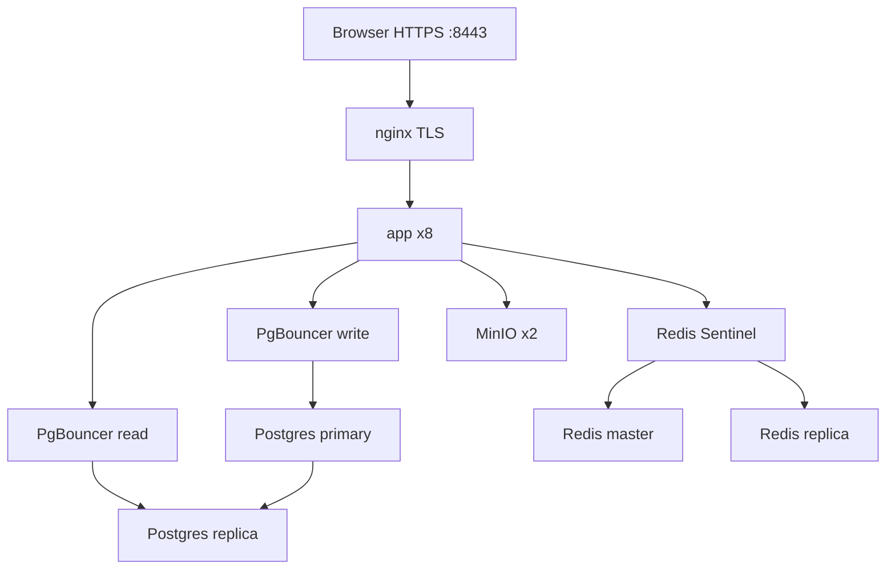

# Деплой FSTEC

Runbook для production-окружения: Docker Compose, scale tiers, HA и VM/Podman.

---

## Обзор prod-стека

| Компонент | Назначение |
|-----------|------------|
| **app** | Next.js standalone (Node 22 Alpine, non-root) |
| **nginx** | TLS-терминация, reverse proxy, rate limits |
| **PostgreSQL 16** | Основное хранилище |
| **Redis 7** | Кеш дашборда, panel counts, Next.js cacheHandler |
| **MinIO** | S3-compatible хранилище вложений отчётов |
| **migrate** | Одноразовый job: Prisma migrate deploy |

Compose-файлы:

| Файл | Назначение |
|------|------------|
| [`docker-compose.prod.yml`](../docker-compose.prod.yml) | Базовый prod-стек (app, nginx, single-node data layer) |
| [`docker-compose.ha.yml`](../docker-compose.ha.yml) | HA overlay: Postgres replica + PgBouncer, Redis Sentinel, MinIO x2 |
| [`docker-compose.vm.yml`](../docker-compose.vm.yml) | VM/Podman overlay: pre-baked image tags |
| [`docker-compose.yml`](../docker-compose.yml) | **Dev only:** Postgres, Redis, MinIO на localhost |

---

## Быстрый старт (local prod preview)

```bash
cp .env.production.example .env.production
# Отредактируйте секреты в .env.production

sh docker/scripts/generate-dev-certs.sh
sh docker/scripts/prod-scale.sh --build -d

# Откройте https://localhost:8443 (self-signed cert)
```

HTTP redirect: `http://localhost:8080` → HTTPS.

**Первый seed (опционально):**

```bash
# Single-node (SCALE_TIER=0)
sh docker/scripts/prod-scale.sh --profile seed-single run --rm seed

# HA (SCALE_TIER≥1)
sh docker/scripts/prod-scale.sh --profile seed-ha run --rm seed-ha
```

---

## Scale tiers

Управляется переменной `SCALE_TIER` (0–3) в `.env.production`. Число реплик app = 2^tier.

| Tier | App replicas | Data layer | Profile |
|------|-------------|------------|---------|
| **0** | 1 | Single-node Postgres, Redis, MinIO | `single` |
| **1** | 2 | HA overlay | `ha` |
| **2** | 4 | HA overlay | `ha` |
| **3** | 8 | HA overlay | `ha` |

**Tier 3 (HA)** включает:

- Postgres primary + read replica + PgBouncer (write/read)
- Redis master + replica + Sentinel
- MinIO distributed (2 nodes)
- nginx → 8 app replicas

```bash
SCALE_TIER=3 sh docker/scripts/prod-scale.sh --build -d
```

Оркестрация: [`docker/scripts/prod-scale.sh`](../docker/scripts/prod-scale.sh)



---

## HA overlay

Подключается автоматически при `SCALE_TIER≥1` через `prod-scale.sh`.

Дополнительные сервисы из [`docker-compose.ha.yml`](../docker-compose.ha.yml):

| Сервис | Роль |
|--------|------|
| `db-primary` / `db-replica` | Streaming replication |
| `pgbouncer` / `pgbouncer-read` | Connection pooling, read/write split |
| `redis-master` / `redis-replica` / `redis-sentinel` | Redis HA |
| `minio1` / `minio2` | Distributed object storage |
| `migrate-ha` | Prisma migrate для HA profile |

**Env для HA:** `POSTGRES_REPLICATION_PASSWORD` — обязателен в `.env.production`.

---

## VM / Podman deploy

Single-node деплой на виртуальной машине без сборки на каждый pull:

```bash
cp .env.production.example .env.production
# SCALE_TIER=0, VM_DOMAIN=app.example.com, секреты

sh docker/scripts/vm-deploy.sh --build
```

| Опция | Описание |
|-------|----------|
| `--build` | Собрать образы перед запуском |
| `--no-build` | Использовать существующие локальные образы |
| `--seed` | Seed после migrate |
| `--down` | Остановить и удалить стек |
| `--pull` | git pull перед build |

Скрипт: [`docker/scripts/vm-deploy.sh`](../docker/scripts/vm-deploy.sh)

Pre-baked images: [`docker/scripts/build-prod-images.sh`](../docker/scripts/build-prod-images.sh)

Рекомендуемые ключи `.env.production` для VM:

```env
SCALE_TIER=0
VM_DOMAIN=app.example.com
FSTEC_IMAGE_REGISTRY=localhost/fstec
FSTEC_IMAGE_TAG=latest
HTTPS_PORT=8443
HTTP_PORT=8080
```

---

## Переменные окружения (production)

| Переменная | Назначение |
|------------|------------|
| `POSTGRES_USER` / `POSTGRES_PASSWORD` / `POSTGRES_DB` | PostgreSQL credentials |
| `POSTGRES_REPLICATION_PASSWORD` | Replication (HA only) |
| `DATABASE_URL` | Prisma connection string (внутри compose-сети) |
| `DATABASE_READ_URL` | Read replica URL (HA, опционально) |
| `REDIS_URL` | Redis connection |
| `DASHBOARD_CACHE_TTL_SECONDS` | TTL кеша дашборда (default 300) |
| `REFERENCE_CACHE_TTL_SECONDS` | TTL справочных данных (default 900) |
| `SESSION_SECRET` | iron-session (≥ 32 символов; `openssl rand -base64 48`) |
| `AUTH_PROVIDER` | `local` \| `active_directory` \| `keycloak` |
| `S3_ACCESS_KEY` / `S3_SECRET_KEY` / `S3_BUCKET` | MinIO / S3 |
| `S3_REGION` / `S3_FORCE_PATH_STYLE` | S3 client config |
| `HTTPS_PORT` / `HTTP_PORT` | nginx entrypoints (8443 / 8080) |
| `SCALE_TIER` | 0–3, см. таблицу выше |
| `FSTEC_IMAGE_REGISTRY` / `FSTEC_IMAGE_TAG` | VM/Podman image tags |
| `VM_DOMAIN` | CN для self-signed TLS cert |
| `NGINX_BENCH_MODE` | `1` — ослабить rate limits для load test |
| `ADMIN_EMAIL` / `ADMIN_PASSWORD` | Seed admin (смените пароль!) |

Полный шаблон: [`.env.production.example`](../.env.production.example)

---

## Операции

### Остановка стека

```bash
docker compose -f docker-compose.prod.yml -f docker-compose.ha.yml \
  --env-file .env.production \
  --profile single --profile ha down --remove-orphans
```

### Пересборка после изменений кода

```bash
sh docker/scripts/prod-scale.sh --build -d
```

### Load testing / benchmark

```bash
sh docker/scripts/benchmark-scale.sh   # tier 0 vs tier 3
sh docker/scripts/load-bench.sh        # нагрузочный прогон
```

Для бенчмарка: `NGINX_BENCH_MODE=1` в `.env.production`, пересборка nginx.

### TLS-сертификаты (dev preview)

```bash
sh docker/scripts/generate-dev-certs.sh
```

Self-signed cert для `VM_DOMAIN` (default `localhost`). В production используйте реальные сертификаты.

### Dockerfile targets

[`Dockerfile`](../Dockerfile): `deps` → `builder` → `migrate` | `runner`

- `runner` — production app (non-root, read-only filesystem)
- `migrate` — одноразовый Prisma migrate job

---

## Безопасность

- **Секреты не в git.** `.env.production` и `.env.local` — только локально / в secret store.
- **`SESSION_SECRET`** — минимум 32 символа, уникальный для каждого окружения.
- **Пароли по умолчанию** из `.env.production.example` и seed — сменить перед prod.
- **`ADMIN_PASSWORD`** — задайте сильный пароль; seed создаёт admin только при первом запуске.
- **nginx** — rate limits на auth и public API; TLS обязателен для production.
- **Public API** — token-scoped, rate-limited; не раскрывает данные вне scope токена.

---

## Email и cron-задачи

Dev: поднимите Mailpit вместе с инфраструктурой:

```bash
docker compose up -d db redis minio mailpit
```

- SMTP: `localhost:1025`
- Web UI писем: http://localhost:8025

Переменные в `.env.local`: `SMTP_HOST`, `SMTP_PORT`, `SMTP_FROM`, `OPERATOR_NOTIFY_EMAIL`, `APP_URL`, `CRON_SECRET`.

**Напоминания о сроках** (ежедневно):

```bash
curl -X POST http://localhost:3000/api/cron/due-reminders \
  -H "Authorization: Bearer $CRON_SECRET"
```

**Входящая почта DOCX** (если настроен IMAP):

```bash
curl -X POST http://localhost:3000/api/cron/mail-inbox \
  -H "Authorization: Bearer $CRON_SECRET"
```

---

## Dev vs Prod

| | Dev | Prod |
|---|-----|------|
| Compose | `docker-compose.yml` | `docker-compose.prod.yml` (+ ha/vm) |
| App | `npm run dev` | Docker `runner` image |
| Env | `.env.local` | `.env.production` |
| TLS | нет | nginx :8443 |
| Entry | localhost:3000 | https://localhost:8443 или VM_DOMAIN |

Локальная разработка: [README.md](../README.md#локальная-разработка)
